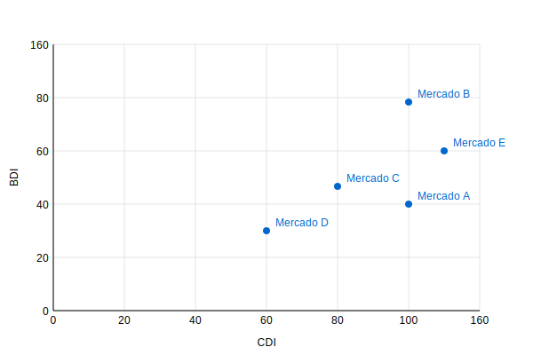

# Herramientas para la Planificación de Medios Publicitarios

## Descripción General
Este paquete R proporciona un conjunto completo de herramientas para la optimización de la planificación de medios, implementando diversos modelos para calcular cobertura, distribución de contactos y acumulación de audiencia. El paquete incluye implementaciones de modelos clásicos de planificación de medios como Sainsbury, Binomial, Beta-Binomial, Metheringham y Hofmans.

## Instalación

La forma más fácil de instalar y configurar mediaPlanR es usando las siguientes instrucciones:

```R
# Instalar el paquete devtools si no está instalado
if (!requireNamespace("devtools", quietly = TRUE)) {
  install.packages("devtools")
}

# Instalar mediaPlanR
devtools::install_github("majesus/mediaPlanR", force = TRUE)

# Cargar el paquete
library(mediaPlanR)

# Configurar todo lo necesario (instala y carga todas las dependencias)
setup_mediaPlanR()
```

***

## Planificación de medios

La planificación de medios es el proceso de encontrar la combinación ideal de canales de comunicación para llegar a la audiencia objetivo de una marca de manera efectiva y eficiente. No se trata solo de alcanzar la mayor cantidad de personas, sino de conectar con las personas correctas, aquellas que tienen más probabilidades de estar interesadas en el producto o servicio que se ofrece. Este proceso busca maximizar el impacto del mensaje publicitario y optimizar el retorno de la inversión (ROI).

Un planificador de medios debe abordar una serie de preguntas fundamentales para garantizar el éxito de una campaña publicitaria. Estas preguntas se estructuran en las siguientes categorías:


<details>
<summary>Haz clic para mayor desarrollo</summary>

***

**1. Conocimiento del Mercado y de la Audiencia**

¿Cuál es el tamaño del mercado y la demanda del producto?: El planificador debe analizar el contexto del mercado del producto o servicio, incluyendo el tamaño actual y futuro del mercado, la segmentación, las cuotas de mercado y las tendencias de la demanda.

¿Quién es el público objetivo?: Es esencial tener un conocimiento profundo del perfil del consumidor al que se dirige la campaña. Esto incluye el análisis de sus características demográficas, psicográficas, comportamiento de compra, fuentes de información y las influencias personales y familiares que recibe.

¿Cuáles son sus hábitos de consumo de medios?: Es fundamental comprender cuáles son los medios que consume el público objetivo, con qué frecuencia y en qué contextos. Esto abarca tanto medios tradicionales como digitales.

¿Quiénes son los competidores y cuáles son sus estrategias de marketing y comunicación?: El análisis de la competencia y sus actividades publicitarias resulta crucial, así como la comprensión de la presión competitiva del entorno y su influencia en el mercado.

**2. Objetivos y Estrategia de la Campaña**

Definir objetivos de manera SMART: Es fundamental que los objetivos de la campaña estén definidos de forma SMART, es decir, específicos, medibles, alcanzables, relevantes y temporales. Esto garantizará una mayor claridad y efectividad en la evaluación de los resultados.

¿Cuáles son los objetivos de marketing y comunicación de la marca?: Los objetivos de la planificación de medios deben estar alineados con los objetivos globales de marketing y comunicación de la marca.

¿Qué se quiere lograr con la campaña publicitaria?: Se deben definir objetivos específicos, como aumentar la notoriedad, cambiar las percepciones del producto, generar respuestas emocionales o incitar a la acción.

¿Cuál es el presupuesto disponible para la campaña?: El presupuesto disponible influye directamente en las decisiones del planificador de medios. Es importante establecer si este presupuesto es fijo o si existe cierta flexibilidad.

¿Qué mensaje se quiere comunicar y qué estrategia creativa se utilizará?: La estrategia creativa del mensaje debe estar en sintonía con los medios seleccionados. El planificador debe evaluar cómo dicha estrategia impacta en la elección de los medios y viceversa.

**3. Selección de Medios y Canales**

¿Cómo se determinará la efectividad de cada medio en relación con los objetivos definidos?: Es crucial evaluar cada medio en función de su capacidad para cumplir con los objetivos de la campaña. Esto implica realizar pruebas previas, análisis de retorno de inversión (ROI) y mediciones de impacto para cada medio seleccionado.

¿Qué medios y canales son los más adecuados para alcanzar al público objetivo y lograr los objetivos de la campaña?: La selección de medios se debe basar en un análisis exhaustivo de la audiencia objetivo, sus hábitos de consumo, las características de cada medio y la estrategia creativa.

¿Qué combinación de medios tradicionales y digitales será la más efectiva?: Es necesario considerar las ventajas y limitaciones de cada medio, buscando la combinación óptima que maximice el impacto de la campaña.

¿Cuál es la cobertura y frecuencia óptimas para la campaña?: El planificador debe definir la cobertura (cuántas personas serán alcanzadas por la campaña) y la frecuencia (cuántas veces serán expuestas al mensaje) óptimas para alcanzar los objetivos.

**4. Implementación, Monitoreo y Evaluación**

¿Cómo se garantizará la evaluación continua durante la campaña?: Para asegurar la evaluación constante, se deben realizar mediciones regulares durante la implementación de la campaña. Esto incluye el seguimiento de indicadores clave de rendimiento (KPIs) a lo largo del ciclo de vida de la campaña y la realización de ajustes oportunos según los resultados obtenidos.

¿Cómo se implementará el plan de medios?: Es esencial definir los aspectos operativos, como la compra de espacios publicitarios, la producción de los anuncios y la gestión de la campaña.

¿Cómo se medirá la efectividad del plan?: Se deben establecer indicadores clave de rendimiento (KPIs) para evaluar el éxito de la campaña, como el retorno de la inversión, el impacto en ventas y otros indicadores relevantes.

**5. Consideraciones Adicionales**

¿Cómo se integrará la planificación de medios con otras áreas del marketing?: La planificación de medios debe estar alineada con una estrategia de comunicación integrada, coordinando todas las herramientas de marketing para maximizar la coherencia e impacto. Esto implica una colaboración estrecha con áreas como ventas, relaciones públicas y promociones, asegurando que todas las acciones sean consistentes y contribuyan a los objetivos estratégicos de la marca.

¿Cómo se integrará la planificación de medios con otras áreas del marketing?: La planificación de medios debe estar alineada con una estrategia de comunicación integrada, coordinando todas las herramientas de marketing para maximizar la coherencia e impacto.

¿Cómo se adaptará el plan de medios al entorno mediático en constante cambio?: El planificador debe mantenerse actualizado respecto a nuevas tendencias, plataformas y tecnologías, y ser flexible para ajustar la estrategia según lo requieran las circunstancias.

En resumen, el planificador de medios debe ser un estratega capaz de analizar información compleja, tomar decisiones informadas y adaptarse a un entorno en constante evolución. Su objetivo primordial es conectar eficazmente la marca con su audiencia, maximizando el retorno de la inversión y contribuyendo al logro de los objetivos de marketing de manera eficiente y efectiva.
</details>

***

## Conceptos básicos

### Métricas relativas a la población:

#### BDI / CDI

El **BDI (índice de desarrollo de marca) y el CDI (índice de desarrollo de categoría)** son dos métricas cruciales utilizadas en la planificación de medios para analizar el rendimiento de una marca y su potencial de crecimiento en diferentes mercados geográficos. 

- **BDI**: Este índice mide la fuerza de las ventas de una marca en un mercado específico (en %) en relación con el tamaño de la población de ese mercado (en %). Se calcula como el porcentaje de ventas de la marca en un mercado dividido por el porcentaje de la población de ese mercado, multiplicado por 100. Un BDI de 100 significa que las ventas de la marca en ese mercado reflejan la población. Si el índice es inferior a 100, la marca no se consume al nivel per cápita; si el BDI es superior a 100, el consumo es mayor que el nivel per cápita. 

- **CDI**: Este índice mide la fuerza de las ventas de una categoría de producto en un mercado específico (en %) en relación con el tamaño de la población de ese mercado (en %). Al igual que el BDI, se calcula como el porcentaje de ventas de la categoría en un mercado dividido por el porcentaje de la población de ese mercado, multiplicado por 100. El CDI se utiliza como medida de potencial, mientras que el BDI es una medida de la fuerza real de la marca.

**Cálculo del BDI / CDI**

Aquí está la tabla sin la columna "Definición":

| Métrica | Cálculo | Interpretación |
|---------|---------|----------------|
| BDI (Índice de Desarrollo de Marca) | (% de Ventas de la Marca en el Mercado / % de Población en el Mercado) x 100 | BDI > 100: Alta cuota de mercado<br>BDI = 100: Ventas de marca proporcionales a la población del mercado<br>BDI < 100: Baja cuota de mercado |
| CDI (Índice de Desarrollo de Categoría) | (% de Ventas de la Categoría en el Mercado / % de Población en el Mercado) x 100 | CDI > 100: Alto potencial de ventas de la categoría<br>CDI = 100: Ventas de categoría proporcionales al mercado<br>CDI < 100: Bajo potencial de ventas de la categoría |

**Uso del BDI / CDI**

El análisis BDI/CDI se utiliza para identificar los mercados donde una marca tiene un buen rendimiento y dónde hay potencial de crecimiento. Se suele representar gráficamente en un gráfico de cuadrantes, donde cada cuadrante refleja una relación diferente entre la marca y la categoría:

- Cuadrante I (Alto BDI, Alto CDI): Tanto la marca como la categoría son fuertes en este mercado. Esta es una buena área para defender.

- Cuadrante II (Alto BDI, Bajo CDI): El BDI es mucho más fuerte que el CDI, lo que significa que el único crecimiento de la marca en este mercado estaría limitado al crecimiento de la categoría.

- Cuadrante III (Bajo BDI, Alto CDI): La categoría es más fuerte que la marca en este mercado. Esta es el área de oportunidad.

- Cuadrante IV (Bajo BDI, Bajo CDI): Tanto la marca como la categoría son débiles en este mercado. Esta es un área donde se evitaría invertir en publicidad.

Además del gráfico de cuadrantes, se puede utilizar el índice de oportunidad de marca (BOI) para identificar mercados con potencial de crecimiento. El BOI se calcula dividiendo el CDI por el BDI. Un BOI alto indica una mayor oportunidad para el crecimiento de la marca.



**Factores adicionales**

Es importante tener en cuenta que el análisis BDI/CDI no es el único factor a considerar en la planificación geográfica. La distribución también juega un papel fundamental. Una marca puede tener un BDI bajo en un mercado debido a una distribución limitada. En estos casos, se recomienda realizar un análisis de ventas por punto de distribución para evaluar el rendimiento de la marca en los puntos de venta donde está disponible.

En resumen, el BDI y el CDI son herramientas valiosas para comprender el rendimiento de una marca y su potencial de crecimiento en diferentes mercados. Sin embargo, es crucial considerar estos índices en conjunto con otros factores, como la distribución y la competencia, para tomar decisiones informadas sobre la asignación de recursos de marketing.

***

#### Coeficiente de afinidad

El coeficiente de afinidad mide la propensión de un grupo específico (segmento o clase) a consumir o usar un producto, servicio o marca en comparación con el resto de la población. Este índice es fundamental para evaluar qué tan relevante o atractivo es un producto para un grupo particular, ayudando a los especialistas en marketing a optimizar sus estrategias de segmentación y posicionamiento.

En particular, el Coeficiente de Afinidad proporciona información basada en datos que ayuda a seleccionar los canales de medios más relevantes para tu campaña. No se trata solo de llegar a una gran audiencia, sino de llegar a la audiencia adecuada. Esto asegura que el mensaje _resuene_ con aquellos que tienen mayor propensión al consumo o uso del producto o servicio, lo que lleva a un mejor rendimiento de la campaña y un mayor retorno de la inversión.

**Cálculo del Coeficiente de afinidad**

| Paso | Descripción | Ejemplo |
|------|-------------|----------|
| 1 | Determinar el porcentaje del segmento o clase que usa/consume el producto | 20% de los adolescentes (segmento o clase) ven un programa específico de cocina |
| 2 | Determinar el porcentaje de la población total que usa/consume el producto | 10% de la población total ve el mismo programa de cocina |
| 3 | Dividir el porcentaje del segmento o clase entre el porcentaje de la población total y multiplicar por 100 | (20% / 10%) x 100 = 200 |

**Interpretación del resultado:**

- Valores superiores a 100: Sugieren que el grupo objetivo tiene una mayor afinidad o inclinación por el producto en comparación con la media poblacional. Esto puede indicar que el producto es especialmente atractivo o relevante para ese grupo específico.

- Valores inferiores a 100: Señalan una menor afinidad de la subpoblación respecto al producto, lo que podría sugerir que el producto tiene menos relevancia o penetración en ese grupo en particular.

***

### Métricas relativas a los soportes:

- **Audiencia (000)**: Número total de personas, expresado en miles, que están expuestas a un anuncio o campaña publicitaria, es decir, las persaonas que se exponen regularmente a un soporte. Es una medida de alcance numérico. Se puede calcular en función de la circulación de una publicación impresa, las estimaciones de audiencia de una emisión o las visitas únicas a un sitio web.

- **Inserciones**: Se refiere al número de veces que se publica un anuncio en un medio determinado. Por ejemplo, si se publica un anuncio tres veces en una revista, se habla de tres inserciones.

- **RP**: Abreviatura de _Rating Point_, que significa "Punto de Rating". Un punto de rating representa el 1% del público. Por ejemplo, un programa de televisión con un rating del 10% significa que el 10% del público lo vio.

- **SOV**: Abreviatura de _Share of Voice_, que significa "Cuota de Voz". Es una medida de la presencia de una marca en el mercado en comparación con sus competidores. Se calcula como el porcentaje de las impresiones totales de la categoría que recibe una marca. Por ejemplo, si una marca tiene un SOV del 20%, significa que recibe el 20% de todas las impresiones de la categoría.

- **Tarifa_Pag_Color**: Se refiere al coste de publicar un anuncio en color en una publicación impresa. Este coste suele ser mayor que el de un anuncio en blanco y negro.

- **CPM**: Abreviatura de "Coste por Mil," que significa _Cost per Thousand_ en inglés. Es una medida de la eficiencia de un medio publicitario. Se calcula como el coste de llegar a 1.000 personas del público con un anuncio. Por ejemplo, si un anuncio cuesta 100 € y llega a 1.000 personas, su CPM es de (100 €/1.000 personas) * 1.000. El CPM se utiliza para comparar la eficiencia de diferentes medios y vehículos publicitarios.

- **C/RP**: Asumiendo que te refieres a CPP, es la abreviatura de "Coste por Punto", que significa _Cost per Point_ en inglés. Se utiliza principalmente en la planificación de medios de difusión, como la televisión y la radio. El CPP compara los vehículos de difusión en base a cuánto cuesta alcanzar el 1% de la audiencia, es decir, un punto de rating.

- **Indice de Utilidad**: Representa el tanto por uno de la audiencia (o audiencia bruta) que es población objetivo.

- **Audiencia Útil (000)**: Se refiere al número de personas de la audiencia de un soporte que es público objetivo.

- **Coste por Contacto Útil**: Se refiere al coste de llegar a una persona de la audiencia útil. Se puede calcular dividiendo el coste total de la campaña por el número de personas de la audiencia útil.

***

**Tabla de principales métricas**

| Soporte  | Audiencia_miles | Inserciones | RP | SOV   | Tarifa_Pag_Color | CPM    | C_RP     | Indice_Utilidad | Audiencia_Util_miles | Coste_Contacto_Util |
|----------|----------------|-------------|----|---------|--------------------|--------|----------|----------------|-------------------|-------------------|
| Diario 1 | 1500          | 1           | 0  | 40.54  | 500               | 333.33 | 131666.7 | 0.30           | 450               | 1.11              |
| Diario 2 | 1000          | 1           | 0  | 27.03  | 250               | 250.00 | 98750.0  | 0.20           | 200               | 1.25              |
| Diario 3 | 1200          | 1           | 0  | 32.43  | 400               | 333.33 | 131666.7 | 0.25           | 300               | 1.33              |

***

**Tabla de comparación de Opciones Publicitarias**

| Opción | Coste | Alcance | CPM | CPPR |
|--------|--------|----------|-----|------|
| Campaña en Redes Sociales | 5.000€ | 100.000 jóvenes adultos | **50€** (5.000€ / (100.000 / 1.000)) | **100€** (5.000€ / (100.000 / 500.000 * 100)) |
| Cuña de Radio Local | 2.500€ | 25.000 jóvenes adultos (5% de la población = 5 RP) | **100€** (2.500€ / (25.000 / 1.000)) | **500€** (calculado como 2.500€ / 5) |

Notas:
- Población = 500.000 personas
- CPM = Coste Por Mil impresiones
- CPPR = Coste Por Punto de Rating
- Todos los costes están expresados en euros
- Los cálculos se muestran entre paréntesis para mayor transparencia
- El alcance se mide en número de jóvenes adultos impactados

***

```R
resultado <- calcular_metricas_medios(
  soportes = c("Diario 1", "Diario 2", "Diario 3"),
  audiencias = c(1500, 1000, 1200),
  tarifas = c(500, 250, 400),
  ind_utilidad = c(0.3, 0.20, 0.25),
  pob_total = 39500000)
head(resultado)
```

## Funciones de mediaPlanR

Modelos:
- calc_sainsbury() 
- calc_beta_binomial()     
- calc_binomial() 
- calc_hofmans()           
- calc_MBBD()             
- calc_metheringham() 
- calc_R1_R2() 

Métricas:
- calcular_metricas_medios() 
- calc_cpm()                  
- calc_grps()  
- plot_grp_metricas()  

Optimización:
- optimizar_d()               
- optimizar_dc()              
- optimize_media_plan() 

Aplicaciones Shiny:
- run_aud_util_explorer()     
- run_beta_binomial_explorer() 
- run_reach_converg_explorer()

***

## Funciones principales de mediaPlanR

### Modelo de Sainsbury (`calc_sainsbury`)

Implementa el modelo de Sainsbury, desarrollado por E. J. Sansbury en la London Press Exchange, para calcular la cobertura y la distribución de contactos para un conjunto de soportes publicitarios y una única inserción por soporte. 

El modelo considera la duplicación aleatoria, las probabilidades individuales de exposición homogéneas, y las probabilidades de exposición del soporte heterogéneas para una estimación más precisa de la cobertura y la distribución de contactos (y acumulada). De las dos últimas hipótesis se deriva que la probabilidad de que un individuo resulte expuesto al soporte i vendrá dado por el cociente entre la audiencia del soporte i (casos favorables) y la población (casos totales). Por su parte, de la asunción de la duplicación aleatoria se deriva que la probabilidad de exposición continuará siendo una variable Bernouilli con diferentes probabilidadades de exposición en cada soporte.

#### Características:
- Considera la independencia entre soportes, es decir, la exposición a un soporte no modifica la probabilidad de resultar expuesto a otro (duplicación aleatoria)
- Asume que las probabilidades de exposición individuales son homogéneas
- Las probabilidades de exposición edl soporte son heterogéneas

***

Cobertura neta (probabilida de al menos 1 contacto):

)

Donde:

* C es la cobertura
* n es el número de soportes
* Ai es la audiencia del soporte i
* P es la población total

***

Distribución de contactos (probabilidad de exactamente k contactos):

=\sum_{|S|=k}\prod_{i\in%20S}p_i\prod_{j\notin%20S}(1-p_j))

Donde:

* |S| = k significa que sumamos sobre todas las combinaciones posibles de k soportes
* pi es la probabilidad de exposición al soporte i (Ai/P)
* El primer producto corresponde a las probabilidades de exposición a los soportes i
* El segundo producto corresponde a las probabilidades de no exposición a los soportes j

***

```R
audiencias <- c(300000, 400000, 200000)  
pob_total <- 1000000                     
resultado <- calc_sainsbury(audiencias, pob_total)

# Examinar resultados
print(paste("Cobertura total:", resultado$reach$porcentaje, "%"))
print(resultado$distribucion$personas)    

# Verificar suma de distribuciones
sum_dist <- sum(resultado$distribucion$porcentaje)/100
print(paste("Suma distribución:", round(sum_dist, 4)))
```

### Modelo Binomial (`calc_binomial`)

Implementa el modelo Binomial, desarrollado por Chandon (1985), para calcular la cobertura y distribución de contactos (y acumulada) de plan de medios de n soportes y una única inserción por soporte. El modelo Binomial asume la duplicación aleatoria (i.e.,la exposición a un soporte no modifica la probabilidad de resultar expuesto a otro), y la homogeneidad de las probabilidades de exposición del soporte y las probabilidades individuales de exposición. Uniendo estas dos hipótesis últimas, la probabilidad de exposición de cualquier individuo a un soporte determinado se calcula como la media de las audiencias de cada soporte. Las probabilidades de exposición son estacionarias respecto al tiempo.

#### Características:
- Cada individuo de la población tiene la misma probabilidad de exposición a un soporte i
- La probabilidad de exposición a cada soporte es la misma para cada uno de ellos
- La duplicación de las audiencias es un suceso aleatorio
- Las probabilidades de exposición son estacionarias

***

Cobertura neta (probabilidad de al menos 1 contacto):


Donde:

* p es la probabilidad media
* n es el número de soportes
* Ai es la audiencia del soporte i
* P es la población total

***

Distribución de contactos (probabilidad de exactamente k contactos):

=\binom{n}{k}p^k(1-p)^{n-k})

Donde:

* k es el número de contactos
* n es el número de soportes
* p es la probabilidad media calculada anteriormente

***

```R
audiencias <- c(300000, 400000, 200000)
pob_total <- 1000000
resultado <- calc_binomial(audiencias, pob_total)

print(paste("Cobertura total:", resultado$reach$porcentaje, "%"))
print(paste("Probabilidad media:", resultado$probabilidad_media))
```

### Modelo Beta-Binomial (`calc_beta_binomial`)

Implementa el modelo Beta-Binomial para calcular la audiencia neta acumulada y la distribución de contactos (y acumulada). El modelo Beta-Binomial considera la heterogeneidad en la probabilidad de exposición de los individuos. 
Combina dos pasos: modela la probabilidad de éxito aplicando la distribución Beta de parámetros alpha y beta -lo cual reduce a dos los datos necesarios para su estimación; y emplea la probabilidad en la distribución Binomial (combinada con la distribución Beta) para valorar la distribución de contactos (y acumulada). Es útil cuando la probabilidad de éxito no es conocida a priori, y puede variar entre los individuos. Los parámetros alpha y beta precisamente permiten ajustar la forma de la distribución para que refleje la incertidumbre en relación con la probabilidad de éxito.


#### Características:
- Modela heterogeneidad de la población en sus probabilidades de exposición
- La acumulación de audiencias no es aleatoria
- Asume la estacionariedad (estabilidad en el tiempo) de las probabilidades de exposición respecto a los individuos o a las inserciones
- Requiere datos de audiencias acumuladas (A1 y A2)
- Mayor precisión para poblaciones heterogéneas

***

Distribución de contactos ((probabilidad de exactamente k contactos))

=\binom{n}{k}\frac{B(k+\alpha,n-k+\beta)}{B(\alpha,\beta)})

Donde:

* k es el número de contactos
* n es el número de inserciones
* α (alpha) y β (beta) son los parámetros de forma
* B(alpha, beta) es la función beta

***


}{(\alpha+\beta)(\alpha+\beta+1)})

Donde:

* R1 es la proporción de audiencia alcanzada (al menos 1 vez) tras la primera inserción
* R2 es la proporción de audiencia alcanzada (al menos 1 vez) tras la segunda inserción

***
}{2R_1-R_1^2-R_2})


Donde:

* α (alpha) controla la asimetría hacia valores altos de probabilidad
* β (beta) controla la asimetría hacia valores bajos de probabilidad

***

```R
resultado <- calc_beta_binomial(
  A1 = 500000,    
  A2 = 550000,    
  P = 1000000,    
  n = 5           
)

print(paste("Cobertura:", round(resultado$reach$porcentaje, 2), "%"))
print(paste("Alpha:", round(resultado$parametros$alpha, 4)))
print(paste("Beta:", round(resultado$parametros$beta, 4)))

# Verificar consistencia
sum_dist <- sum(resultado$distribucion$porcentaje)/100
print(paste("Suma distribución:", round(sum_dist +
                                        resultado$parametros$prob_cero_contactos/100, 4)))
```

### Modelo de Hofmans (`calc_hofmans`)

El modelo de Hofmans (1966) aborda específicamente el problema de la acumulación de audiencias para múltiples inserciones en un mismo soporte. Su aportación fundamental radica en adaptar la formulación de Agostini (1961), diseñada originalmente para el cálculo de cobertura entre diferentes soportes, al caso de inserciones sucesivas en un único soporte.

El modelo se basa en dos supuestos simplificadores fundamentales: la constancia de la audiencia del soporte para todas sus inserciones, y la existencia de una duplicación constante entre cualquier par de inserciones. Su principal innovación es el reconocimiento y corrección del comportamiento no lineal de la acumulación de audiencias mediante la introducción de un parámetro de ajuste (α) que modifica el factor de acumulación según el número de inserciones.

Para su aplicación práctica, el modelo requiere únicamente conocer las coberturas de las tres primeras inserciones, permitiendo estimar la cobertura para cualquier número posterior de inserciones. Esta estructura lo hace especialmente útil para la planificación de campañas con múltiples inserciones en un mismo soporte, ofreciendo una estimación más precisa del comportamiento real de la acumulación de audiencias a medio y largo plazo.

#### Características:

Objetivo del modelo:

* Calcular la audiencia acumulada de múltiples inserciones en un ÚNICO soporte

Supuestos fundamentales:

* La audiencia de un soporte es constante para todos sus números
* La duplicación entre dos inserciones cualesquiera es constante e igual a d
* La duplicación no depende de qué par de inserciones estemos considerando
* Para N = 3: Usa una formulación directa
* Para N > 3: Incorpora el parámetro alpha para ajustar el comportamiento no lineal
* alpha es un parámetro de ajuste que mejora la precisión del modelo para un número de inserciones mayor que 3, corrigiendo la suposición inicial errónea de que k era constante.

Datos de partida:

* R1: Cobertura de la primera inserción (proporción entre 0 y 1)
* R2: Cobertura acumulada tras la segunda inserción (proporción entre 0 y 1)
* N ≥ 3: Número de inserciones para las que queremos calcular la cobertura

El modelo calculará como datos adicionales:

* k = 2 * R1 / R2   
* d = 2 * R1 - R2 
* alpha         

***

Imagina un periódico que tiene estas audiencias:

* Lunes: 100,000 lectores
* Martes: 100,000 lectores
* Miércoles: 100,000 lectores

La duplicación constante significa que el número de personas que leen DOS DÍAS CUALESQUIERA es siempre el mismo. Por ejemplo:

* Entre lunes y martes: 60,000 leen ambos días
* Entre martes y miércoles: 60,000 leen ambos días
* Entre lunes y miércoles: 60,000 leen ambos días

Es decir, d = 60,000 para cualquier par de días.

Si NO fuera constante, podría ser:

* Entre lunes y martes: 60,000 leen ambos días
* Entre martes y miércoles: 55,000 leen ambos días
* Entre lunes y miércoles: 40,000 leen ambos días

En el modelo de Hofmans, esta simplificación (duplicación constante) permite calcular:

d = 2R1 - R2

Donde:

* R1 es la cobertura de un día (por ejemplo 100,000)
* R2 es la cobertura acumulada de dos días (por ejemplo 140,000)
* d sería entonces: 2(100,000) - 140,000 = 60,000 lectores duplicados

Esta constante d se utiliza luego en la fórmula para calcular la cobertura para N inserciones, asumiendo que la duplicación entre cualquier par de días será siempre la misma.

***

```R
R1 <- 0.06    
R2 <- 0.103   
resultado <- calc_hofmans(R1, R2, N = 5)

print(resultado$results)
print(resultado$parametros)
```

### Modelo MBBD (Morgensztern Beta Binomial Distribution)

Este modelo se basa en el procedimiento seguido por Leckenby y Boyd  (1984a) en el desarrollo del modelo Hofmans beta binomial, con la salvedad ya  señalada de que la cobertura se estimaría mediante la fórmula propuesta por  Morgensztem (1970). 

#### Características:

1. Estimación Iterativa de los Parámetros A y B:

- El código comienza con un valor arbitrario A₀ y calcula un valor inicial B₀ siguiendo el método MBBD
- Se realiza un ajuste de A basado en la diferencia entre la cobertura BBD y la cobertura de Morgenstern (RM)
- Se utiliza un factor de ajuste (adj_factor) para refinar el valor de A

2. Cálculo de la Cobertura BBD:

- El código emplea la función 'dbbinom' de la librería de distribuciones extraDistr
- Calcula la probabilidad de cero exposiciones (p_zero)
- La cobertura BBD se obtiene como (1 - p_zero)

3. Proceso Iterativo:

- La iteración continúa hasta que la cobertura calculada por BBD se aproxime lo suficiente a RM
- Esta convergencia es un aspecto fundamental en el ajuste del MBBD

4. Distribución de Contactos Final:

- Al finalizar la iteración, se calcula la distribución de contactos usando los valores finales de A y B (AF y BF)
- Esto permite modelar la distribución de contactos para distintas exposiciones según los requerimientos del modelo MBBD

5. Nota Importante sobre RM:

- El valor RM debe calcularse previamente usando la fórmula de  Morgensztern

***

```R
resultado <- calc_MBBD(
  m = 3,                          
  insertions = c(5, 7, 4),        
  audiences = c(500000, 550000, 600000),  
  RM = 550000,                    
  universe = 1000000,             
  A0 = 0.1                        
)
```

### Optimización de Distribución de Contactos (`optimizar_d`)

Optimiza la distribución de contactos publicitarios utilizando el modelo Beta-Binomial. Esta función optimiza la distribución de contactos publicitarios y calcula los coeficientes de duplicación (R1 y R2) utilizando la distribución Beta-Binomial. El proceso busca la mejor combinación de parámetros alpha y beta y número de inserciones que satisfaga los criterios de cobertura efectiva y frecuencia efectiva (FE) especificados por el usuario.

#### Características principales:
- Calcula parámetros óptimos alpha y beta
- Determina número óptimo de inserciones
- Genera distribución de contactos completa
- Permite ajustar tolerancia y criterios de convergencia

***

```R
resultado2 <- optimizar_d(
  Pob = 1000000,
  FE = 4,
  cob_efectiva = 600000,
  A1 = 450000,
  max_inserciones = 8,
  tolerancia = 0.03,     
  step_A = 0.01,         
  step_B = 0.01,
  min_soluciones = 20    
)

# Examinar resultados
print(head(resultado$mejores_combinaciones))
print(resultado$data)
```

### Optimización de Distribución de Contactos Acumulada (`optimizar_dc`)

Esta función optimiza la distribución de contactos publicitarios y calcula los coeficientes de duplicación (R1 y R2) utilizando la distribución Beta-Binomial. El proceso busca la mejor combinación de parámetros alpha y beta y número de inserciones que satisfaga los criterios de cobertura efectiva y frecuencia efectiva mínima (FEM) especificados por el usuario. La función calcula la cobertura acumulada para individuos que han visto el anuncio FEM o más veces.

#### Características principales:
- Calcula parámetros óptimos alpha y beta
- Determina número óptimo de inserciones
- Genera distribución de contactos completa
- Permite ajustar tolerancia y criterios de convergencia

***

```R
resultado <- optimizar_dc(
  Pob = 500000,
  FEM = 4,               
  cob_efectiva = 250000,
  A1 = 200000,
  max_inserciones = 10,
  tolerancia = 0.03,
  step_A = 0.05,
  step_B = 0.05,
  min_soluciones = 15
)
```

### Optimización de Plan de Medios (`optimize_media_plan`)

Optimiza planes de medios con restricciones mediante procesamiento por lotes.

#### Características:
- Permite elegir entre modelo Sainsbury o Binomial
- Maneja restricciones presupuestarias
- Permite exclusión de soportes específicos
- Trabaja con audiencias brutas o útiles

```R
# Ejemplo con audiencia bruta y modelo Sainsbury
datos <- data.frame(
  soportes = c("Medio1", "Medio2", "Medio3"),
  audiencias = c(1000000, 800000, 600000),
  tarifas = c(50000, 40000, 30000)
)

resultado_bruto <- optimize_media_plan(
  soportes_df = datos,
  fem = 2,
  objetivo_cobertura = 50,
  presupuesto_max = 100000,
  modelo = "sainsbury",
  usar_audiencia_util = FALSE
)

# Ejemplo con audiencia útil y modelo Binomial
datos_util <- data.frame(
  soportes = c("Medio1", "Medio2", "Medio3"),
  audiencias = c(1000000, 800000, 600000),
  tarifas = c(50000, 40000, 30000),
  indices_utilidad = c(1.2, 1.1, 0.9)
)

resultado_util <- optimize_media_plan(
  soportes_df = datos_util,
  fem = 2,
  objetivo_cobertura = 50,
  presupuesto_max = 100000,
  modelo = "binomial",
  usar_audiencia_util = TRUE
)
```

## Características Generales del Paquete

- Múltiples modelos de cobertura y frecuencia
- Optimización con restricciones presupuestarias
- Soporte para audiencias brutas y ponderadas
- Procesamiento por lotes para cálculos eficientes
- Salida detallada con distribuciones de contactos
- Validación y manejo de errores integrado
- Seguimiento de progreso para operaciones largas


### Manejo de Errores
El paquete incluye validación de entrada y manejo de errores:

- Validación de rangos de parámetros
- Verificaciones de consistencia
- Mensajes de error descriptivos
- Seguimiento de progreso

## Referencias

Aldás Manzano, J. (1998). Modelos de determinación de la cobertura y la distribución de contactos en la planificación de medios publicitarios impresos. Tesis doctoral, Universidad de Valencia, España.
Díez de Castro, E.C., Sánchez-Franco, M.J., y Martín Armario, E. (2011). Comunicaciones de marketing. Planificación y Control. Pirámide, España.

## Contacto y Soporte

- **Autor**: Manuel J. Sánchez-Franco
- **ORCID**: [0000-0002-8042-3550](https://orcid.org/0000-0002-8042-3550)
- **Email**: majesus@us.es
- **Issues**: Para reportar problemas o sugerencias, usa la sección de [Issues](https://github.com/majesus/mediaPlanR/issues)

## Licencia

Este paquete está disponible bajo la licencia MIT. Ver el archivo LICENSE para más detalles.

## Cómo Citar

Si utilizas mediaPlanR en tu investigación, por favor cítalo como:

  ```
Sánchez-Franco, M. J. (2024). mediaPlanR: Herramientas para la Planificación de
Medios Publicitarios. R package version 0.1.1.
https://github.com/majesus/mediaPlanR
```
