# Planificación de medios: conceptos básicos

> La planificación de medios es el proceso de encontrar la **combinación adecuada de medios y soportes publicitarios para alcanzar a la población objetivo (o target) de una marca de manera eficaz y eficiente**.

Es importante precisar que la planificación de medios no busca alcanzar a la mayor cantidad de personas, sino que busca **conectar** con su público objetivo **en el momento y lugar precisos**. La planificación pretende que el anuncio publicitario y la combinación de medios y soportes logre los objetivos de comunicación (memoria, actitud e intención) y marketing (crecimiento y rentabilidad) diseñados, y optimice el retorno de la inversión (por ejemplo, *Return On Ad Spend*, ROAS).

Para el logro de los objetivos y el retorno de la inversión se debe pues reflexionar en torno a cinco bloques clave. Véase la siguiente tabla.

| Componente | Descripción (no exhaustiva) |
|---------------------------|---------------------------------------------|
| Público Objetivo | **Base del plan de medios** <br>- Análisis demográfico: edad, sexo, género, localización, nivel de ingresos, ...<br>- Psicografía: valores, intereses, estilo de vida, ...<br>- Hábitos de consumo y de medios<br>- Comportamiento de compra<br>- Presión competitiva<br><br>*Ejemplo*: Una marca de *fitness* que busca llegar a millennials y Generación Z activos en redes sociales con interés en salud y bienestar necesita identificar sus patrones específicos de consumo digital. |
| Objetivos | **Metas claramente definidas y medibles**<br>- Notoriedad (memoria): mejorar, por ejemplo, el reconocimiento de marca<br>- Actitud: aumentar la valoración del uso de la marca<br>- Predisposición a la compra: aumentar la intención de compra<br>- Alineación (subordinación) con objetivos globales de marketing<br><br>*Ejemplo*: Si el objetivo es mejorar la notoriedad de la marca, se priorizarán canales de amplio alcance como TV o video online. Para aumentar la intención y ventas consecuentes, se enfocará en *search* marketing y publicidad segmentada. |
| Presupuesto | **Planificación financiera estratégica**<br>- Métodos de determinación (objetivos y tareas, por ejemplo)<br>- Distribución entre medios (principal 40-50%, apoyo 20-30%, por ejemplo) <br>- ROI / ROAS esperado por cada soporte y su combinación en un plan de medios<br>- Control de costes<br>- Escalabilidad del presupuesto<br><br> - Consideraciones:<br> \* TV: alto coste, gran alcance<br> \* Digital: más asequible, mejor segmentación<br> \* Medios impresos: costes variables según alcance<br> \* Exterior: costes fijos con exposición prolongada |
| Medios publicitarios | **Ecosistema de medios integrado**<br>- Tradicionales:<br> \* Televisión<br> \* Radio<br> \* Prensa<br> \* Cine<br><br>- Digitales:<br> \* Redes sociales<br> \* *Search engines*<br> \* Display advertising<br> \* Email marketing<br><br>- Exterior:<br> \* Vallas publicitarias<br> \* Mobiliario urbano<br> \* *Transit advertising*<br><br>**Métricas**: <br> \* Alcance<br> \* Frecuencia<br> \* Afinidad con target<br> \* Coste por impacto<br> \* Capacidad de segmentación<br> \* ... |
| Programación | **Planificación temporal y evaluación**<br>- Factores clave:<br> \* Estacionalidad del producto/servicio<br> \* Hábitos/timing de consumo del target<br> \* Actividad de la competencia<br><br>- Consideraciones tácticas:<br> \* Momentos de mayor demanda<br> \* Períodos de compra<br> \* Eventos especiales<br> \* Fechas comerciales clave<br> \* Horarios de mayor consumo de medios del target<br><br> - Implementación y monitoreo continuo: <br> \* Medición de KPIs y ajustes<br> \* Evaluación pre-test y durante campaña |

------------------------------------------------------------------------

A partir de estas consideraciones, un planificador de medios debe pues plantearse un conjunto de preguntas clave para promover el éxito de una campaña publicitaria. Estas preguntas se estructuran en las siguientes categorías:

**1. Conocimiento del Mercado y de la Audiencia**

**¿Cuál es el tamaño del mercado y la demanda del producto o servicio?** El planificador debe analizar el contexto del mercado del producto o servicio, incluyendo el tamaño del mercado, su segmentación y opciones de posicionamiento, las cuotas de mercado y las tendencias de la demanda, entre otros factores.

**¿Quién es el público objetivo?** Es esencial tener un conocimiento profundo del perfil del consumidor o usuario al que se dirige la campaña. Esto incluye el análisis de sus características demográficas, psicográficas, hábitos de consumo, comportamiento de compra, sus fuentes de información o las influencias personales o familiares que recibe, entre otros factores.

**¿Cuáles son sus hábitos de consumo de medios?** Es clave comprender cuáles son los medios que consume el público objetivo, con qué frecuencia y en qué contextos. Esto abarca tanto medios tradicionales como no tradicionales ([*cf.* Inversión en publicidad controlada por Infoadex](https://infoadex.es/la-inversion-publicitaria-crece-los-nueve-meses-de-2024/))

**¿Quiénes son los competidores y cuáles son sus estrategias de marketing y comunicación?** El análisis de la competencia y sus actividades de marketing y publicidad resulta crucial, así como la comprensión de la presión competitiva del entorno y su influencia en el mercado.

En particular, los conceptos de Share of Voice (SOV) y Share of Market (SOM) son fundamentales en marketing para comprender la posición de una marca en el mercado y su potencial de crecimiento.

-   **Share of Market (SOM)** se refiere a la porción del mercado que una empresa controla en relación con sus competidores. Se puede calcular en términos de ingresos, ventas unitarias o cualquier otra métrica relevante para la industria. Por ejemplo, si una empresa vende 100,000 unidades de un producto en un mercado donde se venden un total de 1,000,000 unidades, su SOM sería del 10%.

-   **Share of Voice (SOV)**, por otro lado, mide la visibilidad de una marca en el mercado en relación con sus competidores. Tradicionalmente, se enfocaba en la inversión publicitaria, pero ahora también abarca la presencia en canales orgánicos como redes sociales y búsquedas.

<details>

<summary>Véase el concepto de ESOV</summary>

------------------------------------------------------------------------

[Resumen de las acciones de Lidl, ver vídeo](https://youtu.be/bb-6PCbsdyc?si=eGgmME5lZ_UFWVPa)

**1. Desafíos Iniciales**:

-   Percepción del Consumidor: Los compradores asociaban los precios bajos de Lidl con baja calidad, aunque los productos tenían una calidad similar o superior a la competencia.
-   Tamaño de Marca: Al ser una marca pequeña, Lidl tenía que aumentar su share of voice (SOV) para mantener y crecer su cuota de mercado, respaldado por el concepto de ESOV (excess share of voice) identificado por John Philip Jones.

**2. Estrategia de Lidl en 2014:**

-   Objetivo General: Incrementar la penetración en el mercado.
-   Posicionamiento: Cambiar la percepción del consumidor, sorprendiendo con la calidad de sus productos.
-   Estrategia de Comunicación: Desmentir la idea de que precios bajos implican baja calidad.
-   Objetivo de Medios: Generar un ESOV significativo.

**3. Implementación de la Campaña:**

-   Publicidad en televisión, medios impresos y redes sociales para mostrar la sorpresa de los consumidores sobre la calidad de los productos.
-   Ampliación del ESOV, logrando un aumento de la cuota de voz desde el 5% hasta el 19% en 2015.

**4. Resultados:**

-   Cambio de Percepción: Lidl logró que la calidad percibida de sus productos fuera comparable a la de sus competidores.
-   Incremento en Cuota de Mercado: Lidl duplicó su cuota de mercado en cinco años, alcanzando un 6%.
-   Incremento en Ventas: La campaña generó ventas incrementales por 2700 millones de libras y un premio Effie de oro en 2017.

------------------------------------------------------------------------

</details>

**2. Objetivos y Estrategia de la Campaña**

Es fundamental que los objetivos de la campaña estén definidos de forma *SMART*, es decir, *specific, measurable, achiavable, realistic, time-bound*. Esto garantizará una mayor claridad y efectividad en la evaluación de los resultados.

**¿Cuáles son los objetivos de marketing y comunicación de la marca?** Los objetivos de la planificación de medios deben estar alineados (subordinados estratégicamente) a los objetivos de comunicación (memoria, actitud e intención) y globales de marketing (cercimiento y rentabilidad).

**¿Qué se quiere lograr con la campaña publicitaria?** Se deben definir objetivos específicos, como aumentar la notoriedad (memoria), mejorar o cambiar las valoraciones del uso del producto o servicio (actitud hacia el uso), o incitar a la acción.

**¿Qué mensaje se quiere comunicar y qué estrategia creativa se utilizará?** La estrategia creativa del mensaje debe estar en sintonía con los medios seleccionados. El planificador debe evaluar cómo dicha estrategia impacta en la elección de los medios y viceversa.

**3. Selección de Medios y Canales**

**¿Cuál es la cobertura y frecuencia efectivas para la campaña?** El planificador debe definir cuántas personas deben ser alcanzadas por la campaña al menos la frecuencia efectiva mínima (MEF) para alcanzar los objetivos, por ejemplo, la disposición a la compra del producto, servicio o marca.

**¿Cómo se determinará la efectividad de cada medio en relación con los objetivos definidos?** Es crucial evaluar cada medio en función de su capacidad para cumplir con los objetivos de la campaña. Esto implica realizar pruebas previas, análisis de retorno de inversión ( *e.g.*, ROI, ROAS) y mediciones de impacto para cada medio seleccionado.

<details>

<summary>Véanse los conceptos ROAS y ROI</summary>

------------------------------------------------------------------------

El ROAS y el ROI son métricas relacionadas pero diferentes:

**ROAS (Return on Ad Spend):**

-   Es simplemente: Ingresos / Gasto en publicidad
-   En el ejemplo anterior: 8500€ / 2000€ = 4,25€
-   Mide cuántos euros generas por cada euro gastado en publicidad
-   Es una métrica más simple y directa

**ROI (Return on Investment):**

-   Fórmula: [(Ingresos - Costes totales) / Costes totales] × 100

-   Usando el mismo ejemplo pero añadiendo otros costes:

    -   Ingresos: 8500€
    -   Gasto en ads: 2000€
    -   Otros costes (producto, envío, personal): 4000€
    -   ROI = [(8500 - 6000) / 6000] × 100 = 41,67%

En suma, un buen ROAS no siempre significa un buen ROI - podría estar vendiéndose con pérdidas aunque la publicidad sea eficiente en generar ventas.

------------------------------------------------------------------------

</details>

**¿Qué medios y canales son los más adecuados para alcanzar al público objetivo y lograr los objetivos de la campaña?** La selección de medios se debe basar en un análisis exhaustivo de la audiencia útil, sus hábitos de consumo, las características de cada medio y la estrategia creativa, así como los costes relativos y absolutos asociados, entre otros factores.

**¿Qué combinación de medios tradicionales y digitales será la más efectiva?** Es necesario considerar las ventajas y limitaciones de cada medio, buscando la combinación óptima que permita alcanzar los objetivos asociados a la campaña.

**4. Implementación, Monitoreo y Evaluación**

**¿Cómo se implementará el plan de medios?** Es esencial definir los aspectos operativos, como la compra de espacios publicitarios, la producción de los anuncios y la gestión de la campaña.

**¿Cómo se garantizará la evaluación continua durante la campaña?** Para asegurar la evaluación constante, se deben realizar mediciones regulares durante la implementación de la campaña. Esto incluye el seguimiento de indicadores clave de rendimiento (KPIs, _Key Performance Indicators_) a antes (pre-test) y a lo largo del ciclo de vida de la campaña y la realización de ajustes oportunos según los resultados obtenidos.  

Los KPIs presentados a continuación son el resultado de un extenso estudio realizado por la ANA ( _Association of National Advertisers_) en el que participaron noventa y tres respondientes miembros tanto del comité de Media Leadership como del Digital & Social Media Committee (este último con cuatro capítulos geográficos). El trabajo de campo se realizó en enero y febrero de 2021.

El estudio identificó numerosas KPIs que fueron agrupados en seis categorías fundamentales: Audience Measurement (Medición de Audiencia), Efficiency (Eficiencia), Exposure Counting (Conteo de Exposición), Measurement Quality (Calidad de la Medición), Outcome (Resultados) y Other (Otros). Un hallazgo fundamental del estudio es la divergencia entre uso e importancia: las métricas más utilizadas se centran en eficiencia y conteo de exposición (top del embudo de marketing), mientras que las consideradas más importantes están orientadas a resultados y calidad de medición (bottom del embudo). Esta distinción es esencial para comprender el estado actual de la medición en medios.

Según el informe de la ANA, podemos identificar las mejores métricas analizando dos dimensiones clave. Las métricas **más valoradas por su importancia** (no necesariamente las más usadas) son:

- **_ROI/ROAS - Return on Investment/Return on Ad Spend_**. Es considerada la métrica más importante con un 71% de valoración en la escala de importancia. Conecta directamente la inversión publicitaria con los resultados de negocio. Como explica Renee Milliaressis, Chief Media Officer de Colgate-Palmolive en el informe: _ROAS ha incrementado en importancia porque tenemos una mayor capacidad para rastrear y ajustar campañas en plataformas clave en tiempo real_.

- **_Exposed ROAS_**. Con un 63% de valoración en importancia, esta métrica es más precisa que el ROAS tradicional porque solo considera exposiciones válidas medidas. 

- **_Brand Safety Metrics_**. Valorada con un 59% de importancia, esta métrica ha ganado relevancia crucial. No solo mide resultados, sino que también protege la reputación de la marca. Como menciona el informe, es _un área de alta mantenimiento que necesita atención constante._

- **_Customer Lifetime Value_**. Con un 58% de importancia, esta métrica es considerada por los entrevistados como una _métrica de vanguardia_ y un _proxy para el éxito_. Es especialmente valiosa porque va más allá de los resultados inmediatos y se centra en el valor a largo plazo.

- **_Conversion Metrics_**. Con un 57% de importancia, las métricas de conversión son fundamentales porque miden acciones concretas que los usuarios realizan hacia los objetivos de negocio.

Lo interesante es que estas métricas **mejores o más valoradas** no son necesariamente las más utilizadas. De hecho, el informe señala una brecha significativa entre lo que la industria considera importante y lo que realmente mide. Por ejemplo, mientras que CPM es la métrica más utilizada (83%), está bastante abajo en la escala de importancia. La clave está en que las mejores métricas son aquellas que:

- Miden resultados de negocio reales
- Proporcionan información sobre la calidad, no solo la cantidad
- Tienen una visión a largo plazo
- Son precisas y verificables
- Contribuyen a la toma de decisiones estratégicas

Como concluye el informe, la tendencia es clara: _la industria se está moviendo hacia métricas que miden resultados reales de negocio, más allá de simples medidas de exposición o eficiencia_.

La siguiente tabla sí presenta los 20 KPIs con mayor porcentaje de uso actual, proporcionando una visión clara de qué métricas están siendo efectivamente implementadas en la industria.

| KPI | Tipo | Definición/Uso |
|-----|------|----------------|
| CPM | Eficiencia | Costo por mil impresiones. Métrica fundamental para valorar la eficiencia de compra de medios. El informe indica que es una métrica ubicua necesaria pero no suficiente |
| CPC (Coste per Click) | Eficiencia | Costo por cada clic o interacción. Permite evaluar la eficiencia del gasto en medios interactivos |
| Unique Reach | Exposición | Alcance único - número de individuos únicos expuestos al menos una vez durante un período específico. Fundamental para entender la cobertura real |
| ROI/ROAS | Resultado | Return on Investment/Return on Ad Spend. Mide el retorno directo sobre la inversión publicitaria. **Métrica de mayor en importancia según el estudio** |
| Site Visits | Audiencia | Visitas al sitio web. Métrica básica de tráfico que genera debate - algunos la consideran vital mientras otros la ven como "_dull metric_" |
| Viewable Impressions | Exposición | Impresiones realmente visibles (cumpliendo criterios mínimos de visibilidad). Medida de calidad de la exposición |
| CTR | Eficiencia | Click-through rate o tasa de clics. Relación entre impresiones y clics. Para algunos es "imprecisa" |
| Conversion | Resultado | Tasa de conversión a objetivos definidos. Alta importancia (57%) y uso frecuente |
| CPV | Eficiencia | Cost per view o costo por visualización. Específica para video |
| Completion Rate | Exposición | Tasa de completación, especialmente relevante en video |
| Viewability Rates | Calidad | Tasas de visibilidad según estándares de la industria |
| Frequency | Exposición | Frecuencia de exposición por individuo alcanzado |
| GRPs | Audiencia | Gross Rating Points - medida tradicional de presión publicitaria |
| Share of Voice | Otros | Participación en el total de conversación/exposición de la categoría |
| Shares | Audiencia | Compartidos en redes sociales. Considerado "_head fake_" por posible engaño |
| Brand Safety Metrics | Calidad | Métricas de seguridad de marca. Alta importancia (59%) pero uso medio |
| Sentiment | Audiencia | Análisis de sentimiento y comentarios. Considerado "_head fake_" |
| Likes | Audiencia | Me gusta en redes sociales. También considerado "_head fake_" |
| CPP | Eficiencia | Cost per point o costo por punto de rating |
| Share of Search | Otros | Participación en las búsquedas totales de la categoría |

<sub>Fuente: ANA (Association of National Advertisers) - "Media KPIs That Matter" Mayo 2021. Basado en una encuesta a 93 profesionales de los comités de Media Leadership y Digital & Social Media</sub>

Como se comprueba en la tabla, específicamente se identifican tres métricas como "_head fakes_":

- Likes (Me gusta)
- Shares (Compartidos)
- Sentiment/Comments (Sentimiento/Comentarios)

Las razones se resumen en:

- Pueden ser fácilmente manipulables (por ejemplo, compra de likes)
- No necesariamente se traducen en resultados de negocio
- Pueden crear una falsa sensación de éxito
- A menudo son métricas que las plataformas promocionan porque son fáciles de conseguir, pero no porque sean realmente valiosas

Un ejemplo práctico: una publicación puede tener miles de _"likes"_ y _shares_, pero si estos no se traducen en conversiones, ventas o construcción real de marca, son métricamente engañosos - hacen un _"head fake"_, es decir, te hacen mirar en una dirección cuando deberías estar mirando en otra. Por ello, el informe enfatiza la importancia de centrarse en métricas más significativas como ROI/ROAS o Brand Safety Metrics, que tienen una conexión más directa con los resultados de negocio.

Más aún, en el documento, _"dull metric"_ aparece específicamente en relación a "Site Visits" (visitas al sitio web), donde existe un debate interesante en la industria. George Ivie de MRC (Media Rating Council) se refiere a las visitas al sitio web como una _"dull metric"_ porque:

- Es una métrica básica o rudimentaria que no proporciona información profunda sobre el comportamiento del usuario
- No indica por sí sola la calidad de la interacción
- Es una métrica unidimensional que solo cuenta volumen, sin considerar el valor de cada visita

Para entenderlo mejor, podemos usar una analogía. Contar visitas a una tienda física es como contar personas que entran por la puerta. Es un dato que no nos dice:

- Si compraron algo
- Cuánto tiempo estuvieron
- Si volverán
- Si encontraron lo que buscaban

Es importante notar que _"dull"_ no significa inútil - simplemente significa que es una métrica básica que necesita complementarse con otras más sofisticadas para obtener una imagen completa del rendimiento digital.

Los profesionales actuales prefieren pues métricas más sofisticadas que proporcionen información sobre el valor real de estas visitas, como:

- Tiempo de permanencia
- Tasa de conversión
- Valor por visita
- Tasa de retorno

En suma, siguiendo el informe de la ANA, nos encontramos en un momento de transición donde la calidad y la precisión de la medición cobran una importancia sin precedentes. Los datos del estudio revelan una tendencia clara: mientras que las métricas tradicionales de eficiencia y exposición mantienen su relevancia operativa, la industria está avanzando hacia un marco más complejo de medición que prioriza la calidad de los datos y la precisión en su interpretación. Este cambio no es casual, sino que responde a las crecientes demandas de un ecosistema digital cada vez más fragmentado y sofisticado.

Como señala Luke Kigel, VP de media y marketing omnicanal en Walgreens, la transición desde una comunicación tradicional basada en medios masivos hacia una precisión digital habilitada por datos ha tenido profundos impactos en toda la industria. Esto ha llevado a una reconsideración fundamental de cómo priorizamos y utilizamos las métricas para comprender el diagnóstico del rendimiento y el impacto general del marketing en el crecimiento empresarial.

El futuro de la medición digital se articula pues en torno a tres pilares fundamentales: 

- la calidad de las fuentes de datos, que garantiza la fiabilidad de la información base; 
- la precisión en el _targeting_, que optimiza la llegada a las audiencias deseadas; y 
- la medición _cross-platform_, que permite entender el rendimiento publicitario a través de diferentes canales. 

Estos tres factores no solo reflejan las preocupaciones actuales de la industria, sino que también marcan el camino hacia una nueva era de medición más sofisticada y efectiva. 

**5. Presupuesto y Gestión Financiera de la Campaña**

**¿Cómo se determinará el presupuesto publicitario?** El planificador debe establecer el presupuesto considerando diferentes métodos: objetivos y tareas, Peckham 1.5, IAF/5Q, Schroer, porcentaje sobre ventas, paridad competitiva, entre otros. La elección del método dependerá de factores como la etapa del producto, el entorno competitivo y los objetivos de marketing.

<details>

<summary>Véanse algunos métodos de presupuestación</summary>

------------------------------------------------------------------------

La presupuestación publicitaria constituye uno de los aspectos más críticos y complejos en la gestión de marketing. A lo largo de la historia de la publicidad, se han desarrollado diversos métodos para determinar la inversión publicitaria óptima, cada uno con sus propios fundamentos teóricos y aplicaciones prácticas.

### Método de objetivos y tareas

El **método de objetivos y tareas**, preferido por los grandes anunciantes, adopta un enfoque más sistemático. Este método parte de establecer objetivos publicitarios específicos, determinar las tareas necesarias para alcanzarlos y calcular los costes asociados. Su principal virtud radica en vincular directamente las actividades publicitarias con los resultados esperados, aunque puede resultar complejo establecer relaciones precisas entre exposición publicitaria y efectos en el consumidor.

Los objetivos pueden orientarse hacia los medios (como alcanzar ciertos niveles de alcance y frecuencia durante un período específico), hacia la publicidad/aprendizaje (memoria, actitud e intención) y hacia el marketing (como generar un determinado volumen de prueba de producto), o una combinación.

La fortaleza y debilidad de este sistema están pues íntimamente relacionadas: cuando se conocen con precisión los niveles publicitarios requeridos para lograr una tarea específica, el sistema resulta sumamente efectivo. Sin embargo, en la práctica, esta certeza es poco común, lo que convierte al enfoque en altamente subjetivo y, por tanto, cuestionable.

-   Ventajas

    -   Vincula directamente actividades con resultados esperados
    -   Enfoque sistemático y racional
    -   Favorece la planificación estratégica
    -   Permite mejor control y evaluación de resultados

-   Limitaciones

    -   Dificultad para establecer relaciones precisas entre exposición y efecto
    -   Puede resultar complejo y costoso de implementar
    -   Requiere objetivos muy bien definidos
    -   La relación entre tareas y objetivos no siempre es clara o directa
    
A continuación, te muestro algunos ejemplos que se corresponden con la práctica corriente de las empresas.

### Método de Peckham

La **Fórmula de Peckham**, desarrollada por James O. Peckham tras analizar datos de Nielsen entre 1960 y 1978, ofrece un enfoque más sofisticado para categorías de producto donde existe una correlación demostrable entre la participación en la inversión publicitaria (share of voice, SOV) y la participación de mercado (share of market, SOM). Peckham propone que las marcas nuevas deberían establecer su share of voice en un nivel 1,5 veces superior a su participación de mercado objetivo para los primeros dos años. Este método, aunque valioso, requiere considerar factores como el orden de entrada al mercado y la distribución temporal de la inversión publicitaria.

-   Ventajas

    -   Basada en investigación empírica extensa
    -   Proporciona una guía específica para marcas nuevas
    -   Reconoce la relación entre SOV y SOM
    -   Ofrece un marco cuantitativo para la toma de decisiones

-   Limitaciones

    -   Solo aplicable en categorías con correlación demostrable entre SOV y SOM
    -   Requiere considerar el orden de entrada al mercado
    -   La distribución temporal de la inversión puede afectar significativamente los resultados
    -   Puede no ser aplicable en mercados muy dinámicos o emergentes

### Método del porcentaje sobre ventas

El **método del porcentaje sobre ventas** representa uno de los enfoques más ampliamente utilizados en la práctica empresarial. Este método se puede implementar de dos formas fundamentales.

**A**. La primera modalidad se basa en las **ventas históricas**, donde el presupuesto publicitario se calcula aplicando un porcentaje predeterminado sobre las ventas del período anterior. Este enfoque se expresa mediante la fórmula *Publicidad_2 = f(Ventas_1)*, donde Publicidad_2 representa el presupuesto publicitario para el próximo año, f es el porcentaje establecido y Ventas_1 las ventas del año anterior.

Si bien este método ofrece simplicidad en su aplicación, presenta limitaciones significativas al no considerar la rlación funcional entre la publicidad y las ventas futuras, además de carecer de flexibilidad para adaptarse a cambios en el entorno de mercado, es decir, no permite cambios acíclicos.

-   Ventajas

    -   Ofrece simplicidad y facilidad de implementación
    -   Proporciona una base aparentemente estable para la planificación financiera
    -   Permite comparaciones con estándares de la industria
    -   Facilita la administración y control presupuestario

-   Limitaciones

    -   No considera la naturaleza dinámica de la relación publicidad y ventas
    -   Ignora la dependencia de los resultados comerciales de la inversión publicitaria, es decir, subvierte la relación natural: *las ventas están en función de las inversiones en publicidad*
    -   Carece de flexibilidad para adaptarse a cambios del mercado
    -   Puede perpetuar situaciones de subinversión o sobreinversión
    -   Basa decisiones futuras en datos históricos, lo que puede ser poco apropiado en mercados cambiantes

**B**. La segunda modalidad del método de porcentaje sobre ventas se fundamenta en las **ventas proyectadas**, expresada como *Publicidad_2 = f(Ventas_2), donde Ventas_2* representa las ventas previstas para el próximo período.

Esta variante resulta más lógica desde una perspectiva de planificación, ya que vincula la inversión publicitaria con el período que pretende influenciar. Los porcentajes típicos en la industria oscilan entre el 2% y 5% de las ventas, aunque estos valores pueden variar significativamente según el sector y las condiciones del mercado.

-   Ventajas

    -   Vincula la inversión con el período que pretende influenciar
    -   Permite una planificación más proactiva
    -   Considera las expectativas futuras del mercado
    -   Se alinea mejor con los objetivos de crecimiento

-   Limitaciones

    -   Depende de la precisión de las proyecciones de ventas
    -   Puede subestimar las necesidades publicitarias en mercados en crecimiento
    -   No considera necesariamente los movimientos competitivos
    -   Mantiene una visión simplificada de la relación publicidad y ventas en tanto que hace una proyección previa de las ventas sin precisar la influencia de la inversión en publicidad

### Método de paridad competitiva

El **método de paridad competitiva** introduce una perspectiva estratégica al establecer el presupuesto publicitario en relación con la participación de mercado y las acciones de la competencia. Este método resulta particularmente útil en mercados maduros con posiciones competitivas estables, aunque puede ignorar factores importantes como cambios en los hábitos de consumo y condiciones económicas generales.

-   Ventajas

    -   Considera el contexto competitivo
    -   Útil en mercados maduros y estables
    -   Proporciona un marco de referencia
    -   Ayuda a mantener posiciones competitivas establecidas

-   Limitaciones

    -   Ignora cambios en hábitos de consumo
    -   Puede perpetuar niveles de gasto ineficientes de la industria
    -   Asume que los competidores toman decisiones racionales
    -   Puede no ser apropiado para marcas que buscan cambiar su posición en el mercado

Un método de presupuestación asociado con la paridad competitiva es el **ratio publicidad/ventas**.

### Método ratio publicidad/ventas

El **método ratio publicidad/ventas** representa el enfoque más utilizado para determinar presupuestos publicitarios. Este método considera los gastos publicitarios como parte integral del presupuesto de marketing de un producto, donde los fondos se establecen como un coste de hacer negocios. Los porcentajes típicos en la industria oscilan entre el 2% y 9% de las ventas, aunque estos valores pueden variar significativamente según el sector.

-   Ventajas

    -   Es auto-correctivo respecto al rendimiento de ventas y mantiene un margen de beneficio consistente para la marca
    -   Resulta relativamente fácil de gestionar la asignación presupuestaria
    -   La relación es fácilmente comprensible y generalmente satisface los intereses tanto del equipo financiero como de marketing
    -   Opera con un sistema de incentivos implícito donde el aumento de ventas genera fondos adicionales para publicidad agresiva, mientras que la marca se penaliza por ventas bajas

-   Limitaciones

    -   Los requerimientos para un programa publicitario no siempre siguen directamente a las ventas, particularmente - cuando las ventas de la marca están disminuyendo
    -   Se requiere considerable información histórica para determinar el ratio correcto
    -   Se deberían usar ratios variables por área, lo que requiere análisis exhaustivos
    -   La suposición básica de una relación lineal directa entre publicidad y ventas podría no ser cierta
    -   La presupuestación podría ser demasiado vulnerable a revisiones ya que la publicidad suele ser el elemento de coste más flexible

| Sector | Ratio P/V % | Sector | Ratio P/V % |
|---------------------|-----------------|-----------------|-----------------|
| Moda y confección | 5.6 | Electrodomésticos | 3.0 |
| Tiendas recambios auto | 9.0 | Equipos audio/video hogar | 3.6 |
| Bebidas | 7.5 | Edición de revistas | 5.6 |
| Maquinaria construcción | 2.0 | Cerveza y malta | 5.5 |
| Grandes almacenes | 2.6 | Edición de periódicos | 3.4 |
| Ordenadores/Informática | 1.7 | Perfumería y cosmética | 8.8 |
| Alimentación y productos básicos | 6.3 | Emisoras de radio | 8.2 |
| Juegos y juguetes | 16.4 | Jabones y detergentes | 9.9 |
| Supermercados | 1.1 | Material deportivo | 6.4 |
| Hoteles y establecimientos turísticos | 3.6 | Emisoras de TV | 3.2 |

A continuación, te propongo un ejemplo sencillo de aplicación del método P/V en el lanzamiento de un perfume de lujo

Datos iniciales:

-   Sector: Perfumería y cosmética.
-   Ratio Publicidad/Ventas según tabla: 8,8%.
-   Previsión ventas primer año: 1.000.000€.

Cálculo base método P/V:

-   1.000.000€ × 0,088 = 88.000€

Consideraciones:

-   Es el método más utilizado en el sector.

-   Se considera un "coste de hacer negocio".

-   Requiere ajustes porque:

    -   Los requerimientos publicitarios no siempre siguen directamente a las ventas
    -   Deben usarse ratios P/V variables por área, lo que exige análisis exhaustivo\_

Advertencias:

-   Necesidad de información competitiva precisa
-   Importancia de definir correctamente el mercado
-   No asumir relación directa publicidad-ventas
-   La competencia podría estar dictando tu presupuesto

Presupuesto:

-   Base P/V (8,8%): 88.000€
-   Ajuste por lanzamiento (+50%): 132.000€

------------------------------------------------------------------------

### Método todo lo que se pueda permitir

El **método _todo lo que se pueda permitir_**, aunque menos sofisticado, sigue siendo utilizado por algunas empresas que determinan su presupuesto publicitario basándose únicamente en los recursos disponibles, sin considerar objetivos específicos o condiciones de mercado.

En suma, la selección del método más apropiado debe considerar múltiples factores, incluyendo la etapa del ciclo de vida del producto, las condiciones del mercado, los objetivos de marketing o los recursos disponibles, entre otros factores. En la práctica, muchas organizaciones emplean una combinación de métodos para obtener diferentes perspectivas antes de determinar su presupuesto final. Este enfoque múltiple permite una mayor robustez en la toma de decisiones y una mejor adaptación a las condiciones cambiantes del mercado.

------------------------------------------------------------------------

</details>

**¿Cuál es la distribución adecuada del presupuesto entre medios?** Es fundamental determinar la asignación presupuestaria entre los diferentes canales, considerando, por ejemplo:

-   Medio principal (40-50%): canal con mayor impacto para objetivos primarios
-   Medios de apoyo (20-30%): complementan y refuerzan el mensaje
-   Medios tácticos (10-20%): acciones específicas y oportunidades
-   Innovación y pruebas (5-10%): nuevos formatos y canales

**¿Cómo se optimizará el rendimiento del presupuesto?** Se debe establecer un sistema de control y optimización que incluya:

-   Métricas de eficiencia: CPM, CPC, CPL, ROAS
-   KPIs financieros: ROI, ROAS, margen sobre inversión publicitaria
-   Control de costes: producción, espacios, implementación
-   Flexibilidad para ajustes según resultados

**¿Qué consideraciones adicionales afectan al presupuesto?**

-   Estacionalidad del negocio y del consumo mediático
-   Presión competitiva y *share of voice* (SOV) deseado
-   Costes de producción y adaptación de materiales
-   Reserva para contingencias y oportunidades
-   Economías de escala y negociación con medios

**¿Cómo se evaluará la eficiencia presupuestaria?** Es necesario establecer:

-   Sistema de *reporting* financiero regular
-   Análisis de desviaciones y causas
-   Medición de retorno por canal y campaña
-   Benchmarks (o valores de referencia) de eficiencia por medio y formato
-   Optimización continua de la inversión

**6. Consideraciones Adicionales**

**¿Cómo se integrará la planificación de medios con otras áreas del marketing?** La planificación de medios debe estar subordinada a una estrategia de [*Integrated Marketing Communications*](https://scholar.google.com/citations?view_op=view_citation&hl=es&user=7Sdld_4AAAAJ&citation_for_view=7Sdld_4AAAAJ:4DMP91E08xMC), coordinando todas las herramientas de marketing para maximizar la coherencia e impacto. Esto implica una colaboración estrecha, asegurando que todas las acciones sean consistentes y contribuyan a los objetivos estratégicos de la marca. La palabra clave es sinergia.

**¿Cómo se adaptará el plan de medios al entorno mediático en constante cambio?** El planificador debe mantenerse actualizado respecto a nuevas tendencias, plataformas y tecnologías, y ser flexible para ajustar la estrategia según lo requieran las circunstancias.

</details>

------------------------------------------------------------------------

## Conceptos básicos de la planificación de medios

## Métricas relativas a la población:

### A. BDI / CDI

> El **BDI (índice de desarrollo de marca) y el CDI (índice de desarrollo de categoría)** son dos métricas cruciales utilizadas en la planificación de medios para analizar el rendimiento de una marca y su potencial de crecimiento en diferentes mercados geográficos. El CDI se utiliza como medida de potencial, mientras que el BDI es una medida de la fuerza real de la marca.

-   **BDI**: Este índice mide la fuerza de las ventas de una marca en un mercado específico (en %) en relación con el tamaño de la población de ese mercado (en %). **Se calcula como el porcentaje de ventas de la marca en un mercado dividido por el porcentaje de la población de ese mercado**. Un BDI de 100 significa que el % de las ventas de la marca en ese mercado reflejan el % de la población.

-   **CDI**: Este índice mide la fuerza de las ventas de una categoría de producto en un mercado específico (en %) en relación con el tamaño de la población de ese mercado (en %). Al igual que el BDI, **se calcula como el porcentaje de ventas de la categoría en un mercado dividido por el porcentaje de la población de ese mercado**.

------------------------------------------------------------------------

<details>

<summary>Ver más detalles.</summary>

------------------------------------------------------------------------

**Uso del BDI / CDI**

El análisis BDI/CDI se utiliza para identificar los mercados donde una marca tiene un buen rendimiento y dónde hay potencial de crecimiento. Se suele representar gráficamente en un gráfico de cuadrantes, donde cada cuadrante refleja una relación diferente entre la marca y la categoría:

**Alto BDI, Alto CDI: Mercados a mantener**

-   La marca y la categoría muestran fuerte presencia
-   Prioridad: Mantener posición y defender cuota de mercado
-   Estrategia defensiva recomendada

**Alto BDI, Bajo CDI: Mercados a potenciar**

-   La marca tiene fuerte presencia pero la categoría es débil
-   El crecimiento está limitado por el bajo desarrollo de la categoría
-   Potencial de crecimiento condicionado a la evolución de la categoría

**Bajo BDI, Alto CDI: Mercados a conquistar**

-   La categoría es fuerte pero la marca tiene presencia débil
-   Representa la mayor oportunidad de crecimiento
-   Área prioritaria para inversión y desarrollo

**Bajo BDI, Bajo CDI: Mercados a desarrollar**

-   Tanto la marca como la categoría son débiles
-   Baja prioridad para inversión publicitaria
-   Requiere análisis adicional antes de cualquier inversión significativa

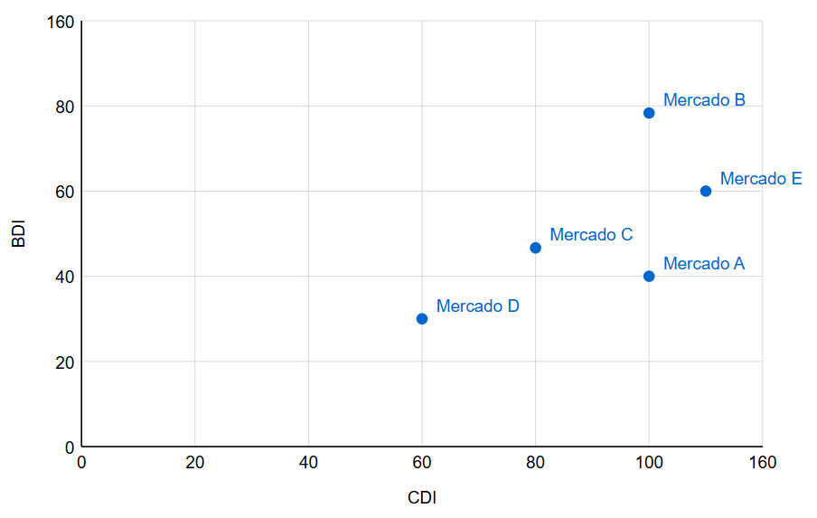

Se presenta adicionalmente el **índice de oportunidad de marca (BOI)** para identificar mercados a conquistar. **El BOI se calcula dividiendo el CDI por el BDI**. Un BOI alto indica una mayor oportunidad para el crecimiento de la marca.

**Factores adicionales**

Es importante tener en cuenta que el análisis BDI/CDI no es el único factor a considerar en la planificación geográfica. La distribución también juega un papel fundamental. Una marca puede tener un BDI bajo en un mercado debido a una distribución limitada. El BDI y el CDI son pues herramientas valiosas para comprender el rendimiento de una marca y su potencial de crecimiento y rentabilidad en diferentes mercados. Sin embargo, es crucial considerar estos índices en conjunto con otros factores, como la distribución y la competencia, para tomar decisiones informadas sobre la asignación de recursos de marketing.

</details>

------------------------------------------------------------------------

### B. Coeficiente (índice) de afinidad

> El coeficiente (índice) de afinidad mide la propensión de un grupo específico (segmento o clase) a consumir o usar un producto, servicio o marca en comparación con la población considerada en su conjunto.

El coeficiente de afinidad es fundamental para evaluar qué tan relevante o atractivo es un producto, servicio o marca para un grupo específico, ayudando a los especialistas en marketing a adaptar sus estrategias de segmentación y posicionamiento.

En particular, en el ámbito de la planificación de medios el coeficiente de afinidad proporciona información basada en datos que también ayuda a seleccionar los canales de medios más relevantes (o afines) para una campaña. No se trata solo de llegar a una audiencia (bruta), sino de llegar a la audiencia adecuada (útil). Esto asegura que el mensaje *resuene* con aquellos que tienen mayor propensión al consumo o uso del producto o servicio, lo que lleva a un mejor rendimiento de la campaña.

**Cálculo del coeficiente (índice) de afinidad**

| Paso | Descripción | Ejemplo |
|------------------|------------------------------|------------------------|
| 1 | Determinar el porcentaje del segmento o clase que usa/consume el producto o servicio | 20% de los adolescentes ven un programa específico de cocina |
| 2 | Determinar el porcentaje de la población total que usa/consume el producto os ervicio | 10% de la población ve el mismo programa de cocina |
| 3 | Dividir el porcentaje del segmento o clase entre el porcentaje de la población total y multiplicar por 100 | (20% / 10%) x 100 = 200 |

**Interpretación del resultado:**

-   Valores superiores a 100: Sugieren que el grupo objetivo tiene una mayor afinidad o inclinación por el producto en comparación con la población. Es un indicador aproximado de que el producto es especialmente atractivo o relevante para ese grupo específico.

-   Valores inferiores a 100: Señalan una menor afinidad del grupo objetivo respecto al producto.

------------------------------------------------------------------------

## Métricas relativas a los soportes:

**Audiencia o Audiencia Bruta**\
Número total de personas, expresado frecuentemente en miles (000), que se exponen regularmente a un soporte (vehículo) publicitario. Medida fundamental de alcance numérico que constituye la base para cálculos más específicos como la audiencia útil o la cobertura.

**Perfil de audiencia** El perfil de audiencia se refiere a la caracterización detallada de la audiencia de un medio o soporte publicitario. Esta caracterización va más allá de simples datos demográficos (edad, sexo, ubicación) e incluye, por ejemplo: - Hábitos de consumo de medios: Con qué frecuencia e intensidad consumen determinados medios (TV, radio, prensa, etc.). - Intereses y Estilo de vida: Qué tipo de contenido les atrae, sus aficiones, valores y actividades. - Nivel socioeconómico: Nivel de ingresos, educación, ocupación. - ...

**Índice de Utilidad**\
Expresa el tanto por uno de la audiencia (bruta) de un soporte que corresponde a la población objetivo. Permite evaluar la eficacia del soporte en términos de su capacidad para alcanzar específicamente al público deseado.

**Audiencia Útil**\
Número de personas de la audiencia de un soporte que pertenece específicamente al público objetivo. Refina la audiencia bruta para centrar los esfuerzos de marketing en el público relevante o target para la campaña publicitaria.

**Soporte**\
*Vehículo* dentro de un [medio publicitario](https://www.infoadex.es/wp-content/uploads/2024/01/Resumen-Estudio-InfoAdex-2023.pdf) que *transporta* o difunde el mensaje al público objetivo. Características:

-   Es el canal específico de transmisión del mensaje
-   Puede ser un programa, una publicación, una web específica, etc.
-   Su selección afecta directamente a la efectividad del mensaje
-   Determina el contexto de exposición al mensaje

**Inserción**\
Colocación física o digital de un anuncio en un soporte publicitario específico. Representa la acción de situar el anuncio o mensaje en el vehículo de medios. Aspectos clave:

-   Es el acto de colocación del anuncio en el medio
-   Genera oportunidades de ver (OTS) para la audiencia del soporte
-   No garantiza la exposición efectiva
-   Su efectividad depende de factores como ubicación, formato o contexto

**OTS ( *Opportunity To See* )**\
Oportunidad(es) de ver, oír o leer el anuncio o la oferta promocional. Características fundamentales:

-   En singular: representa una única oportunidad de contacto con el mensaje
-   En plural: equivale a la frecuencia promedio de exposición
-   Representa una oportunidad de ver, leer o escuchar el anuncio durante el ciclo publicitario, no la atención efectiva
-   Es la unidad básica para medir la intensidad de una campaña

## Métricas de cobertura y frecuencia

**Alcance o Cobertura (Reach)**\
Número absoluto (o relativo) de individuos expuestos al menos una vez ($\geq$ 1) a un mensaje publicitario durante un ciclo específico. Características clave:

-   Es uno de los tres parámetros básicos del plan de medios, junto con la frecuencia y la distribución de exposición
-   Se centra en individuos únicos, no en exposiciones
-   Puede expresarse en términos absolutos o porcentuales
-   Es la base para el cálculo del alcance efectivo

**Patrón de Alcance (Reach Pattern)**\
Distribución de la continuidad (estrategias de *continuity*, *flighting* o *pulsing*) de ciclos publicitarios para alcanzar el alcance efectivo durante el período de planificación. Tipos principales:

-   Patrones para Nuevos Productos:

    -   Blitz Pattern (patrón blitz)
    -   Wedge Pattern (patrón cuña)
    -   Reverse-wedge/PI Pattern (patrón cuña inversa/PI)
    -   Short Fad Pattern (patrón moda corta)

-   Patrones para Productos Establecidos:

    -   Regular Purchase Cycle Pattern (patrón de ciclo de compra regular)
    -   Awareness Pattern (patrón de conciencia o notoriedad)
    -   Shifting Reach Pattern (patrón de alcance cambiante o acumulado)
    -   Seasonal Priming Pattern (patrón estacional)

**Frecuencia**\
Número medio de exposiciones por individuo en un ciclo publicitario. Aspectos relevantes:

-   Es un promedio de exposiciones por individuo alcanzado
-   Debe analizarse junto con su distribución de exposición (o contactos)

**Distribución de Exposición (o Contactos)**\
Distribución de frecuencia de exposiciones en un ciclo publicitario. Incluye:

-   Porcentaje no alcanzado (0 exposiciones)
-   Porcentaje con exclusivamente 1 exposición
-   Porcentaje con exclusivamente 2 exposiciones
-   ...

También se calcula la distribución de exposiciòn acumulada, es decir, individuos expuestos al menos i exposiciones.

**Rating Point (RP)**\
Representa el 1% de la población alcanzada en caso de realizar una inserción en el soporte publicitario. Características:

-   Es una medida estándar en medios publicitarios de difusión
-   Facilita la comparación entre diferentes soportes y campañas
-   Base para el cálculo de GRPs

**GRPs (Gross Rating Points)**\
Es una estimación del total de oportunidades de exposición promedio por cada 100 individuos de la población (o target). Se calcula:

-   Método básico recomendado (Cobertura × Frecuencia):

    -   *GRP = Cobertura (%) × Frecuencia media*
    -   Ejemplo: Si alcanzamos al 60% del público (o target) con una frecuencia media de 4 impactos, GRP = 60 × 4 = 240 GRPs

-   Método: impactos:

    -   *GRP = (Número total de impactos / Población) × 100*
    -   Ejemplo: Si generamos 1.500.000 impactos con una población de 500.000 personas, GRP = (1.500.000 / 500.000) × 100 = 300 GRPs

-   Método: audiencia por inserción:

    -   *GRP = Suma de las audiencias i (%) por cada inserción realizada en el soporte i*
    -   Ejemplo: Si contratamos 1 spot en cada soporte con audiencias de S1: 20%, S2: 15% y S3: 25%, GRP = 20 x 1 + 15 x 1 + 25 x 1 = 60 GRPs

En este contexto, señalamos una de las principales limnitaciones del uso de los valores GRPs como único indicador:

**Caso 1:**

-   Cobertura: 80% del público objetivo
-   Frecuencia: 3 impactos
-   GRPs = 80 × 3 = 240 GRPs

**Caso 2:**

-   Cobertura: 40% del público objetivo
-   Frecuencia: 6 impactos
-   GRPs = 40 × 6 = 240 GRPs

Ambos planes dan 240 GRPs, pero son estrategias muy diferentes:

-   El primer caso alcanza a más público (mayor cobertura) con menos frecuencia media
-   El segundo caso alcanza a menos público pero con más frecuencia media

Problemas que esto genera:

-   No refleja la distribución real de los impactos
-   No indica si estamos sobre-exponiendo a una parte del público
-   No muestra si hay personas que no reciben ningún impacto
-   No considera la calidad de los impactos o el contexto
-   Puede llevar a decisiones erróneas si solo se mira el número final

## Métricas de eficiencia y costes

**CPM (Coste Por Mil)**\
Coste de alcanzar a mil personas de la audiencia o de la cobertura alcanzada. Características:

-   Se calcula dividiendo el coste total de una inserción (o del plan de medios) entre el número de personas de la audiencia (o la cobertura, según corresponda)
-   Permite comparar eficiencia entre soportes o planes de medios
-   Para el target específico se denomina CPMT

**Coste por Contacto Útil**\
Representa el coste de alcanzar a una persona de la audiencia útil. Características:

-   Se calcula dividiendo el coste total de una inserción entre el número de personas de la audiencia útil
-   Proporciona una medida más precisa que el CPM
-   Considera específicamente el público objetivo

**SOV (Share of Voice)**\
Representa la cuota de voz o presencia publicitaria de una marca en comparación con sus competidores. Características:

-   Indica la dominancia relativa en el mercado publicitario
-   Permite comparar la presencia mediática entre competidores o medios en que se programa
-   Es un indicador clave del esfuerzo publicitario relativo

## Métricas avanzadas de planificación

**Ciclo Publicitario**\
Período específico durante el cual se desarrolla una actividad publicitaria planificada. Puede variar desde:

-   Una exposición continua durante todo el período
-   Ciclos discontinuos con duraciones variables u oleadas (*flighting o pulsing*).

En particular, en lugar de mantener una presión publicitaria constante durante todo el ciclo, el *flighting o pulsing* se basa en la idea de concentrar la inversión en momentos estratégicos, aprovechando el *carryover publicitario*, que es la persistencia (de parte) del efecto de la publicidad después de que la exposición ha cesado. 

Ejemplos: 

- *Regular Purchase Cycle*: Este patrón se utiliza para productos con ciclos de compra regulares, como alimentos o productos de higiene personal. La publicidad se concentra en períodos que coinciden con los momentos de compra, con intervalos de pausa entre cada oleada. 

- *Awareness*: Se usa para productos con ciclos de compra largos, como bienes inmobiliarios o automóviles. La publicidad se implementa en ciclos espaciados, con una baja frecuencia por ciclo, pero manteniendo una continuidad anual para reforzar la presencia de marca.

Las ventajas de usar oleadas en un ciclo publicitario:

-   Optimización del presupuesto: Permite concentrar la inversión en momentos de mayor impacto, evitando el desperdicio en períodos de menor receptividad.
-   Aprovechamiento del _carryover_: Se maximiza el efecto de la publicidad, ya que el impacto de las oleadas anteriores se mantiene (parcialmente) durante los períodos de pausa.
-   Mayor flexibilidad: Permite adaptar la estrategia a las fluctuaciones del mercado, la estacionalidad o la actividad de la competencia.

**Ciclo de Compra (Purchase Cycle)**\
Intervalo medio de tiempo entre compras sucesivas en una categoría de producto o servicio. También conocido como:

-   IPT ( *Inter-Purchase Time* ): tiempo entre compras
-   IPI ( *Inter-Purchase Interval* ): intervalo entre compras

Es fundamental para: - Determinar momentos óptimos de comunicación - Establecer la frecuencia efectiva (mínima) de exposición - Diseñar patrones de alcance efectivos - Sincronizar la comunicación con el comportamiento de compra

**Timing**\
Táctica que busca sincronizar la comunicación con momentos de elevada receptividad del público objetivo. Implica:

-   Selección estratégica de momentos de contacto
-   Consideración de ciclos de compra y activaciones del reconocimiento de la necesidad de la categoría
-   Optimización de la efectividad del mensaje

**Frecuencia Efectiva**\
Número de exposiciones, en un ciclo publicitario, necesario para maximizar la disposición de compra del público objetivo. Se expresa como:

-   MEF (Minimum Effective Frequency): nivel mínimo necesario
-   MaxEF (Maximum Effective Frequency): nivel máximo antes de generar desgaste

**Carryover Publicitario (Advertising Carryover)**\
Persistencia de la disposición de compra generada por las exposiciones publicitarias. Aspectos clave:

-   Es el efecto posterior al ciclo publicitario
-   Es especialmente clave en exposiciones espaciadas en el tiempo
-   Afecta directamente al alcance efectivo activo

**Alcance Efectivo**\
Número de individuos del público objetivo que deben alcanzarse al nivel de MEF o superior en un ciclo publicitario. Características:

-   Combina alcance y frecuencia efectiva
-   Se define dentro del rango [MEF, MaxEF]
-   Es un parámetro clave para evaluar planes de medios

**Alcance Efectivo Activo**\
Alcance efectivo después del ciclo publicitario. Características:

-   Mide la persistencia del efecto publicitario
-   Considera el fenómeno de *carryover*
-   Es clave para evaluar la efectividad a largo plazo
-   Depende de la tasa de decaimiento de los efectos publicitarios

**Dominancia**\
Estrategia en que la frecuencia MEF se establece deliberadamente por encima de la competencia principal. Características:

-   Busca establecer presencia superior
-   Es especialmente relevante en momentos críticos del mercado

------------------------------------------------------------------------

<details>

<summary>Ejemplo de diversas métricas</summary>

------------------------------------------------------------------------

**Tabla de principales métricas**

| Soporte | Audiencia_miles | Inserciones | RP | SOV | Tarifa_Pag_Color | CPM | C/RP | Indice_Utilidad | Audiencia_Util_miles | Coste_Contacto_Util |
|-------|-------|-------|-------|-------|-------|-------|-------|-------|-------|-------|
| D 1 | 150000 | 1 | 30 | 40,54 | 500 | 3,33 | 16,67 | 0,30 | 45000 | 0,01 |
| D 2 | 100000 | 1 | 20 | 27,03 | 250 | 2,50 | 12,50 | 0,20 | 20000 | 0,01 |
| D 3 | 120000 | 1 | 24 | 32,43 | 400 | 3,33 | 16,67 | 0,25 | 30000 | 0,01 |

------------------------------------------------------------------------

**Tabla de comparación de opciones publicitarias en función del coste relativo**

| Opción | Coste | Alcance | CPM | C/RP |
|---------------|---------------|---------------|---------------|---------------|
| D 4 | 5.000€ | 100.000 jóvenes adultos | **50€** (5.000€ / (100.000 / 1.000)) | **100€** (5.000€ / (100.000 / 500.000 \* 100)) |
| D 5 | 2.500€ | 25.000 jóvenes adultos (5% de la población = 5 RP) | **100€** (2.500€ / (25.000 / 1.000)) | **500€** (2.500€ / 5) |

Población = 500.000 personas

------------------------------------------------------------------------

La función **calcular_metricas_medios()** del paquete mediaPlanR permite estimar la tabla resumen del conjunto de soportes elegidos.

### Aplicación de la función:

``` r
resultado <- calcular_metricas_medios(
  soportes = c("D 1", "D 2", "D 3"),
  audiencias = c(1500, 1000, 1200),
  tarifas = c(500, 250, 400),
  ind_utilidad = c(0.3, 0.20, 0.25),
  pob_total = 39500000)
head(resultado)
```

</details>

------------------------------------------------------------------------

## Objetivos del Plan de Medios y Soportes

El objetivo del plan de medios y soportes reside en lograr que la disposición hacia la compra del _target_ supere un determinado nivel crítico, y considera para ello tres elementos clave u objetivos de comunicación:

**Objetivos de exposición**:

-   _Cobertura y frecuencia efectivas_

**Objetivos de comunicación**:

-   _Need for the category_ (necesidad de la categoría)
-   _Brand awareness_ (memoria y sus modos de recuperación: recuerdo y reconocimiento)
-   _Brand attitude_ (asociación entre una marca y su uso, y un valor dado)
-   _Brand purchase intention_ (disposición a la compra)
-   _Purchase Facilitation_ (facilitación de compra)

<details>

<summary>Ver más detalles.</summary>

------------------------------------------------------------------------

Los **objetivos de comunicación** son fundamentales en el proceso publicitario ya que establecen conexiones mentales duraderas entre la marca y el consumidor potencial. Estos objetivos se materializan a través de cinco efectos de comunicación que deben estar presentes antes de que el comprador tome acción:

- **Necesidad de Categoría**

    Esta es la base del proceso, y se refiere a la aceptación por parte del consumidor de que necesita un producto o servicio para satisfacer una discrepancia entre su estado actual y el deseado. Por ejemplo, reconocer la necesidad de un automóvil es el primer paso antes de considerar una marca específica.

    Imagina el lanzamiento de los primeros servicios de _streaming_ de música como Spotify. Inicialmente, la tarea comunicacional no era convencer sobre las ventajas de Spotify sobre otros servicios similares, sino crear la necesidad de categoría: ¿por qué alguien necesitaría un servicio de _streaming_ de música cuando ya tenía su música descargada? La comunicación debía enfocarse en mostrar los problemas que resolvía esta nueva categoría: el espacio limitado en los dispositivos, la imposibilidad de descubrir nueva música fácilmente, la dificultad de acceder a toda la música que uno desea.

    Otros casos clásicos que ilustran el objetivo de la necesidad de la categoría: [A Case Study on American Express “Don’t Leave Home Without It](https://thebrandhopper.com/2024/09/17/a-case-study-on-american-express-dont-leave-home-without-it/)

- **Memoria de marca, conciencia o notoriedad de marca**

    Se define como la capacidad del consumidor para identificar y diferenciar la marca dentro de su categoría. Es importante notar que la notoriedad o la _conciencia de marca_ puede evidenciarse tanto por el reconocimiento (como ver el envase en una tienda) como por el recuerdo (rememorar la marca cuando surge la necesidad).
    
    En este contexto, Tesla ofrece un excelente ejemplo de construcción de conciencia de marca. Cuando ingresó al mercado, su estrategia no se basó en publicidad tradicional masiva, sino en crear elementos distintivos muy reconocibles: un diseño minimalista único, el logo característico, y la interfaz de pantalla táctil gigante. Estos elementos hacen que un Tesla sea instantáneamente reconocible, tanto en el punto de venta como en la calle. Además, la marca construyó un fuerte recuerdo de marca a través de la asociación con innovación y sostenibilidad.
    
- **Actitud hacia la Marca**

    Se refiere a la evaluación que hace el consumidor sobre la capacidad de la marca para satisfacer una motivación relevante. La actitud se compone de creencias sobre los beneficios funcionales y asociaciones emocionales que el consumidor vincula con la marca, y la importancia percibida de cada uno de ellos.

    Nike representa un caso maestro de construcción de actitud hacia la marca. Su comunicación va más allá de los beneficios funcionales de su calzado deportivo para crear una conexión emocional profunda con el "espíritu deportivo". Su eslogan "_Just Do It_" y sus campañas no venden simplemente zapatos ergonómicos, sino que también venden superación personal, determinación y excelencia. Esta actitud positiva hacia la marca se construye mediante la combinación de beneficios funcionales (tecnología, comodidad, durabilidad) con beneficios emocionales (confianza, inspiración, pertenencia).

- **Intención de Compra, disposición, desplazamiento mental**

    Se define como la disposición del consumidor para comprar la marca. Es interesante notar que la intención de compra puede variar según el nivel de implciación del consumidor o usuario - para productos de baja implicación, una actitud favorable (superficial o _soft_) puede ser suficiente, mientras que para productos de alta implicación se necesita generar una actitud _hard_ y una intención explícita.

    Apple maneja magistralmente la generación de intención de compra, especialmente en sus lanzamientos de iPhone. Observa cómo construyen anticipación semanas antes del lanzamiento, filtran estratégicamente información, crean eventos de presentación que son verdaderos espectáculos y generan listas de espera. Para un producto de alto involucramiento como un smartphone, no basta con que te guste la marca; Apple busca crear una urgencia de compra inmediata.

- **Facilitación de Compra**

    Este último efecto asegura que no existan obstáculos en el proceso de compra, como problemas de distribución, precio o disponibilidad que puedan impedir la adquisición del producto.

    Amazon es el ejemplo perfecto de facilitación de compra. Su obsesión por eliminar cualquier fricción en el proceso de compra se refleja en innovaciones como:

    - El botón "Compra con 1-Click"
    - Prime con envío gratuito y rápido
    - Múltiples opciones de pago
    - Política de devolución simple
    - Reseñas detalladas de productos

</details>

------------------------------------------------------------------------

## A. Cobertura efectiva

> Se refiere al porcentaje o número absoluto de individuos del público objetivo que debe estar expuesto al mensaje publicitario una frecuencia igual o superior a la frecuencia efectiva mínima (MEF).

## B. Frecuencia efectiva

> Se refiere al número de veces ( *oportunidades de ver* ) que un individuo debe exponerse a un mensaje publicitario dentro del ciclo publicitario para que la publicidad logre disponer al individuo hacia la compra de la marca. La frecuencia efectiva se define en el contexto de dos límites, a saber, **Frecuencia Efectiva Mínima (MEF) y Frecuencia Efectiva Máxima (MaxEF)**.

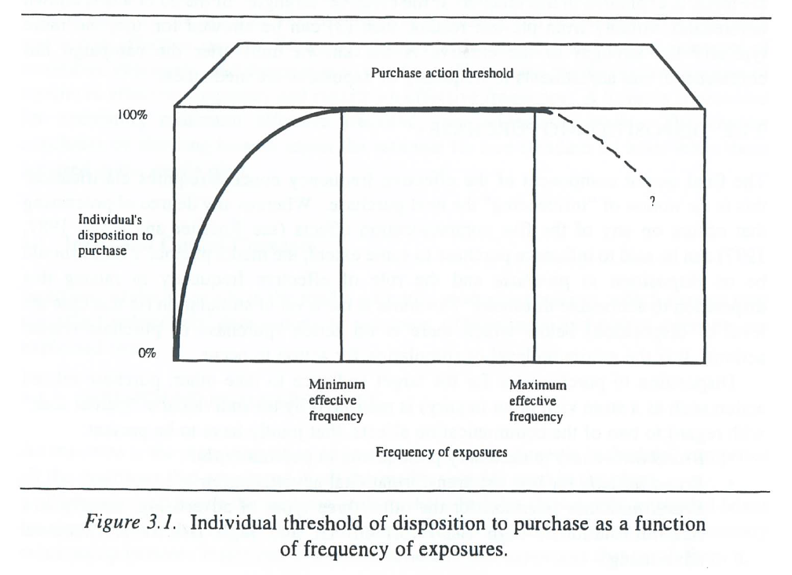 <sub>Nota: *La imagen ha sido tomada de "Advanced Media Planning", por J. R. Rossiter y P. J. Danaher, 1998, Kluwer Academic Publishers. Copyright 1998 por Kluwer Academic Publishers. Reproducido con fines académicos.*</sub>

### B.1. Frecuencia Efectiva Mínima (MEF)

> Es el número mínimo de exposiciones necesarias para que la disposición a la compra supere el umbral crítico que activa el comportamiento deseado. Por debajo del valor MEF la publicidad no será efectiva, es decir, *no habrá merecido la pena*.

### B.2. Frecuencia Efectiva Máxima (MaxEF)

> La Frecuencia Efectiva Máxima (MaxEF) es el límite superior de exposiciones recomendado por ciclo. El valor MaxEF se alcanza cuando las exposiciones adicionales ya no aumentan la probabilidad de compra, e incluso, puede decrecer.

-   En suma, pueden producirse dos efectos:

    -   ***Wear-in***: Este efecto describe la fase inicial en la que la repetición de la exposición a un anuncio aumenta su efectividad. A medida que el público objetivo ve el anuncio más veces, se familiariza con el mensaje, lo que puede llevar a un mayor *memoria*, una mejor *comprensión del mensaje* y una *actitud más favorable hacia la marca y su uso*.
    -   ***Wear-out***: Este efecto se produce cuando la repetición excesiva de un anuncio comienza a tener un impacto negativo en su efectividad. El público puede llegar a cansarse del anuncio, considerarlo repetitivo o incluso irritante, lo que podría generar, por ejemplo, una actitud negativa hacia la marca.

Finalmente, es importante destacar que el concepto de frecuencia efectiva se combina con el efecto _**recencia**_, que enfatiza la importancia de llegar a los receptores cerca del momento en que están predispuestos para realizar una compra. La publicidad de comida a altas horas de la noche, dirigida a personas que buscan opciones rápidas y convenientes, es un ejemplo del efecto _recency_ en acción. 

La recencia no se centra en alcanzar un número específico de exposiciones como la frecuencia efectiva, sino en estar presente en el mercado de manera constante para influir en las decisiones de compra en el momento oportuno.

------------------------------------------------------------------------

## C. Guía de cálculo de la Frecuencia Efectiva Mínima (MEF)

La frecuencia efectiva mínima (MEF) se puede determinar mediante la fórmula:

$$
\text{MEF/c} = 1 + \text{VA} \times (\text{TA} + \text{BA} + \text{BATT} + \text{PI})
$$

Donde:

$$
\begin{aligned}
\text{VA} & = \text{Vehicle Attention (Atención al medio)} \\
\text{TA} & = \text{Target Audience (Audiencia objetivo)} \\
\text{BA} & = \text{Brand Awareness (Notoriedad de marca, memoria)} \\
\text{BATT} & = \text{Brand Attitude (Actitud hacia la marca, y su uso)} \\
\text{PI} & = \text{Personal Influence (Influencia personal)}
\end{aligned}
$$

Los valores se presentan en la siguiente tabla que presenta un marco de referencia para la corrección de la frecuencia efectiva en ciclos publicitarios, basándose en cuatro factores fundamentales: la atención al medio, el tipo de público objetivo, los objetivos de comunicación y el nivel de influencia personal. Es una herramienta que permite pues ajustar el número de exposiciones necesarias (MEF) dependiendo de las características específicas de cada campaña publicitaria y la posición de la marca en el mercado.

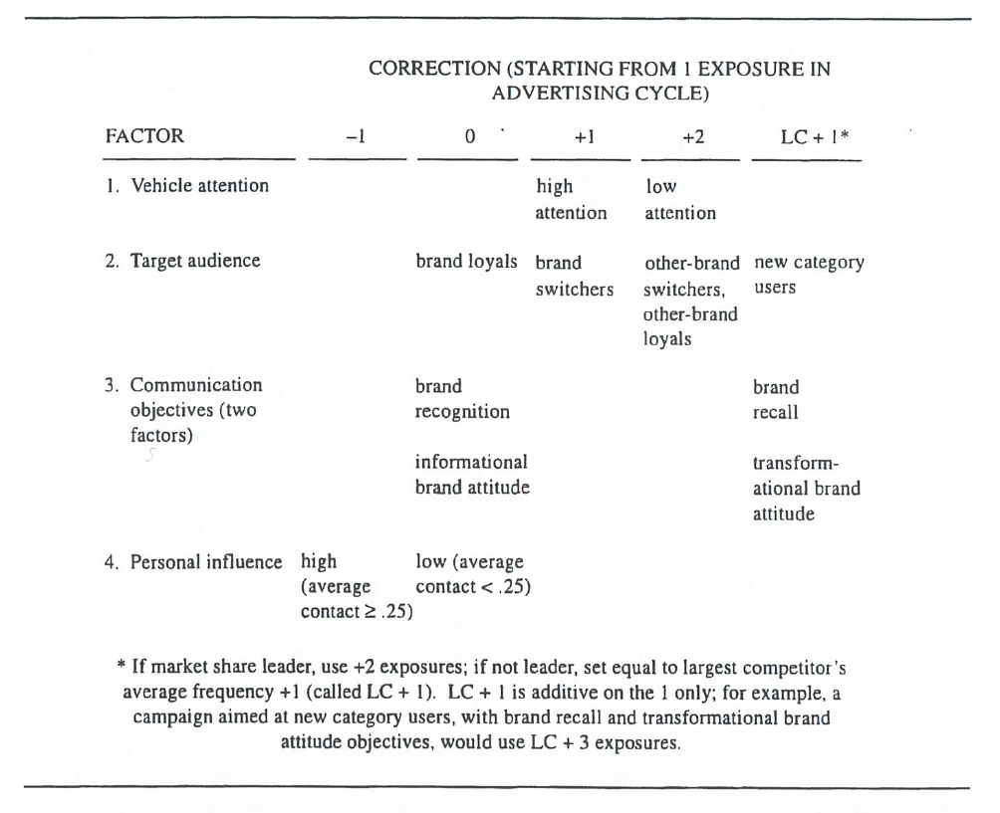 <sub>Nota: *La imagen ha sido tomada de "Advanced Media Planning", por J. R. Rossiter y P. J. Danaher, 1998, Kluwer Academic Publishers. Copyright 1998 por Kluwer Academic Publishers. Reproducido con fines académicos.*</sub>

------------------------------------------------------------------------

<details>

<summary>Ver más detalles.</summary>

---

## Conceptos Clave en el Cálculo de MEF (Minimum Effective Frequency)

### _Vehicle Attention_ (VA)

El concepto de atención al vehículo mediático se refiere al nivel de procesamiento cognitivo que un medio específico demanda de su audiencia. Se fundamenta en la capacidad del medio para captar y mantener la atención del espectador/lector/oyente.

- **Medios con Alto Valor de Atención**:

    - **Televisión**: La televisión, al ser un medio audiovisual, tiene un alto potencial para captar la atención del público. Los anuncios televisivos pueden combinar imágenes, sonido y movimiento para crear un impacto visual y emocional significativo. Sin embargo, es importante tener en cuenta factores como la saturación publicitaria que puede disminuir la atención del público. En este sentido, televisión en _prime time_ suele ser considerada una franja de alto VA, mientrsa que otros horarios o franjas, a excepción del período que se corrsponde con los seriales a mediodía, se consideran franjas de bajo VA.

    - **Revistas**: La atención a las revistas varía según el tipo de publicación y el nivel de implicación del lector con su contenido. Las revistas especializadas, que se dirigen a un público con un alto interés en el tema, pueden generar un alto VA, ya que los lectores suelen prestar mayor atención al contenido.

    - **Internet**: La publicidad en Internet puede tener un alto VA debido a su capacidad de segmentación y personalización. La publicidad en línea puede dirigirse a usuarios con intereses específicos, lo que aumenta la probabilidad de que presten atención al mensaje.

- **Medios con Bajo Valor de Atención**:

    - **Radio**: La radio, al ser un medio únicamente auditivo, puede tener un VA más bajo que la televisión, ya que compite con otras actividades que el oyente puede estar realizando simultáneamente. No obstante, la atención a la radio también depende del tipo de programa y la fidelidad del oyente.

    - **Publicidad Exterior** (preferentemente móvil):  La atención a la publicidad exterior puede ser baja debido a la distracción del entorno y la brevedad de la exposición. Es fundamental considerar este factor al diseñar la campaña y seleccionar las ubicaciones. No obstante, la atención a la publicidad exterior, como vallas publicitarias, depende en gran medida del contexto y la ubicación. Un anuncio en una carretera con mucho tráfico puede pasar desapercibido, mientras que un anuncio en una parada de autobús, donde las personas tienen tiempo de observarlo, puede generar mayor atención.

    - **Prensa**: La atención a los anuncios en prensa escrita, como periódicos y revistas, puede ser baja si los lectores simplemente hojean las páginas sin detenerse a leer el contenido.

### _Target Audience_ (TA)

Se refiere a la clasificación de la audiencia según su relación actual con la marca y la categoría. Esta clasificación determina diferentes necesidades de exposición:

#### _Brand Loyals_ (BLs)

-   Son consumidores ya leales a la marca
-   Su comportamiento de compra ya está establecido
-   No requieren ajuste adicional en la frecuencia

#### _Favorable Brand Switchers_ (FBSs)

-   Son consumidores que alternan entre marcas pero tienen una actitud positiva hacia nuestra marca
-   El objetivo es reforzar su preferencia existente
-   Requieren al menos 1 exposición por ciclo

#### _Other-Brand Loyals_ (OBLs) y _Other-Brand Switchers_ (OBSs)

-   Son consumidores leales a otras marcas o que alternan entre otras marcas
-   El objetivo es persuadirlos para cambiar sus preferencias actuales
-   Requieren un ajuste adicional de +2 exposiciones

#### _New Category Users_ (NCUs)

-   Son consumidores nuevos en la categoría, o que han manifestado rechazo o resistencia a iniciativas comerciales previas.
-   Necesitan _educación_ sobre la categoría y la marca
-   Requieren el máximo ajuste

### _Communication Objectives_ (BA y BATT)

Se refiere a los objetivos específicos de comunicación que la marca busca alcanzar:

#### _Brand Awareness_ (BA)

-   Reconocimiento y recuerdo de marca ( _brand recognition_, _brand recall_)

    - **Reconocimiento** (disponible): El reconocimiento de marca se puede lograr con una frecuencia de exposición menor que el recuerdo. La simple exposición al anuncio, aunque no sea suficiente para generar un recuerdo, puede crear una familiaridad con la marca que facilite su reconocimiento posterior. Se beneficia de los aprendizajes parciales.

    - **Recuerdo libre o ayudado** (disponible y accesible): Para lograr un alto nivel de recuerdo, se requiere generalmente una mayor frecuencia de exposición. Las exposiciones repetidas refuerzan la información en la memoria.
    
    **El Reconocimiento en el contexto publicitario**:

    Este mecanismo cognitivo se manifiesta en la capacidad del consumidor para identificar elementos publicitarios previamente expuestos, operando mediante:

    1. Identificación de Marca:

        - Reconocimiento instantáneo de logotipos en entornos comerciales
        - Discriminación de elementos visuales distintivos
        - Activación de asociaciones marca-producto
    
    2. Procesamiento Periférico:
        - Detección automática de elementos cromáticos corporativos
        - Reconocimiento de _jingles_ y elementos sonoros distintivos
        - Identificación de _packaging_ y elementos de identidad visual

    **El Recuerdo como indicador de efectividad**:

    El recuerdo publicitario implica un procesamiento más profundo y constituye un indicador más robusto de la efectividad comunicacional, manifestándose en:

    1. Recuperación Activa:

        - Evocación espontánea de mensajes publicitarios
        - Reconstrucción de propuestas de valor
        - Articulación de beneficios producto-servicio

    2. Integración Cognitiva:

        - Incorporación del mensaje a esquemas mentales preexistentes
        - Construcción de narrativas marca-consumidor
        - Establecimiento de vínculos emocionales duraderos


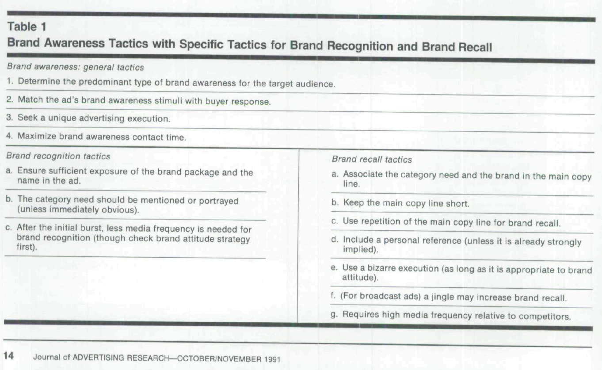 <sub>Nota: *La imagen ha sido tomada de "A better Advertising Planning Grid", por J. R. Rossiter et al, 1991, Journal of Advertising Research 31(5):11-21. Reproducido con fines académicos.*</sub>

### _Brand Attitude_ (BATT)

Se divide en dos tipos principales:

#### _Informational Brand Attitude_

-   Busca comunicar beneficios funcionales
-   Se centra en aspectos racionales, fácilmente observables y aprehensibles a través de los sentidos, del producto
-   No requiere un ajuste adicional sobre el base

-   Ejemplos: 
    
    Anuncio de un **medicamento para la acidez estomacal**:
    
      - Emoción (Problema): Malestar, dolor, frustración por la acidez.
      - Emoción (Solución): Alivio, bienestar, tranquilidad.
      - Enfoque: Mostrar a personas sufriendo los síntomas de la acidez, luego presentar el medicamento como una solución rápida y eficaz para aliviar el malestar.
    
    Anuncio de un **servicio de reparación de electrodomésticos**:
    
      - Emoción (Problema): Frustración, estrés, impotencia ante la avería del electrodoméstico.
      - Emoción (Solución): Tranquilidad, confianza, satisfacción.
      - Enfoque: Presentar situaciones cotidianas donde un electrodoméstico se avería, generando caos e inconvenientes. El servicio de reparación se muestra como la solución confiable y rápida para recuperar la normalidad.

#### _Transformational Brand Attitude_

-   Busca crear asociaciones emocionales y experienciales, transformando la esencia del producto
-   Requiere el máximo ajuste

-   Ejemplos:

    Anuncio de una marca de cerveza:
    
      - Emoción: Alegría, amistad, diversión, celebración.
      - Enfoque: Mostrar grupos de amigos disfrutando de momentos agradables y de la cerveza en un ambiente festivo y relajado. Se busca asociar la marca con la felicidad y la camaradería.
    
    Anuncio de un perfume:
    
      - Emoción: Sensualidad, elegancia, sofisticación, atracción.
      - Enfoque: Presentar imágenes sugestivas y elegantes con modelos atractivos utilizando el perfume. Se busca transmitir un aura de misterio y seducción, asociando el perfume con la belleza y la confianza en uno mismo.

 <sub>Nota: *La imagen ha sido tomada de "A better Advertising Planning Grid", por J. R. Rossiter et al, 1991, Journal of Advertising Research 31(5):11-21. Reproducido con fines académicos.*</sub>

La Figura _FCB Grid_ (desarrollado por la agencia de publicidad Foote, Cone & Belding) es una herramienta clásica y sencilla para comprender cómo los consumidores toman decisiones de compra y cómo se relacionan con diferentes productos y servicios en el mercado. Es un punto de partida para la planificación publicitaria, que debe complementarse con métodos más completos.

Este modelo se estructura en torno a dos dimensiones fundamentales: el **grado de implicación** (involvement) en el eje vertical, que va desde alta a baja implicación, y la **naturaleza de la decisión** en el eje horizontal, que oscila entre el pensamiento racional (think) y el sentimiento (feel).

- En el cuadrante superior izquierdo, donde confluyen la alta implicación y el pensamiento racional, encontramos productos y servicios que requieren una considerable deliberación cognitiva, como los seguros de vida, los seguros de automóvil y los coches familiares. Son decisiones que los consumidores toman con detenimiento y análisis.

- El cuadrante superior derecho, que combina alta implicación con decisiones emocionales, alberga productos como perfumes, coches deportivos y vinos para ocasiones especiales. Estas compras, aunque importantes, se basan más en preferencias personales y respuestas emocionales.

- En la parte inferior del grid, encontramos productos de baja implicación. A la izquierda, en el área de pensamiento racional, se sitúan productos cotidianos como productos de limpieza, repelentes de insectos y toallas de papel. A la derecha, en la zona emocional de baja implicación, aparecen productos como snacks, refrescos y cerveza regular, que suelen comprarse por impulso o placer inmediato.

Es importante señalar, como indica la nota al pie del _grid_, que el nivel de implicación aumenta hacia la parte superior del eje vertical y que ambas dimensiones son continuas, no categóricas. Esta continuidad permite una comprensión más matizada de cómo los consumidores se relacionan con diferentes productos y marcas. En este sentido, esta herramienta resulta especialmente valiosa para los profesionales del marketing, ya que permite adaptar las estrategias de comunicación y publicidad según la posición que ocupa cada producto en el grid, optimizando así la efectividad de sus mensajes y campañas.  

A continuación, te muestro un breve ejemplo ilustrativo del concepto _Informativo versus Transformativo_ de un producto de baja implicación:
    
  **Campaña Informativa**. Imagina una campaña publicitaria para una nueva cerveza artesanal cuyo objetivo principal e inicial es dar a conocer al público las características únicas de esta cerveza, diferenciándola de las cervezas industriales.

  - Información Clave: Se destacaría el origen de los ingredientes (lúpulo orgánico, agua de manantial), el proceso de elaboración artesanal (fermentación lenta, sin aditivos) y el sabor distintivo (notas cítricas, amargor equilibrado).
  - Medios Adecuados: Se podrían utilizar revistas especializadas en gastronomía y cerveza, anuncios en sitios web de reseñas de cerveza, y degustaciones en eventos gastronómicos.
  - Frecuencia Efectiva: La campaña repetiría la información clave en diferentes formatos para asegurar que el consumidor la recuerde. Se podrían usar infografías que expliquen el proceso de elaboración, videos cortos con el maestro cervecero hablando de la pasión por su producto, y testimonios de consumidores que destacan el sabor único de la cerveza.

  **Campaña Transformativa**: Imagina una campaña para una cerveza tradicional, ya conocida por el público. El objetivo no es tanto informar, sino transformar la percepción de la cerveza, asociándola con momentos de felicidad y conexión humana.

  - Mensaje Emocional: Se mostrarían escenas de amigos riendo y disfrutando de la cerveza en diferentes contextos: una reunión familiar, un partido de fútbol, una noche de juegos de mesa. La música y la estética del anuncio transmitirían una sensación de alegría y camaradería, a saber, gratificacións ensorial y aprobación social. La motivación es transformacional, buscando la gratificación a través del sabor y las sensaciones que la cerveza proporciona. 
  - Medios Masivos: Se utilizaría la televisión, con anuncios durante programas de entretenimiento y eventos deportivos. También se podrían usar plataformas de redes sociales, creando contenido que invite a los usuarios a compartir sus propias historias de momentos felices con la cerveza.
  - Conexión Emocional: La campaña buscaría generar una respuesta emocional en el espectador, haciéndole sentir nostalgia por momentos felices compartidos con amigos y familia. La cerveza se presentaría como un elemento que facilita y realza esos momentos de conexión.

En este sentido, si bien la estrategia de comunicación más efectiva para cualquier tipo de cerveza debería enfocarse en aspectos emocionales y experienciales, variando únicamente la intensidad de la implicación requerida en la decisión de compra, para una cerveza artesanal nueva en el mercado, sería estratégicamente válido:

- Primera Fase (Introductoria - Informativa):

  - Comunicar las características diferenciales (ingredientes, proceso, origen)
  - Educar sobre las cualidades organolépticas distintivas
  - Establecer credenciales de calidad y autenticidad
  - Construir _brand awareness_

- Segunda Fase (Transformativa):

  - Una vez establecido el conocimiento básico, transitar hacia comunicación más emocional
  - Enfatizar la experiencia de consumo
  - Construir conexiones emocionales
  - Reforzar aspectos sociales y hedónicos

Esta estrategia dual respetaría tanto la necesidad inicial de información como la naturaleza fundamentalmente emocional del producto en el largo plazo.

### _Personal Influence_ (PI)

- Define efecto multiplicador de la comunicación boca a boca y la influencia social:

#### Alto Contacto ($\geq$ 0.25)

-   Significa que al menos una de cada cuatro personas expuestas comparte el mensaje
-   Típico en productos con alto componente social
-   Reduce la necesidad de frecuencia publicitaria

#### Bajo Contacto (< 0.25)

-   Menor tasa de transmisión del mensaje entre personas
-   Típico en productos de consumo privado o baja implicación social
-   No permite reducir la frecuencia publicitaria

## Consideraciones adicionales para el Cálculo del MEF:

En la determinación del MEF, existen varias consideraciones críticas relacionadas con el tratamiento del competidor más grande (Largest Competitor, LC) y los ajustes necesarios en diferentes contextos mediáticos.

- Para marcas **líderes del mercado (LC)**, el valor que corresponde a la última columna de la tabla +2. Las marcas **no líderes (no LC)** deben igualar la frecuencia del competidor más grande más una exposición adicional (LC + 1). No obstante, este ajuste puede variar según el contexto competitivo específico, y no debe establecerse como un valor fijo.

    El valor del competidor más grande (LC) funciona como base única en la fórmula y se ajusta posteriormente según los requerimientos específicos de comunicación. Es crucial entender que el valor LC se incorpora una sola vez y no se duplica con cada ajuste adicional. Por ejemplo, en una campaña que requiere tanto recuerdo de marca como actitud transformativa, la fórmula sumará (LC + 1) + (~~LC~~ + 1), evitando la duplicación errónea de (LC + 1) + (LC + 1). Esta distinción es fundamental para prevenir una sobrestimación del efecto del competidor principal en la frecuencia necesaria.

- En situaciones donde el competidor más grande utiliza vehículos de baja atención (VA = 2), es fundamental realizar un ajuste específico en la fórmula del MEF para evitar una "sobre exposición". En estos casos, existen dos opciones válidas: 

    - Se puede corregir el valor del vehículo de atención de VA = 2 a VA = 1 cuando nuestra marca también emplea un medio de baja atención.
    - Se puede dividir por 2 el valor MEF del competidor más grande (LC). Esta corrección es necesaria porque se asume que el competidor dominante ya ha sobre dimensionado su frecuencia para compensar la naturaleza del vehículo de baja atención.

La implementación correcta de estos ajustes requiere una comprensión profunda del contexto competitivo y los objetivos de comunicación específicos. La fórmula del MEF, con sus diversos componentes y ajustes, debe verse como una herramienta de planificación flexible que se adapta a las condiciones particulares de cada situación de mercado.

</details>

------------------------------------------------------------------------

Finalmente, mostramos una propuesta alternativa de Ostrow (1982) basada en **factores de marketing, *copy* y medios** que determinan los niveles de frecuencia efectiva. La imagen se toma del artículo citado al pie de la tabla.

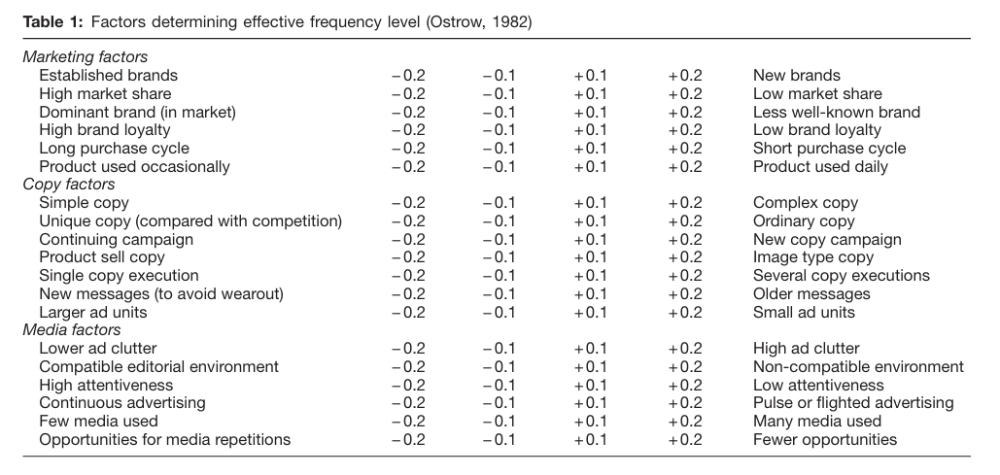 <sub>Nota: *La imagen ha sido tomada de "Advanced Media Planning", por J. R. Rossiter y P. J. Danaher, 1998, Kluwer Academic Publishers. Copyright 1998 por Kluwer Academic Publishers. Reproducido con fines académicos.*</sub>

---

<details>
<summary>Ver más detalles.</summary>

---

### Ejemplo: cálculo MEF

- No líder (no LC)
- Televisión en prime time
- Público leal a la marca
- Reconocimiento
- Estrategia informativa
- Influencia personal > 0.25 

MEF = 1 + 1 [0 + 0 + 0 - 1] = 0

---

- Líder (LC)
- Televisión en prime time
- No usuario de la categoría
- Recuerdo
- Estrategia transformativa
- Influencia personal > 0.25

MEF = 1 + 1 [2 + 2 + 2 - 1] = 6

---

- No Líder (No LC)
- MEF líder +4\ TV prime time
- Televisión prime time
- No usuario de la categoría
- Recuerdo
- Estrategia transformativa
- Influencia personal > 0.25

MEF = 1 + 1 [(4+1) + (~~4~~+1) + (~~4~~+1) - 1] = 7

---

- No Líder (No LC)
- MEF líder +4\ TV no prime time
- Televisión no prime time
- No usuario de la categoría
- Recuerdo
- Estrategia transformativa
- Influencia personal > 0.25

MEF = -1 + 2 [(4/2+1) + (~~4/2~~+1) + (~~4/2~~+1) - 1] = 9


</details>

---

<details>
<summary>Ver más detalles.</summary>

------------------------------------------------------------------------

### Ejemplo: lanzamiento de cerveza artesana

- La empresa C lanzará una nueva marca de cerveza artesana al mercado, dirigida al público no consumidor de cerveza artesanal. 
- La campaña de comunicación busca establecer una emoción basada en la alegría, amistad, diversión y celebración, mostrando grupos de amigos disfrutando de momentos agradables en un ambiente festivo y relajado. 
- Se busca asociar la marca con la felicidad y la camaradería. 

**Objetivos**:

- Cobertura efectiva: 85.000 personas
- Frecuencia efectiva mínima (FEM): ¿?

**Plan de medios y soportes**:

- Medio: Radio
- Soporte radiofónico Radio S1, horario 6:30-7:30
- Audiencia tras la primera inserción en S1: 100.000 personas.
- Audiencia acumulada tras la segunda inserción en S1: 120.000 personas.
- Programación temporal de las inserciones: Una inserción de lunes a viernes en S1 durante dos semanas consecutivas.
- Población total: 500.000 personas

**Detalles adicionales del plan**:

- FEM del mayor competidor: +2, también emplea la radio como canal principal de difusión de sus mensajes publicitarios.
- Influencia personal: +.25 (al menos uno de cada cuatro _influencers_ apoyarán la marca en su lanzamiento)
- Lugar de toma de la decisión de compra: En el hogar, debido al precio _premium_ que se establecerá.

**Preguntas**:

1. Analice la efectividad del plan de medios teniendo en cuenta los datos proporcionados.
2. Calcule el volumen de GRPs.
3. Considerando las opciones de estrategia de cobertura y distribución de contactos, ¿cuál recomendaría para esta campaña? Describa la estrategia elegida.
4. Emplee el paquete de R mediaPlanR, y valide sus resultados alcanzados manualmente.

</details>

------------------------------------------------------------------------

<details>

<summary>Ver más detalles.</summary>

------------------------------------------------------------------------

### Caso Práctico (ficticio): lanzamiento de VitaBiome+ en el Mercado de Yogures Funcionales

### Contexto de Mercado

NutriHealth planea lanzar VitaBiome+, un yogur probiótico _premium_, en un mercado valorado en \$2.500 millones anuales. El escenario competitivo muestra un claro dominio de Activia con un 45% de participación de mercado, seguido por Yakult con un 25%, mientras que el 30% restante se encuentra fragmentado entre diversos competidores menores.

### Características del Producto y Estrategia

VitaBiome+ se posiciona como un producto _premium_, respaldado por una cepa probiótica patentada y un contenido proteico 30% superior al mercado. Con un precio de \$4.99, se ubica un 80% por encima del promedio del mercado, comercializándose exclusivamente a través de canales _premium_ y tiendas especializadas. Esta estrategia apunta a un consumidor educado y con alto poder adquisitivo.

### Plan de Medios

La inversión publicitaria total asciende a \$2.5 millones, distribuidos estratégicamente en tres pilares principales: revistas de salud y bienestar, que constituyen el medio primario con un 60% del presupuesto; suplementos dominicales, que reciben un 25%; y revistas médicas profesionales, que completan el plan con un 15% de la inversión.

### Información Clave para el Cálculo del MEF

**Atención al Medio (Vehicle Attention)**

El plan combina medios primarios especializados (revistas de salud y profesionales) con medios secundarios (suplementos dominicales), creando un mix que requiere una consideración cuidadosa del factor VA.

**Audiencia Objetivo (Target Audience)**

El mercado está compuesto principalmente por consumidores actuales de yogures funcionales, considerados _Other Brand Loyals_, con un perfil socioeconómico alto y educado. El objetivo es convertir a estos consumidores de marcas establecidas.

**Objetivos de Comunicación**

La estrategia requiere un enfoque dual: _brand recall_ como objetivo principal, necesario para superar al líder del mercado, complementado con un componente _transformacional_ para establecer el posicionamiento _premium_ del producto.

**Influencia Personal (Personal Influence)**

La categoría de alimentos funcionales _premium_ se caracteriza por un alto componente de recomendación y respaldo profesional, con un coeficiente de contacto documentado de 0.3 para productos similares.

**Información Adicional Relevante**

Activia, como competidor principal (LC), mantiene una frecuencia media de 3 impactos semanales en sus medios principales. El ciclo de compra típico en la categoría es quincenal, y los estudios de mercado indican una alta sensibilidad a la recomendación profesional.

## Caso Práctico (ficticio): EcoRide Scooters

**Contexto de Mercado**

EcoRide planea introducir su línea de scooters eléctricos en un mercado dominado por Vespa Electric (40% de participación) y NIU Technologies (25%). Vespa Electric mantiene una frecuencia media de 4 impactos en medios digitales. El mercado de vehículos eléctricos de dos ruedas crece 40% anualmente y está valorado en $1.2 billones.

**Características del Producto y Estrategia**

Scooter eléctrico con autonomía de 120km, conectividad IoT y diseño minimalista. Precio: $2,999, posicionándose como alternativa premium y tecnológica frente a Vespa Electric ($3,500) y NIU ($2,500).

**Plan de Medios**

Inversión total: $3 millones

- **Digital: redes sociales y búsquedas**: 60%

- **Digital: portales tecnológicos y de movilidad**: 40%

**Información Clave para MEF**

- **_Vehicle Attention_**: Medios digitales que requieren mayor frecuencia por ser de baja atención.

    - Existe multitarea durante el consumo del medio
    - El tiempo de exposición es fragmentado y breve
    - Compiten con múltiple contenido simultáneo

- **_Target Audience_**: NCUs ( _New Category Users_) sin experiencia previa en la categoría. 

- **_Communication Objectives_**: _Brand recall_ y _transformational brand attitude_

    _**Brand recall**_
    - Crítico porque las decisiones de compra de scooters eléctricos típicamente ocurren "lejos" del punto de venta
    - El consumidor debe recordar activamente la marca EcoRide antes de su decisión de compra
    - Las búsquedas de información y comparaciones se realizan principalmente _online_
    - El proceso de decisión es extenso y complejo (producto de alta implicación)
    
    _**Transformational Brand Attitude**_
    - Busca transformar la percepción actual de los scooters eléctricos
    - Debe crear asociaciones emocionales con sostenibilidad e innovación
    - Necesita establecer beneficios experienciales más allá de los funcionales

- **_Personal Influence_**: Coeficiente de contacto moderado (0.28) que permite reducir un punto la frecuencia efectiva por el efecto de recomendación entre early adopters

A continuación, te propongo un plan para valorar si es probable alcanzar a la cobertura efectiva, sabiendo que el factor de covnersión es del 10 %, y el objetivo es vender 1.000 unidades el primer año. 

``` r
library(mediaPlanR)

?calc_metheringham()

matriz_dup <- matrix(c(
  50000, 45000, 62000,
  45000, 50000, 35000,
  62000, 35000, 60000
), nrow = 3, byrow = TRUE)

metricas <- calc_metheringham(
  audiencias = c(120000, 80000, 120000),
  inserciones = c(2, 3, 2),
  matriz_duplicacion = matriz_dup,
  ayuda = FALSE
)

metricas

```

</details>

------------------------------------------------------------------------

## Estrategias de cobertura y distribución de exposición

La planificación de medios se fundamenta en dos dimensiones críticas que determinan el impacto de una campaña publicitaria: **la cobertura (reach) y la distribución de exposición (frecuencia)**. Como se ha expuesto anteriormente:

> La cobertura representa el porcentaje del público objetivo que está expuesto al menos una vez al mensaje publicitario durante un período específico. 

> La distribución de exposición describe cómo se acumulan las exposiciones en el tiempo para cada individuo del público objetivo, considerando tanto el número de impactos como su espaciamiento temporal.

Estas dimensiones se entrelazan en lo que conocemos como patrones de planificación de medios, que son estrategias diseñadas para optimizar la relación entre cobertura y frecuencia según objetivos específicos. La elección del patrón adecuado depende de factores como el ciclo de vida del producto, el proceso de decisión de compra, la estacionalidad y el comportamiento del consumidor, entre otros factores.

Los patrones se dividen en dos grandes categorías:

> Patrones para Marcas Nuevas: Diseñados para productos que necesitan establecerse en el mercado, estos patrones tienden a priorizar una alta frecuencia inicial para generar conocimiento y consideración rápidamente.

> Patrones para Marcas Establecidas: Enfocados en mantener la presencia de marca y optimizar la inversión publicitaria a largo plazo, estos patrones suelen equilibrar la cobertura y la frecuencia de manera más eficiente.

La distribución de exposición en cada patrón puede ser:

> Continua: Mantiene un nivel constante de presión publicitaria

> Pulsante: Alterna períodos de alta y baja intensidad, incrementa o decrece la intensidad gradualmente

> Flighting: Concentra la actividad en períodos específicos, alterna períodos de actividad con períodos de hiatus

[Escuchar audio resumen](https://notebooklm.google.com/notebook/cfd21a5c-ca97-4971-9045-44318103d078/audio)

---

## Patrones para marcas nuevas

## El Patrón _Blitz_ en la Planificación de Medios

### Fundamentos y Aplicación

El modelo o patrón _Blitz_ representa la máxima expresión de intensidad publicitaria en el lanzamiento de nuevos productos o servicios al mercado. Esta estrategia se caracteriza por mantener una presencia publicitaria continua y dominante, alcanzando el 100% del público objetivo con una frecuencia mínima elevada durante el ciclo contratado. Su principal objetivo es maximizar la tasa de prueba del producto (*trial rate*) y suprimir los efectos de la publicidad competitiva mediante el dominio sostenido.

La potencia del patrón _Blitz_ radica en su capacidad para establecer el estándar de la categoría antes de la entrada de competidores. Esta aproximación permite asegurar el dominio en la comunicación desde el inicio, estableciendo una posición de liderazgo difícil de disputar por competidores subsecuentes. La estrategia aprovecha las ventajas del primer entrante, aunque esto implica asumir la responsabilidad y el costo de educar al mercado.

### Implementación y Desarrollo

La ejecución efectiva del patrón _Blitz_ requiere una planificación meticulosa que integre una estrategia de medios fundamentada en vehículos masivos de alta cobertura, complementados estratégicamente con medios de alta afinidad. Es crucial mantener una presión publicitaria constante y dominante, eliminando por completo los períodos sin publicidad (*hiatus*). La distribución de impactos debe ser homogénea, asegurando una presencia continua y consistente en el mercado.

Para lograr esta consistencia, resulta fundamental desarrollar un portafolio diverso de ejecuciones creativas que mantengan el interés del público sin generar desgaste (*wearout*). Este _pool_ de contenidos debe adaptarse según la naturaleza del producto y los objetivos de comunicación específicos de la campaña, considerando si se trata de publicidad informacional o transformacional.

### Aplicaciones y Contextos Óptimos

El patrón _Blitz_ demuestra particular efectividad en el lanzamiento de productos tecnológicos de nueva generación y plataformas digitales disruptivas. También resulta especialmente adecuado para nuevas cadenas de retail o servicios que pretenden redefinir una categoría de mercado. La clave del éxito reside en la capacidad de mantener una presencia dominante y consistente que establezca la marca como referente indiscutible de la categoría.

### Consideraciones Estratégicas y Evaluación

La implementación del patrón _Blitz_ debe adaptarse considerando la naturaleza del producto y el nivel de riesgo percibido en su prueba. El éxito se mide principalmente a través del alcance, la frecuencia de exposición y la capacidad de suprimir el impacto de la publicidad competitiva. La inversión requerida es significativa, pero debe contemplarse como el coste necesario para asegurar una posición de liderazgo sostenible en el mercado.

La transición posterior al período _Blitz_ debe planificarse cuidadosamente para mantener las ventajas competitivas adquiridas. Esto implica un monitoreo constante de la efectividad de la campaña y la disposición para realizar ajustes tácticos en el mix de medios según sea necesario. La evaluación continua de la respuesta del mercado y el análisis de la efectividad por canal son fundamentales para optimizar el retorno sobre la inversión publicitaria.

El patrón _Blitz_, aunque demandante en términos de recursos, representa una herramienta estratégica fundamental para aquellas marcas que buscan establecer un liderazgo clave en categorías nuevas o en proceso de redefinición. Su implementación exitosa requiere no solo una inversión significativa, sino también un compromiso con la excelencia en la ejecución y una comprensión profunda de la dinámica del mercado objetivo.

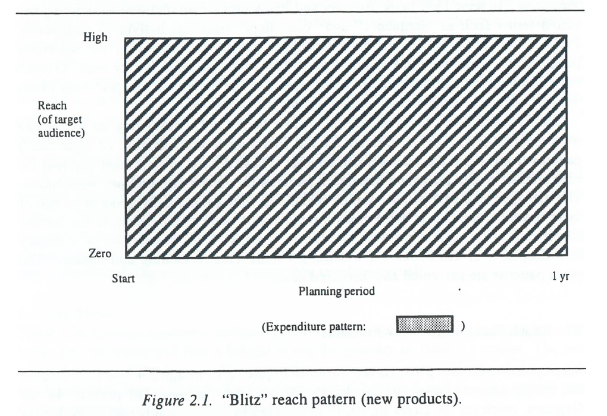 <sub>Nota: *La imagen ha sido tomada de "Advanced Media Planning", por J. R. Rossiter y P. J. Danaher, 1998, Kluwer Academic Publishers. Copyright 1998 por Kluwer Academic Publishers. Reproducido con fines académicos.*</sub>

## El Patrón _Wedge_ en la Planificación de Medios

### Fundamentos y Aplicación

El patrón _Wedge_  representa el enfoque más común para el lanzamiento de nuevos productos, caracterizándose por una estrategia de intensidad decreciente que mantiene el alcance mientras ajusta la frecuencia. Es importante notar que este patrón se refiere específicamente al patrón de *expenditure* (gasto) y no al patrón de alcance.

### Estrategia y Desarrollo

La lógica del patrón _Wedge_ se fundamenta en el comportamiento natural del consumidor frente a nuevos productos. La fase inicial de alta intensidad busca crear un fuerte conocimiento de marca (*brand awareness*) y facilitar el aprendizaje sobre los beneficios del producto (publicidad informacional) mientras se construye la imagen deseada (publicidad transformacional). Esta estrategia resulta particularmente efectiva para productos de compra regular, donde la prueba inicial puede conducir a la conversión de consumidores en *favorable brand switchers* (consumidores favorables a la marca) o *brand loyals* (consumidores leales a la marca).

La eficiencia del patrón radica en reconocer que los consumidores que prueban y adoptan el producto en las fases iniciales requerirán menor frecuencia de exposición publicitaria en ciclos posteriores para mantener su estado de comunicación efectiva. Este principio permite una optimización natural de la inversión publicitaria a lo largo del tiempo.

### Implementación Práctica

El desarrollo del patrón Wedge se estructura típicamente en tres fases principales. La primera fase establece una presencia contundente en el mercado, similar a un _blitz_ inicial pero de menor duración. La segunda fase introduce una reducción gradual de la presión publicitaria, mientras que la tercera fase se centra en el mantenimiento estratégico de la presencia de marca.

La planificación de medios evoluciona con cada fase, comenzando con una combinación de medios masivos y de alta afinidad, para luego transitar hacia una optimización que prioriza los medios más eficientes en términos de coste-beneficio. Esta evolución debe mantener la cobertura o alcance mientras se ajusta la frecuencia.

### Consideraciones Estratégicas

El efecto multiplicador de la primera oleada justifica la reducción gradual de la frecuencia publicitaria, permitiendo una optimización presupuestaria sin comprometer el impacto en el mercado.

La duración de cada fase debe determinarse considerando factores como el ciclo de compra de la categoría, la complejidad del producto y la velocidad de adopción del mercado. Las transiciones entre fases deben ser fluidas y responder a la retroalimentación del mercado, manteniendo un monitoreo constante de indicadores clave como la tasa de prueba del producto, la conversión a compras repetidas y el desarrollo de lealtad de marca.

El patrón Wedge representa una aproximación sofisticada y eficiente a la introducción de nuevos productos, combinando el impacto inicial necesario para establecer la marca con una optimización gradual que reconoce y aprovecha la dinámica natural del mercado.

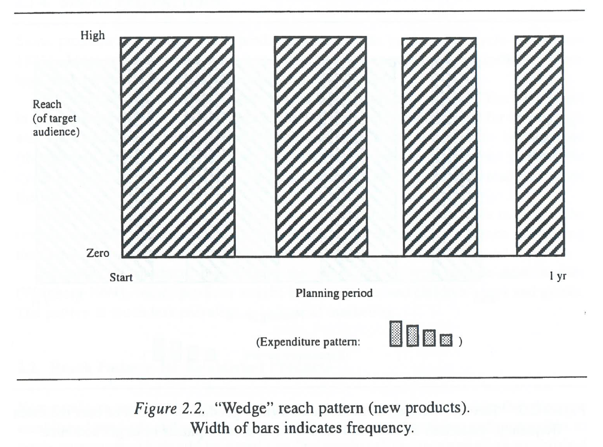 <sub>Nota: *La imagen ha sido tomada de "Advanced Media Planning", por J. R. Rossiter y P. J. Danaher, 1998, Kluwer Academic Publishers. Copyright 1998 por Kluwer Academic Publishers. Reproducido con fines académicos.*</sub>

## El Patrón _Reverse-Wedge/PI_ en la Planificación de Medios

### Fundamentos y Concepto

El patrón _Reverse-Wedge_, también conocido como _PI (Personal Influence)_, representa una estrategia de planificación de medios que capitaliza el poder de la influencia personal como catalizador para la adopción de productos o servicios. A diferencia del Wedge tradicional, este patrón comienza con un alcance limitado que se expande progresivamente, aprovechando el efecto multiplicador de la influencia social y la comunicación entre pares.

### Estrategia y Principios

La esencia del Reverse-Wedge/PI radica en su comprensión sofisticada de cómo se difunden las innovaciones en el mercado. El patrón reconoce que, para ciertos productos y servicios, la adopción exitosa depende más de la influencia personal y la validación social que de la simple exposición publicitaria masiva. La estrategia construye deliberadamente una base de *innovators* (innovadores) y *early adopters* (adoptadores tempranos) que, actuando como líderes de opinión, facilitarán la expansión hacia el mercado masivo.

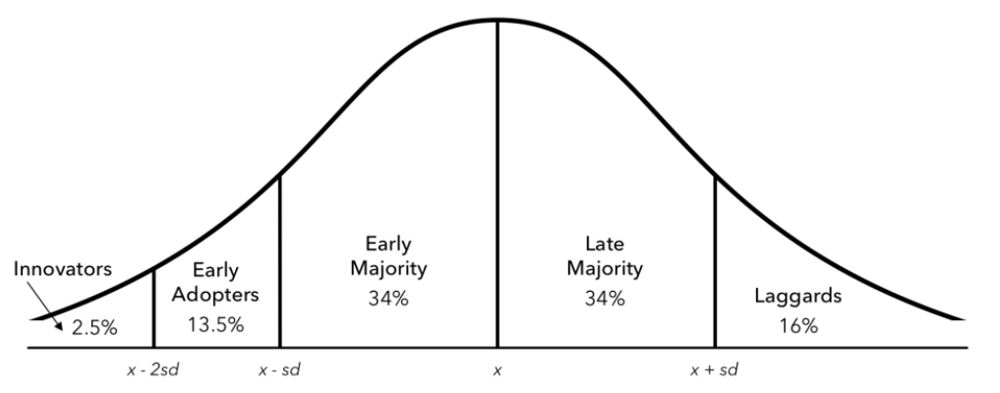

### Implementación Práctica

El desarrollo del patrón se estructura en tres fases claramente diferenciadas. La primera fase se centra en los innovadores y *early adopters*, utilizando medios altamente segmentados y especializados. Por ejemplo, en el caso de una nueva tecnología empresarial, esta fase se enfoca en líderes de opinión del sector a través de medios profesionales específicos y eventos exclusivos.

La segunda fase expande el alcance hacia la *early majority* (mayoría temprana), incorporando gradualmente medios más amplios mientras mantiene la credibilidad construida en la primera fase. La comunicación podría expandirse a publicaciones sectoriales más generales y plataformas digitales con mayor alcance, pero manteniendo un enfoque profesional.

La tercera fase amplía la comunicación hacia el mercado masivo, aprovechando el impulso generado por las fases anteriores. Es en este punto donde la estrategia puede incorporar medios masivos tradicionales, siempre manteniendo la coherencia con el mensaje y la credibilidad establecida inicialmente.

### Consideraciones Estratégicas

La planificación de medios en el Reverse-Wedge/PI debe mantener un delicado balance entre alcance y credibilidad. La frecuencia de exposición aumenta progresivamente, pero siempre de manera que refuerce la percepción de exclusividad y especialización. Las primeras fases pueden tener una frecuencia relativamente baja, con exposiciones más cualitativas y contextualizadas, aumentando gradualmente conforme el producto gana aceptación en el mercado.

El timing resulta crucial en este patrón. Cada fase debe tener la duración suficiente para permitir que los mecanismos de influencia personal operen efectivamente. La fase inicial podría extenderse durante varios meses, permitiendo que los *early adopters* experimenten y validen el producto antes de ampliar la comunicación a segmentos más amplios.

### Evaluación y Optimización

El éxito del Reverse-Wedge/PI se mide a través de indicadores tanto cuantitativos como cualitativos. Estos incluyen el nivel de _engagement_ de los influenciadores clave, la calidad y cantidad de recomendaciones profesionales, la adopción por parte de organizaciones referentes y la generación de contenido especializado y casos de éxito.

La flexibilidad es una característica fundamental de este patrón. La transición entre fases debe responder a señales del mercado más que a calendarios predeterminados. Es crucial monitorear la respuesta de cada segmento y ajustar el ritmo de expansión según la madurez del mercado y la solidez de la base de adopción construida.

El patrón Reverse-Wedge/PI representa una aproximación sofisticada a la introducción de productos y servicios que requieren una validación social o profesional significativa. Su éxito depende de una cuidadosa orquestación de la expansión del mensaje y un profundo entendimiento de las dinámicas de influencia en el mercado objetivo.

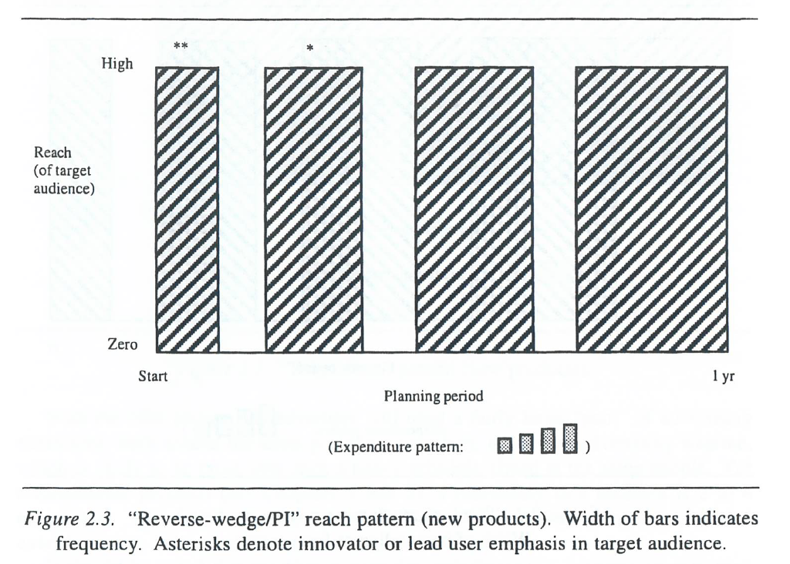 <sub>Nota: *La imagen ha sido tomada de "Advanced Media Planning", por J. R. Rossiter y P. J. Danaher, 1998, Kluwer Academic Publishers. Copyright 1998 por Kluwer Academic Publishers. Reproducido con fines académicos.*</sub>

## El Patrón _Short Fad_ en la Planificación de Medios

### Fundamentos y Concepto

El patrón _Short Fad_ representa una estrategia de planificación de medios diseñada específicamente para productos o servicios con un ciclo de vida corto y concentrado. Este patrón funciona esencialmente como un _Blitz_ condensado, donde la intensidad publicitaria debe maximizarse en un período significativamente más breve. La urgencia y concentración son las características definitorias de esta estrategia.

### Estrategia y Principios

La premisa fundamental del _Short Fad_ radica en la necesidad de crear un impacto inmediato y capitalizar rápidamente una oportunidad de mercado temporal. A diferencia de otros patrones que permiten una construcción gradual de *awareness* (conocimiento) y consideración, el Short Fad debe generar conocimiento y deseo de compra casi simultáneamente, reconociendo que el período de oportunidad es limitado y que la velocidad de penetración en el mercado es crítica para el éxito.

### Implementación Práctica

El desarrollo se estructura en tres fases comprimidas pero claramente definidas. La fase de introducción intensiva debe generar un conocimiento explosivo del producto, buscando alcanzar rápidamente a un porcentaje significativo del público objetivo con una frecuencia de exposición alta. La fase de crecimiento acelerado debe mantener la presión publicitaria mientras facilita una rápida conversión. Finalmente, la fase de capitalización rápida busca maximizar las ventas antes de que el interés decline.

La planificación de medios debe priorizar la velocidad de construcción de cobertura sobre la eficiencia en costes. El mix de medios se selecciona principalmente por su capacidad para generar *awareness* y respuesta inmediata, complementándose con tácticas de activación. La frecuencia de exposición debe ser notablemente más alta que en patrones tradicionales, reconociendo que el período para generar el efecto deseado es mucho más corto.

### Aplicaciones y Consideraciones

Este patrón resulta especialmente efectivo para productos vinculados a tendencias o modas pasajeras, lanzamientos de películas y contenido de entretenimiento, eventos con fechas específicas y productos estacionales de corta duración. La capacidad de ajuste rápido es crucial, con un monitoreo prácticamente en tiempo real y la flexibilidad para realizar ajustes tácticos inmediatos según la respuesta del mercado.

### Estrategia y Evaluación

La evaluación debe basarse en métricas que reflejen la inmediatez de sus objetivos, como la velocidad de construcción de *awareness*, la tasa de respuesta inmediata, la conversión rápida a ventas y la eficiencia en la generación de demanda inmediata. Los presupuestos deben contemplar la necesidad de adaptación ágil, manteniendo un porcentaje de la inversión como reserva táctica para reforzar los canales que demuestren mayor efectividad.

La coordinación con otros elementos del marketing mix debe ser especialmente precisa. La distribución, el precio y la promoción deben alinearse perfectamente con la estrategia de medios para capitalizar el breve período de oportunidad. El _Short Fad_ representa una aproximación altamente especializada a la planificación de medios, diseñada para situaciones donde el tiempo es el factor más crítico.

Su éxito depende de una ejecución precisa y una coordinación perfecta de todos los elementos de la campaña. Aunque puede resultar más costoso en términos de eficiencia publicitaria tradicional, su capacidad para generar resultados inmediatos lo convierte en la opción óptima para productos y servicios con ciclos de vida cortos y definidos.

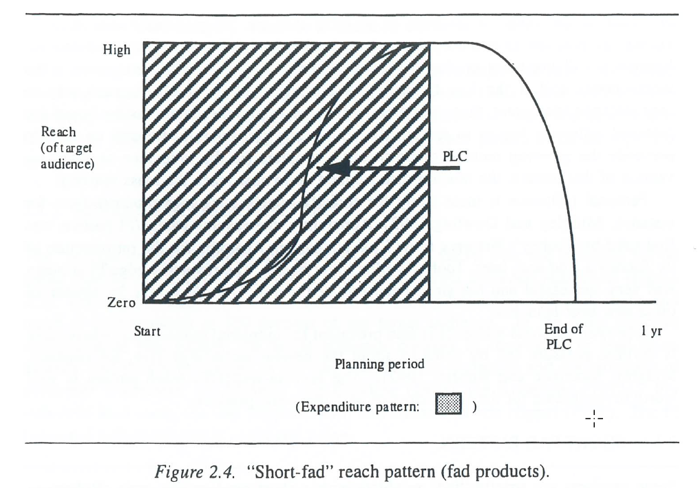 <sub>Nota: *La imagen ha sido tomada de "Advanced Media Planning", por J. R. Rossiter y P. J. Danaher, 1998, Kluwer Academic Publishers. Copyright 1998 por Kluwer Academic Publishers. Reproducido con fines académicos.*</sub>

------------------------------------------------------------------------

## Patrones para marcas establecidas

## El Patrón _Regular Purchase Cycle_ en la Planificación de Medios

### Fundamentos y Concepto

El patrón _Regular Purchase Cycle_ representa una estrategia de planificación de medios diseñada específicamente para productos y servicios que son adquiridos con una regularidad predecible. Esta estrategia se fundamenta en la sincronización precisa de la actividad publicitaria con los ciclos naturales de compra del consumidor, alternando períodos de actividad publicitaria con *hiatus* estratégicos (períodos sin publicidad).

### Bases Estratégicas

La efectividad de este patrón radica en su alineación con el comportamiento real de compra del consumidor. Los estudios de comportamiento del consumidor han documentado ciclos específicos para diferentes categorías de productos, estableciendo patrones de compra regulares y predecibles. La comprensión de estos ciclos permite una planificación publicitaria más eficiente y efectiva.

### Implementación y Estructura

La estructura básica del _Regular Purchase Cycle_ alterna períodos de actividad publicitaria con períodos de *hiatus*. La planificación debe considerar tres elementos fundamentales. Primero, el timing de la actividad publicitaria debe anticiparse ligeramente al momento de compra típico (reconocimiento de la necesidad), permitiendo influir en la decisión cuando el consumidor está comenzando a considerar la recompra. Segundo, la intensidad de la comunicación debe adaptarse al proceso de decisión de compra característico de la categoría. Tercero, la continuidad de la comunicación debe mantener un equilibrio entre la necesidad de estar presente en el momento crítico y la eficiencia en la inversión publicitaria.

### Consideraciones Tácticas y Carryover Effect

Un elemento crucial en este patrón es el *carryover effect* (efecto residual). Durante los períodos de *hiatus*, las ventas pueden mantenerse gracias al efecto residual de la publicidad anterior y al refuerzo que proporcionan las actividades promocionales en el punto de venta. Este fenómeno, conocido como "histéresis publicitaria", permite optimizar la inversión sin comprometer la efectividad., en tanto que permite aprovechar la inercia de marca en tiempos de recortes presupuestarios, pues el "residuo" de campañas anteriores aún genera retorno a medio plazo.

La selección de medios debe priorizar aquellos que mejor se adapten al ciclo de compra identificado. Para productos de compra frecuente, los medios digitales y punto de venta pueden ser especialmente relevantes por su capacidad de activación inmediata, mientras que los medios masivos tradicionales pueden cumplir un rol de mantenimiento de *awareness*.

### Optimización y Medición

La efectividad del patrón debe evaluarse considerando múltiples dimensiones. La cobertura efectiva durante los períodos de actividad debe ser suficiente para impactar al público objetivo en el momento relevante. El monitoreo de ventas durante los períodos de *hiatus* resulta crucial para validar la duración óptima de estos períodos. Si se observa una caída significativa en las ventas antes del siguiente ciclo publicitario, podría ser necesario ajustar la duración del *hiatus*.

### Coordinación con Marketing Mix

La efectividad se maximiza cuando se coordina adecuadamente con otras actividades de marketing. Las promociones comerciales deberían planificarse considerando los ciclos publicitarios establecidos. De manera similar, las actividades en el punto de venta pueden ayudar a mantener la presencia de marca durante los períodos de *hiatus* publicitario.

### Adaptación y Flexibilidad

Aunque el patrón se basa en ciclos regulares, debe mantener suficiente flexibilidad para adaptarse a cambios en el comportamiento del consumidor o condiciones del mercado. Eventos estacionales, cambios en el comportamiento de la competencia o situaciones especiales del mercado pueden requerir ajustes en la regularidad de los ciclos.

El _Regular Purchase Cycle_ representa una aproximación sofisticada y eficiente a la planificación de medios para productos de compra regular. Su éxito depende de un entendimiento profundo de los ciclos de compra del consumidor y una implementación precisa que equilibre la presencia publicitaria con la eficiencia en la inversión. Cuando se ejecuta correctamente, este patrón permite mantener una presencia efectiva en el mercado mientras optimiza el presupuesto publicitario a través de una sincronización precisa con los momentos de mayor receptividad del consumidor.

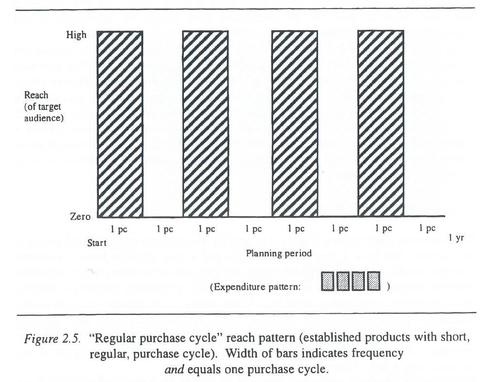 <sub>Nota: *La imagen ha sido tomada de "Advanced Media Planning", por J. R. Rossiter y P. J. Danaher, 1998, Kluwer Academic Publishers. Copyright 1998 por Kluwer Academic Publishers. Reproducido con fines académicos.*</sub>

## El Patrón _Awareness_ en la Planificación de Medios

### Fundamentos y Concepto

El patrón _Awareness_ representa una estrategia de planificación de medios diseñada específicamente para productos y servicios que implican ciclos de compra extensos y procesos de decisión prolongados. Este patrón se distingue por mantener una presencia publicitaria constante pero de baja intensidad, priorizando el alcance sobre la frecuencia, con el objetivo fundamental de mantener la marca en el conjunto de consideración del consumidor durante largos períodos.

### Bases Estratégicas

La premisa fundamental del patrón _Awareness_ radica en el reconocimiento de que, para ciertas categorías de productos, el consumidor puede pasar meses o incluso años considerando la compra antes de tomar una decisión final. En estos casos, la estrategia publicitaria debe mantener la marca "presente" en la mente del consumidor, sin necesidad de generar una respuesta inmediata. La efectividad del patrón depende de su capacidad para mantener la marca como una opción relevante y deseable cuando llegue el momento de la decisión.

<details>
<summary>Ejemplo en el caso de los automóviles</summary>

---

**Adaptabilidad del Patrón Notoriedad a la Compra de Automóviles**

La compra de un automóvil es un proceso complejo que involucra un ciclo de compra extenso y un alto grado de implicación por parte del consumidor. Este tipo de compra suele estar motivada por necesidades específicas y requiere una considerable inversión, lo que lleva a los consumidores a realizar una búsqueda exhaustiva de información y a comparar diferentes opciones antes de tomar una decisión.

**Ventajas del Patrón Notoriedad para la Compra de Automóviles**

En este contexto, el Patrón Notoriedad, con su enfoque en mantener la marca presente en la mente del consumidor a largo plazo, puede ser beneficioso por las siguientes razones:

- **Generación de Familiaridad y Confianza**: La presencia constante, aunque de baja intensidad, puede generar familiaridad con la marca y aumentar la confianza del consumidor.

- **Posicionamiento en el Conjunto de Consideración**: Al mantener la marca visible durante el proceso de búsqueda de información, el Patrón Notoriedad puede asegurar que la marca sea incluida en el conjunto de opciones que el consumidor evalúa.

- **Construcción de Imagen de Marca**: La publicidad de baja intensidad puede utilizarse para comunicar los valores y atributos de la marca, construyendo una imagen positiva que influya en la decisión del consumidor.

---

</details>

### Implementación Práctica

La ejecución del patrón _Awareness_ se estructura típicamente en ciclos regulares de comunicación con características particulares. La frecuencia por ciclo puede ser relativamente baja, buscando alcanzar al público objetivo con exposiciones suficientes para mantener la presencia de marca. Los intervalos entre ciclos deben ser lo suficientemente cortos para mantener la continuidad en la mente del consumidor.

La comunicación debe combinar elementos de construcción de marca con mecanismos de respuesta directa. Esta dualidad permite mantener la presencia de marca mientras se facilita la acción cuando el consumidor está listo para avanzar en su proceso de decisión. Un ejemplo ilustrativo es la estrategia utilizada por los consorcios de turismo, que combinan comunicación de construcción de marca en medios masivos con elementos de respuesta directa integrados.

### Integración de Elementos de Respuesta

Los elementos de respuesta directa deben integrarse de manera sutil pero efectiva, incluyendo llamadas a la acción no intrusivas pero claras, mecanismos de contacto múltiples y adaptados al perfil del target, sistemas de seguimiento y nutrición de leads, y contenido valioso que justifique el contacto. La clave está en facilitar la acción sin presionar, reconociendo que el tiempo de decisión es variable para cada consumidor.

Para integrar **elementos de respuesta directa** en este patrón, se pueden utilizar los siguientes mecanismos:

- Llamadas a la acción no intrusivas: Incluir una invitación a realizar una acción, como visitar un sitio web o llamar a un número de teléfono, sin ser agresivo en el mensaje.

- Sistemas de seguimiento y nutrición de leads: Una vez que un consumidor muestra interés, es importante darle seguimiento y ofrecerle contenido de valor para mantener su interés a lo largo del proceso de decisión.

- Contenido valioso que justifique el contacto: Ofrecer información útil y relevante que motive al consumidor a interactuar con la marca.

La clave del éxito en este tipo de estrategia radica en facilitar la acción sin presionar al consumidor, reconociendo que cada persona necesita un tiempo diferente para tomar una decisión de compra.

### Consideraciones Estratégicas

La selección de medios debe equilibrar dos objetivos aparentemente contradictorios: la necesidad de mantener presencia en medios de alto impacto que contribuyan a la construcción de marca y percepción de valor, y la importancia de incluir medios más económicos que permitan mantener la continuidad dentro de presupuestos razonables.

### Evaluación y Métricas

La medición de efectividad en el patrón _Awareness_ debe considerar métricas de largo plazo como el nivel de consideración de marca, la calidad de la percepción de marca, el engagement con contenidos profundos, la generación y maduración de leads, y la eficiencia en la conversión final. Es fundamental establecer KPIs intermedios que permitan validar la estrategia antes de las conversiones finales.

El patrón _Awareness_ representa una aproximación sofisticada a la planificación de medios para productos y servicios que requieren decisiones complejas y prolongadas. La clave está en la consistencia y la calidad de la comunicación más que en la intensidad, reconociendo que el objetivo no es generar una respuesta inmediata sino mantener la marca como una opción relevante y deseable cuando llegue el momento de la decisión.

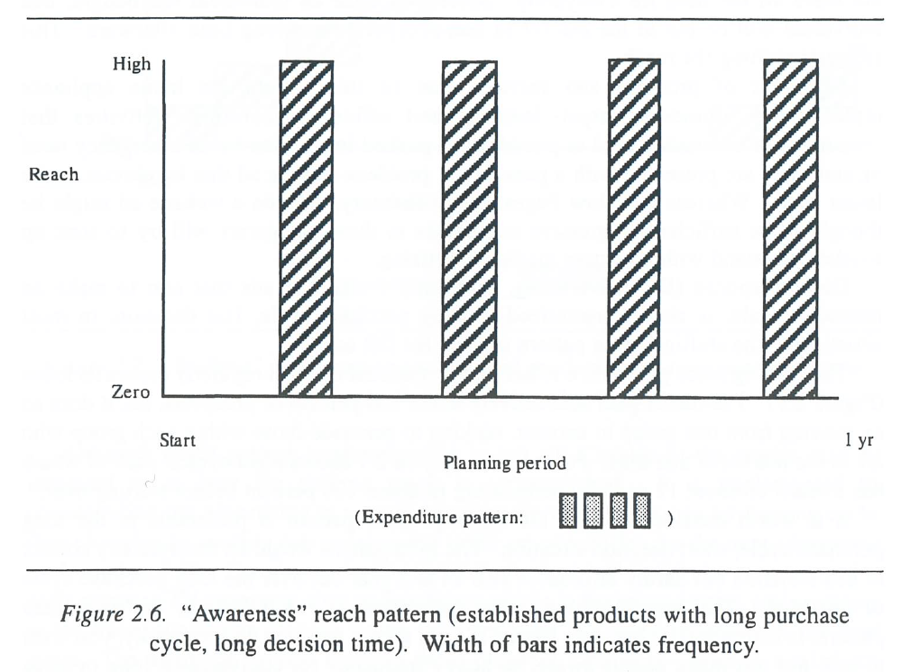 <sub>Nota: *La imagen ha sido tomada de "Advanced Media Planning", por J. R. Rossiter y P. J. Danaher, 1998, Kluwer Academic Publishers. Copyright 1998 por Kluwer Academic Publishers. Reproducido con fines académicos.*</sub>

## El Patrón _Shifting Reach_ en la Planificación de Medios

### Fundamentos y Concepto

El patrón _Shifting Reach_ representa una estrategia de planificación de medios innovadora que se caracteriza por su movimiento sistemático entre diferentes segmentos del mercado objetivo. Este patrón está diseñado para categorías donde la demanda está dispersa en el tiempo y el espacio, pero que requieren una comunicación intensiva cuando se contacta con cada segmento específico. La estrategia reconoce que, para ciertos productos y servicios, es más efectivo concentrar los recursos publicitarios en segmentos específicos del mercado de manera rotativa que intentar mantener una presencia continua en todo el mercado simultáneamente.

### Bases Estratégicas

La estrategia se fundamenta en la comprensión de que algunos mercados son más efectivamente abordados a través de una segmentación temporal de la comunicación. La efectividad del patrón radica en su capacidad para maximizar el impacto en cada segmento específico durante su período de activación, en lugar de diluir los recursos tratando de alcanzar a todo el mercado continuamente.

### Implementación Práctica

El desarrollo del _Shifting Reach_ se estructura en ciclos publicitarios secuenciales y bien definidos, donde cada ciclo se enfoca en un segmento específico del mercado. La implementación requiere una coordinación precisa entre varios elementos:

El timing de los ciclos debe ser suficiente para generar impacto pero no tan largo que pierda eficiencia. La selección de medios para cada ciclo debe utilizar la combinación más eficiente para su segmento específico, considerando no solo el alcance sino también la afinidad y el contexto. Aunque el mensaje _core_ debe mantener consistencia, puede adaptarse en tono y enfoque para cada segmento específico.

### Planificación y Coordinación

La selección de medios debe optimizarse para cada segmento específico. Por ejemplo, el segmento profesional puede abordarse a través de medios digitales especializados durante horarios laborales, mientras que el segmento doméstico puede alcanzarse mediante televisión en franjas específicas. La intensidad de la comunicación durante cada ciclo debe ser suficiente para generar impacto significativo en el segmento objetivo.

### Ventajas y Consideraciones

El _Shifting Reach_ ofrece varias ventajas distintivas. Permite una mayor eficiencia presupuestaria al concentrar recursos en segmentos específicos. La estrategia reconoce que no todos los consumidores están en el mercado al mismo tiempo, facilitando una mejor utilización de los recursos publicitarios al evitar la dispersión. Además, proporciona flexibilidad táctica para adaptar la comunicación a las características específicas de cada segmento.

### Evaluación y Optimización

La medición de la efectividad debe realizarse a dos niveles. A nivel de ciclo individual, se evalúa el alcance efectivo en el segmento objetivo, la frecuencia de impacto durante el período activo y la respuesta generada en el segmento específico. A nivel de patrón completo, se analiza la cobertura acumulada del mercado total, la eficiencia en la construcción de awareness y el equilibrio en la distribución de impactos.

### Aplicación y Adaptación

Para implementar exitosamente este patrón, es crucial desarrollar una comprensión profunda de los diferentes segmentos del mercado y sus patrones de consumo de medios. Se debe establecer un sistema de medición que permita evaluar la efectividad en cada ciclo y realizar ajustes. Es fundamental mantener la consistencia en el mensaje core mientras se adapta la ejecución para cada segmento.

El _Shifting Reach_ representa una aproximación sofisticada a la planificación de medios que reconoce la naturaleza dinámica y segmentada de ciertos mercados. Su éxito depende de una implementación precisa y una comprensión profunda de los diferentes segmentos del mercado y sus patrones de consumo de medios. Cuando se ejecuta correctamente, este patrón permite maximizar el impacto de presupuestos limitados y generar una presencia efectiva en el mercado a través de una aproximación sistemática y focalizada. 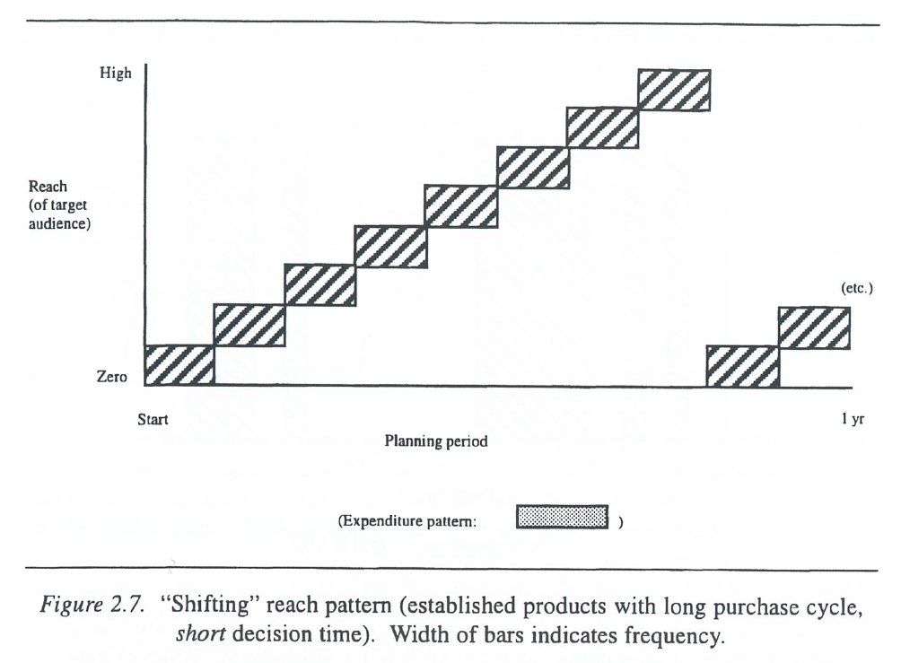 <sub>Nota: *La imagen ha sido tomada de "Advanced Media Planning", por J. R. Rossiter y P. J. Danaher, 1998, Kluwer Academic Publishers. Copyright 1998 por Kluwer Academic Publishers. Reproducido con fines académicos.*</sub>

## El Patrón _Seasonal Priming_ en la Planificación de Medios

### Fundamentos y Concepto

El patrón _Seasonal Priming_ representa una estrategia de planificación de medios específicamente diseñada para productos y servicios con marcada estacionalidad. Este patrón se distingue por su enfoque anticipatorio, preparando el mercado antes de los picos estacionales de demanda y maximizando la efectividad durante los períodos de mayor oportunidad comercial. La estrategia reconoce dos momentos críticos: el período de "priming" o preparación, y el pico estacional propiamente dicho. 

### Diferenciación por Nivel de Riesgo

El patrón se adapta según el nivel de riesgo de la compra. Para productos de bajo riesgo, como medicamentos para alergias estacionales o productos para barbacoa, el período de priming puede ser relativamente corto. En contraste, para productos de alto riesgo, como equipamiento deportivo especializado o sistemas de climatización, se requiere un período de priming más extenso, con una construcción gradual de frecuencia.

#### Implementación Práctica

La ejecución del _Seasonal Priming_ se estructura en tres fases principales. La fase de pre-temporada (priming) se caracteriza por un alcance amplio pero frecuencia moderada, con énfasis en contenido educativo e informativo para la construcción de awareness y consideración. La fase de temporada alta maximiza la intensidad publicitaria, combinando medios de alto impacto con frecuencia elevada y mensajes orientados a la acción y compra inmediata. La fase de post-temporada reduce la intensidad pero mantiene una presencia selectiva, enfocándose en ventas de oportunidad y preparación para el siguiente ciclo.

### Consideraciones Estratégicas

La planificación debe considerar que la mayoría de los competidores suelen adoptar la misma estrategia de medios, lo que genera una alta concentración publicitaria alrededor del pico estacional. El patrón de priming responde a esta realidad introduciendo vuelos publicitarios de alto alcance pero baja frecuencia antes del desarrollo del pico estacional.

La publicidad pre-temporada "prepara" a los consumidores, creando awareness de marca sin interferencia competitiva. Este priming temprano alcanza a los consumidores cuando su nivel de necesidad de la categoría es bajo, permitiendo establecer presencia de marca y comunicar mensajes sin la saturación típica del período pico.

### Optimización y Timing

El timing resulta crucial en este patrón. La actividad pre-temporada debe iniciarse con suficiente anticipación para construir awareness, pero no tan temprano que pierda relevancia. Las transiciones entre fases deben ser fluidas, respondiendo a indicadores de mercado y patrones históricos de comportamiento del consumidor.

### Evaluación y Adaptación

La efectividad del patrón debe evaluarse considerando tanto los resultados durante el período pico como la eficiencia del priming en la construcción de predisposición de compra. Es fundamental monitorear la respuesta del mercado durante las diferentes fases para optimizar el timing y la intensidad de la comunicación en ciclos futuros.

### Aplicaciones y Variaciones

Este patrón resulta particularmente efectivo para productos y servicios con estacionalidad clara, ya sea por factores climáticos, culturales o de comportamiento del consumidor. La estrategia puede adaptarse según la duración del ciclo estacional, la complejidad del producto y el nivel de competencia en el mercado.

El _Seasonal Priming_ representa una aproximación estratégica a mercados con demanda estacional, maximizando la efectividad a través de una preparación anticipada del mercado. Su éxito radica en la capacidad para construir presencia de marca y predisposición de compra antes del período de máxima demanda, permitiendo una mejor capitalización de las oportunidades comerciales durante los picos estacionales. 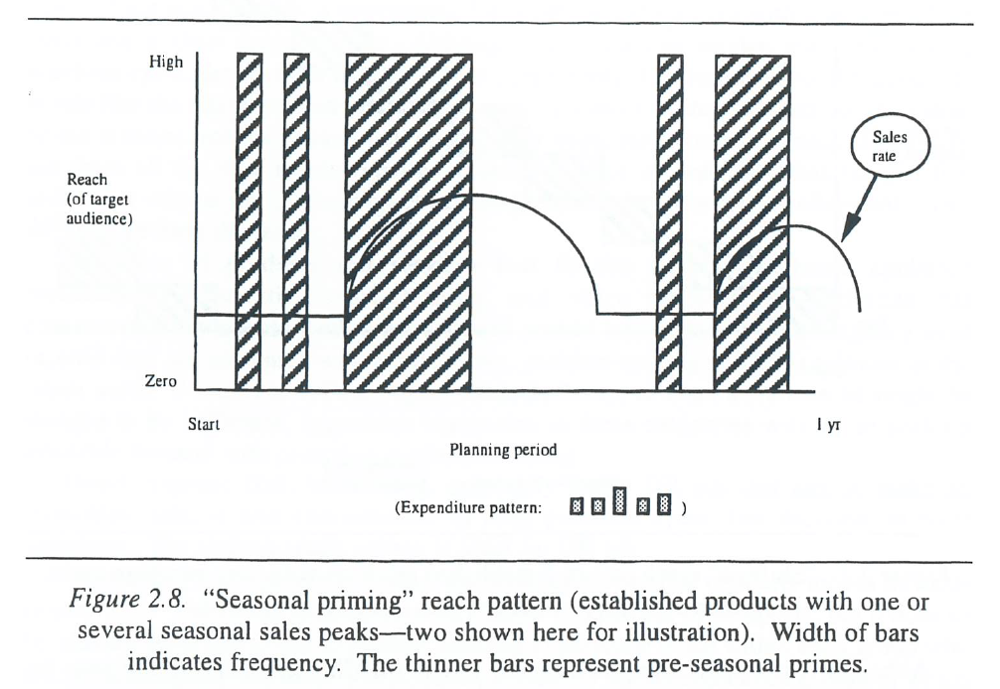 <sub>Nota: *La imagen ha sido tomada de "Advanced Media Planning", por J. R. Rossiter y P. J. Danaher, 1998, Kluwer Academic Publishers. Copyright 1998 por Kluwer Academic Publishers. Reproducido con fines académicos.*</sub>

------------------------------------------------------------------------

## Control del plan de medios

Finalmente, proponemos un ejemplo sencillo e ilustrativo de cálculo de la cobertura (o alcance):

### Cobertura

> Número de personas expuestas durante un ciclo publicitario **al menos una vez**.


***Tu*** **(hipotética campaña de ropa), una inserción por soporte**

| Soportes                   | Alcance estimado |
|----------------------------|------------------|
| Instagram                  | 30% del público  |
| Audio en Spotify           | 20% del público  |
| Exterior en la Universidad | 15% del público  |

**Modo de calcular la cobertura conociendo las n-plicaciones**

| Paso | Cálculo | Resultado |
|------------------------------------|------------------|------------------|
| 1\. Alcance bruto combinado (impactos) | 30% + 20% + 15% | 65% |
| 2\. Restar duplicaciones | 65% - 5% - 3% - 2% | 55% |
| 3\. Añadir la triplicación (se restó tres veces) | 55% + 1% | 56% |

Así pues, se calcula el alcance neto de esta campaña en un 56%. Permite tomar decisiones más inteligentes sobre la inversión en publicidad y evitar estimar en exceso su impacto.

### Duplicación

> La duplicación ocurre cuando una misma persona se expone (o *tiene la oportunidad de ver*, OTS) más de una vez al anuncio durante un ciclo publicitario (en el mismo soporte o en distinto soporte).

En la campaña *Tu*, se estimó una duplicación del 5% entre Instagram y Spotify, un 3% entre Instagram y carteles, y un 2% entre Spotify y carteles.

### Frecuencia media

> Es el número promedio de veces que un individuo alcanzado se expone durante un ciclo publicitario.

La frecuencia media se calcula sumando todas las exposiciones (impactos) y dividiéndolas por el tamaño de la cobertura. Es decir, si la campaña anterior generó 280.000 impactos y alcanzó ($\geq$ 1 OTS) a 100.000 personas, la frecuencia media sería igual a 2,8 oportunidades *de ver el anuncio* por persona de la cobertura.

La expresión matemática para el cálculo de la frecuencia media es la siguiente:

$Frecuencia = \frac{\sum_{i=1}^{n} A_i \times n_i}{Cobertura}$

La principal limitación del concepto de frecuencia media en la planificación de medios es que las estimaciones de frecuencia proporcionadas por los programas de planificación son abstracciones estrictamente sin sentido práctico. Estas simplemente resumen una amplia distribución, donde pocos valores están realmente cercanos al "promedio". Por ejemplo, si especificamos una frecuencia promedio semanal de 5 OTS, el plan pudiera entregar 5 OTS en una minoría de los casos.

La frecuencia media es pues un indicador poco fiable y potencialmente engañoso para la planificación de medios. No refleja necesariamente la realidad de la exposición que experimentará la mayoría de la cobertura. En suma, usar promedios de frecuencia puede dar una falsa sensación de precisión en la planificación de medios, cuando en realidad estamos trabajando con una distribución mucho más dispersa y variable de exposiciones reales al mensaje publicitario.

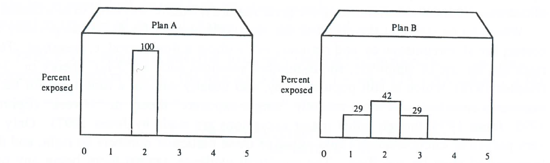 <sub>Nota: *La imagen ha sido tomada de "Advanced Media Planning", por J. R. Rossiter y P. J. Danaher, 1998, Kluwer Academic Publishers. Copyright 1998 por Kluwer Academic Publishers. Reproducido con fines académicos.*</sub>

### Distribución de exposición (o contactos)

> Se refiere al número de personas de la población (o la cobertura) que se exponen **exclusivamente i veces** al anuncio durante el ciclo publicitario.

Describe pues cómo se distribuyen las exposiciones entre la población (o la cobertura). Por ejemplo, la distribución de contactos puede ser uniforme, donde todos los individuos tienen un número similar de exposiciones, o desigual, donde algunos individuos se exponen el anuncio muchas veces y otros muy pocas.

Este concepto está relacionado con la frecuencia media. No obstante, la distribución de exposición proporciona una visión más detallada de cómo se alcanzan los niveles de frecuencia efectiva. En la campaña de ropa *TU*, la distribución de contactos fue la siguiente:

Exclus. 1 vez: 40.000 personas

Exclus. 2 veces: 30.000 personas

Exclus. 3 veces: 30.000 personas

### Distribución de exposición (o contactos) acumulada

> Muestra el número total de personas que han sido expuestas a un anuncio **al menos una vez, dos veces, tres veces, etc.**, es decir, $\geq$ i veces, durante la campaña publicitaria.

La distribución de contactos acumulada permite visualizar el progreso de la campaña en términos de alcance y frecuencia a medida que avanza el tiempo. Es una herramienta útil para analizar la efectividad de la campaña en términos de MEF.

En la campaña de ropa *TU*, la distribución de contactos acumulada fue la siguiente:

+1 vez: 100.000 personas

+2 veces: 60.000 personas

+3 veces: 30.000 personas

<details>

<summary>Ejemplo ilustrativo de una distribución de exposición ficticia</summary>

------------------------------------------------------------------------

El análisis presentado utiliza el paquete mediaPlanR en R para modelar la distribución de exposición (y acumulada). La función **calc_beta_binomial** implementa un modelo Beta-Binomial con tres parámetros principales: una audiencia tras la primera inserción (FIR) de 500.000 personas, una audiencia acumulada tras la segunda inserción (SIR) de 650.000 y un universo total de 1.000.000 de individuos, distribuidos en 5 niveles de exposición.

Los resultados muestran que la campaña alcanza una cobertura total del 80,21% del universo (802.083 personas), con una distribución relativamente uniforme de contactos entre 1 y 5 exposiciones. La distribución acumulada revela que el 50% de la población recibe 3 o más contactos, mientras que aproximadamente un 20% de la audiencia queda sin exposición. El modelo estima una frecuencia media de 3.12 contactos por individuo alcanzado.

``` r
> library(mediaPlanR)
> resultados <- calc_beta_binomial(500000, 650000, 1000000, 5)
> resultados

MODELO BETA-BINOMIAL
===================
Descripción: Modelo que considera heterogeneidad en la población

MÉTRICAS PRINCIPALES:
--------------------
Cobertura total: 80.21% (802083 personas)

PARÁMETROS DEL MODELO:
---------------------
Alpha: 0.750 (forma de la distribución beta)
Beta: 0.750 (forma de la distribución beta)
Probabilidad de 0 contactos: 19.79%

DISTRIBUCIÓN DE CONTACTOS:
-------------------------
(Porcentaje de población que recibe exactamente N contactos)
1 contacto: 15.63% (156250 personas)
2 contactos: 14.58% (145833 personas)
3 contactos: 14.58% (145833 personas)
4 contactos: 15.63% (156250 personas)
5 contactos: 19.79% (197917 personas)

DISTRIBUCIÓN ACUMULADA:
----------------------
(Porcentaje de población que recibe N o más contactos)
>= 1 contacto: 80.21% (802083 personas)
>= 2 contactos: 64.58% (645833 personas)
>= 3 contactos: 50.00% (500000 personas)
>= 4 contactos: 35.42% (354167 personas)
>= 5 contactos: 19.79% (197917 personas)

RESUMEN ESTADÍSTICO:
-------------------
Promedio de contactos por individuo alcanzado: 3.12
Media teórica de la distribución beta: 0.500
```

</details>

------------------------------------------------------------------------

## mediaPlanR: Descripción General

> **mediaPlanR** proporciona un conjunto completo de herramientas para la planificación de medios publicitarios -preferentemente en prensa-, implementando diversos modelos para estimar la cobertura, distribución de contactos y acumulación de audiencia.

El paquete **mediaPlanR** incluye implementaciones de modelos clásicos de planificación de medios como Sainsbury, Binomial, Beta-Binomial, Metheringham o Hofmans, así como permite el cálculo de las métricas clásicas en la planificación de medios.

### Instalación

La forma más sencilla de instalar y configurar **mediaPlanR** es usando las siguientes instrucciones:

``` r
# Instalar el paquete devtools si no está instalado
if (!requireNamespace("devtools", quietly = TRUE)) {
  install.packages("devtools")
}

# Instalar mediaPlanR
devtools::install_github("majesus/mediaPlanR", force = TRUE, upgrade = "never")
```

## mediaPlanR: Funciones de mediaPlanR

**Modelos:** 

- calc_sainsbury() 
- calc_beta_binomial()
- calc_binomial() 
- calc_hofmans()
- calc_MBBD()
- calc_metheringham() 
- calc_R1_R2()

**Métricas:** 

- calcular_metricas_medios() 
- calc_cpm()
- calc_grps()
- plot_grp_metricas()

**Optimización:** 
- optimizar_d()
- optimizar_dc()
- optimize_media_plan()

**Aplicaciones Shiny:** 
- run_aud_util_explorer()
- run_beta_binomial_explorer() 
- run_reach_converg_explorer()

------------------------------------------------------------------------

## Estimación de Cobertura y Distribución

### Fundamentos y Consideraciones Iniciales

La elección de un modelo de estimación de cobertura y distribución de exposición requiere una comprensión de las hipótesis subyacentes. Estas hipótesis, que simplifican la realidad para facilitar la modelización, tienen un impacto directo en la precisión de las estimaciones. En este capítulo, examinaremos las diferentes hipótesis y tipos de modelos disponibles.

### Hipótesis sobre las Probabilidades de Exposición

#### Estacionariedad de las Probabilidades de Exposición

La hipótesis de estacionariedad asume que la probabilidad de exposición de un individuo a un soporte permanece constante a lo largo del tiempo. Esta hipótesis se puede desglosar en dos componentes:

1.  **Estacionariedad respecto a los individuos**: La probabilidad de que un individuo sea expuesto a una inserción publicitaria en particular no depende de si ha estado expuesto a inserciones anteriores en el mismo soporte.En otras palabras, para un individuo cualquiera, la exposición no varía según el contenido o momento dentro del mismo soporte. Por ejemplo, si una persona tiene una probabilidad del 20% de ver un anuncio en una revista, esa probabilidad será la misma independientemente de la página o número de anuncio en esa revista.

2.  **Estacionariedad respecto a las inserciones**: La probabilidad de exposición de un individuo a una inserción no está influenciada por la probabilidad de exposición de otro individuo a la misma inserción. Esto significa que si una inserción tiene una probabilidad del 15% de ser vista por una persona, esa probabilidad será la misma para cualquier persona que consuma ese soporte, sin importar sus características individuales.

#### Otras Hipótesis Fundamentales

-   **Homogeneidad de la Población**: Asume que todos los individuos de la población objetivo tienen igual probabilidad de exposición a un soporte.

-   **Homogeneidad de los Soportes**: Considera que todos los soportes del plan de medios tienen igual capacidad de generar exposición.

-   **Aleatoriedad de la Duplicación**: Establece que la probabilidad de exposición a dos soportes diferentes es independiente de la exposición a otros soportes.

-   **Aleatoriedad de la Acumulación**: Postula que la probabilidad de exposición a múltiples inserciones en un mismo soporte es independiente de la exposición a otras inserciones.

### Taxonomía de Modelos según Soportes e Inserciones

Los modelos se pueden clasificar en tres categorías principales según su aplicación:

1.  **Modelos de Acumulación de Audiencias**

    -   Diseñados para planes con $n$ inserciones en un único soporte
    -   Focalizados en el efecto acumulativo de exposiciones repetidas

2.  **Modelos de Duplicación de Audiencias (o Cobertura neta)**

    -   Aplicables a planes con una inserción en $n$ soportes diferentes
    -   Centrados en el efecto de la exposición a través de múltiples soportes

3.  **Modelos de Cobertura Neta Acumulada**

    -   Desarrollados para planes con $n$ inserciones en $m$ soportes diferentes
    -   Combinan los efectos de acumulación y duplicación

### Clasificación según Enfoque Metodológico

#### Modelos Empíricos (ad hoc)

Estos modelos se caracterizan por:

-   Buscar funciones matemáticas que se ajusten a los datos de audiencia disponibles
-   No considerar la naturaleza probabilística de la exposición
-   Enfocarse en reproducir la evolución de la cobertura según el número de inserciones

**Limitaciones principales**:

-   No proporcionan información sobre la distribución de exposición
-   No permiten determinar la campaña óptima al no considerar la frecuencia de exposición

#### Modelos Estocásticos

Estos modelos se distinguen por:

-   Representar los patrones de audiencia mediante distribuciones de probabilidad
-   Considerar la exposición como fenómeno aleatorio
-   Asumir probabilidades individuales de exposición

**Características clave**:

-   Requieren hipótesis adicionales sobre la probabilidad individual
-   Las hipótesis específicas diferencian los distintos modelos estocásticos

### Conclusiones

La selección del modelo de estimación debe basarse en un análisis riguroso que considere:

-   Las hipótesis subyacentes
-   El tipo de plan de medios a evaluar
-   La precisión requerida en las estimaciones
-   Los recursos disponibles para la implementación

La comprensión de estos aspectos permite una elección informada que optimiza el balance entre precisión y complejidad del modelo.

------------------------------------------------------------------------

## Modelos de estimación de la cobertura y distribución de exposición

## Modelo de Sainsbury (`calc_sainsbury`)

**Modelo de duplicación de audiencias o cobertura neta**

La función calc_sainsbury() implementa el modelo de Sainsbury, desarrollado por E. J. Sansbury en la London Press Exchange, para calcular la cobertura y la distribución de contactos para un conjunto de soportes publicitarios y una única inserción por soporte.

El modelo considera la duplicación aleatoria, las probabilidades individuales de exposición homogéneas, y las probabilidades de exposición del soporte heterogéneas para una estimación más precisa de la cobertura y la distribución de contactos (y acumulada). De las dos últimas hipótesis se deriva que la probabilidad de que un individuo resulte expuesto al soporte i vendrá dado por el cociente entre la audiencia del soporte i (casos favorables) y la población (casos totales). Por su parte, de la asunción de la duplicación aleatoria se deriva que la probabilidad de exposición continuará siendo una variable Bernouilli con diferentes probabilidadades de exposición en cada soporte.

### Características:

-   Considera la independencia entre soportes, es decir, la exposición a un soporte no modifica la probabilidad de resultar expuesto a otro (duplicación aleatoria)
-   Asume que las probabilidades de exposición individuales son homogéneas
-   Las probabilidades de exposición edl soporte son heterogéneas

------------------------------------------------------------------------

Cobertura neta (probabilida de al menos 1 contacto):

$$C = 1 - \prod_{i=1}^{n} \left(1 - \frac{A_i}{P}\right)$$

Donde:

-   C es la cobertura
-   n es el número de soportes
-   Ai es la audiencia del soporte i
-   P es la población total

Aplicando la función de Sainsbury (simplificado) a los datos anteriormente expuestos, este sería el valor (en tanto por uno) de la cobertura neta:

$Cobertura_{neta} = 1 - (1-0,30) \times (1-0,20) \times (1-0,15) = 0,524$

------------------------------------------------------------------------

Distribución de contactos (probabilidad de exactamente k contactos):

$$P(X=k) = \sum_{|S|=k} \prod_{i \in S} p_i \prod_{j \notin S} (1-p_j)$$

Donde:

-   \|S\| = k significa que sumamos sobre todas las combinaciones posibles de k soportes
-   pi es la probabilidad de exposición al soporte i (Ai/P)
-   El primer producto corresponde a las probabilidades de exposición a los soportes i
-   El segundo producto corresponde a las probabilidades de no exposición a los soportes j

------------------------------------------------------------------------

### Aplicación de la función:

``` r
> library(mediaPlanR)
> audiencias <- c(300000, 400000, 200000)  
> pob_total <- 1000000                     
> resultado <- calc_sainsbury(audiencias, pob_total)
> resultado

MODELO SAINSBURY
================
Descripción: Modelo que considera independencia entre soportes y heterogeneidad de soportes

MÉTRICAS PRINCIPALES:
--------------------
Cobertura total: 66.40% (664000 personas)

DISTRIBUCIÓN DE CONTACTOS:
-------------------------
(Porcentaje de población que recibe exactamente N contactos)
1 contacto: 45.20% (452000 personas)
2 contactos: 18.80% (188000 personas)
3 contactos: 2.40% (24000 personas)

DISTRIBUCIÓN ACUMULADA:
----------------------
(Porcentaje de población que recibe N o más contactos)
>= 1 contacto: 66.40% (664000 personas)
>= 2 contactos: 21.20% (212000 personas)
>= 3 contactos: 2.40% (24000 personas)

RESUMEN ESTADÍSTICO:
-------------------
Promedio de contactos por individuo alcanzado: 1.36
```

## Modelo Binomial (`calc_binomial`)

**Modelo de duplicación de audiencias o cobertura neta**

La función calc_binomial() Implementa el modelo Binomial, desarrollado por Chandon (1985), para calcular la cobertura y distribución de contactos (y acumulada) de plan de medios de n soportes y una única inserción por soporte. El modelo Binomial asume la duplicación aleatoria (i.e.,la exposición a un soporte no modifica la probabilidad de resultar expuesto a otro), y la homogeneidad de las probabilidades de exposición del soporte y las probabilidades individuales de exposición. Uniendo estas dos hipótesis últimas, la probabilidad de exposición de cualquier individuo a un soporte determinado se calcula como la media de las audiencias de cada soporte. Las probabilidades de exposición son estacionarias respecto al tiempo.

### Características:

-   Cada individuo de la población tiene la misma probabilidad de exposición a un soporte i
-   La probabilidad de exposición a cada soporte es la misma para cada uno de ellos
-   La duplicación de las audiencias es un suceso aleatorio
-   Las probabilidades de exposición son estacionarias

------------------------------------------------------------------------

Cobertura neta (probabilidad de al menos 1 contacto):

$$p = \frac{1}{P} \sum_{i=1}^{n} \frac{A_i}{n}$$

Donde:

-   p es la probabilidad _promedio_ de éxito
-   n es el número de soportes (1 inserción por soporte)
-   Ai es la audiencia del soporte i
-   P es la población total

------------------------------------------------------------------------

Distribución de contactos (probabilidad de exactamente k contactos):

$$P(X=k) = \binom{n}{k} p^k (1-p)^{n-k}$$

Donde:

-   k es el número de contactos
-   n es el número de soportes
-   p es la probabilidad media calculada anteriormente

------------------------------------------------------------------------

### Aplicación de la función:

``` r
> library(mediaPlanR)
> audiencias <- c(300000, 400000, 200000)  
> pob_total <- 1000000                     
> resultado <- calc_binomial(audiencias, pob_total)
> resultado

MODELO BINOMIAL
===============
Descripción: Modelo que asume independencia entre soportes y homogeneidad

MÉTRICAS PRINCIPALES:
--------------------
Cobertura total: 65.70% (657000 personas)
Probabilidad media de exposición: 0.300

DISTRIBUCIÓN DE CONTACTOS:
-------------------------
(Porcentaje de población que recibe exactamente N contactos)
1 contacto: 44.10% (441000 personas)
2 contactos: 18.90% (189000 personas)
3 contactos: 2.70% (27000 personas)

DISTRIBUCIÓN ACUMULADA:
----------------------
(Porcentaje de población que recibe N o más contactos)
>= 1 contacto: 65.70% (657000 personas)
>= 2 contactos: 21.60% (216000 personas)
>= 3 contactos: 2.70% (27000 personas)

RESUMEN ESTADÍSTICO:
-------------------
Promedio de contactos por individuo alcanzado: 1.37
```

## Modelo Beta-Binomial (`calc_beta_binomial`)

Implementa el modelo Beta-Binomial para calcular la acumulación de audiencia y la distribución de exposición (y acumulada). El modelo Beta-Binomial considera la heterogeneidad en la probabilidad de exposición de los individuos. Combina dos pasos: modela la probabilidad de éxito aplicando la distribución Beta de parámetros alpha y beta -lo cual reduce a dos los datos necesarios para su estimación; y emplea la probabilidad en la distribución Binomial (combinada con la distribución Beta) para valorar la distribución de contactos (y acumulada). Es útil cuando la probabilidad de éxito no es conocida a priori, y puede variar entre los individuos. Los parámetros alpha y beta precisamente permiten ajustar la forma de la distribución para que refleje la incertidumbre en relación con la probabilidad de éxito.

### Características:

-   Modela heterogeneidad de la población en sus probabilidades de exposición
-   La acumulación de audiencias no es aleatoria
-   Asume la estacionariedad (estabilidad en el tiempo) de las probabilidades de exposición respecto a los individuos o a las inserciones
-   Requiere datos de audiencias acumuladas (A1 y A2)

------------------------------------------------------------------------

Distribución de contactos ((probabilidad de exactamente k contactos))

$$P(X=k|n,\alpha,\beta) = \binom{n}{k} \frac{B(k+\alpha, n-k+\beta)}{B(\alpha, \beta)}$$

<details>
<summary>Mayor detalle</summary>

***

**¿Qué modela la distribución beta en este contexto?** La distribución beta modela la heterogeneidad de las probabilidades individuales de exposición (p) en la población. No es una distribución para cada individuo, sino una única distribución que describe cómo varían las probabilidades entre individuos.

**¿Cómo se asignan las probabilidades individuales?** Cada individuo "extrae" su probabilidad p de la distribución beta común Beta($\alpha$,$\beta$). Una vez asignada, esta p se mantiene constante para ese individuo (estacionariedad).

**¿Cómo funciona el proceso de exposición?** Para cada individuo con su p fija:

* La probabilidad p proviene de Beta($\alpha$,$\beta$)
* Las exposiciones siguen Binomial(n,p)

Matemáticamente: P(X=k) = C(n,k)B($\alpha$+k,$\beta$+n-k)/B($\alpha$,$\beta$)

**¿Por qué no es aleatoria la acumulación?** Porque las probabilidades individuales son persistentes y provienen de una distribución que modela la heterogeneidad poblacional, no de un proceso puramente aleatorio.

***

</details>

Se desarrolla del modo siguiente:

<br>

$$P_i = \binom{n}{i} \left[ \frac{\prod_{j=1}^{i} (\alpha + i - j) \prod_{j=1}^{n-i} (\beta + n  - i - j)}{\prod_{j=1}^{n} (\alpha + \beta + n - j)} \right]$$

<br><br>

$$P_i = \binom{n}{i} \frac{(\alpha + i - 1)(\alpha + i - 2) \cdots \alpha \cdot (\beta + n - i - 1)(\beta + n - i - 2) \cdots \beta}{(\alpha + \beta + n - 1)(\alpha + \beta + n - 2) \cdots (\alpha + \beta)}$$

<br>

Donde:

-   i es el número de contactos
-   n es el número de inserciones
-   $\alpha$ (alpha) controla la asimetría hacia valores altos de probabilidad
-   $\beta$ (beta) controla la asimetría hacia valores bajos de probabilidad

------------------------------------------------------------------------

$$\alpha = \frac{R_1(R_2 - R_1)}{2R_1 - R_1^2 - R_2}$$

$$\beta = \alpha \frac{1 - R_1}{R_1}$$

Donde:

-   R1 es la proporción de audiencia alcanzada (al menos 1 vez) tras la primera inserción
-   R2 es la proporción de audiencia alcanzada (al menos 2 veces) tras la segunda inserción

------------------------------------------------------------------------


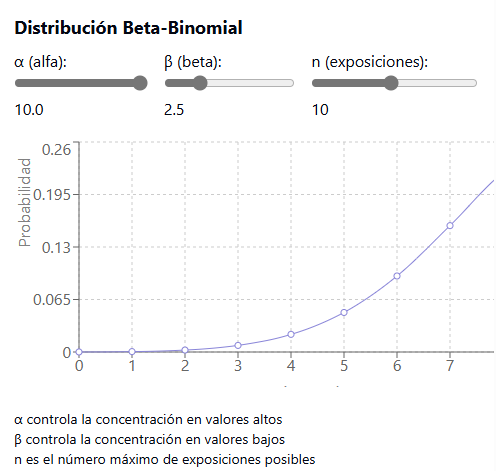
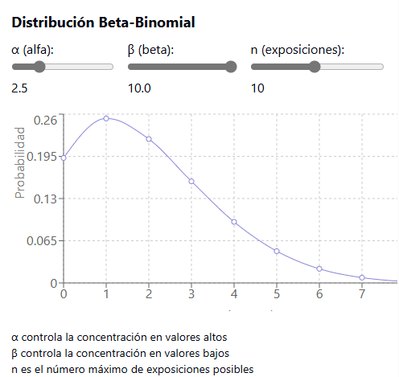

------------------------------------------------------------------------

### Aplicación de la función:

``` r
resultado <- calc_beta_binomial(
  A1 = 500000,    
  A2 = 550000,    
  P = 1000000,    
  n = 5           
)
resultado

# MODELO BETA-BINOMIAL
# ===================
# Descripción: Modelo que considera heterogeneidad en la población

# MÉTRICAS PRINCIPALES:
# --------------------
# Cobertura total: 60.34% (603365 personas)

# PARÁMETROS DEL MODELO:
# ---------------------
# Alpha: 0.125 (forma de la distribución beta)
# Beta: 0.125 (forma de la distribución beta)
# Probabilidad de 0 contactos: 39.66%

# DISTRIBUCIÓN DE CONTACTOS:
# -------------------------
# (Porcentaje de población que recibe exactamente N contactos)
# 1 contacto: 6.01% (60096 personas)
# 2 contactos: 4.33% (43269 personas)
# 3 contactos: 4.33% (43269 personas)
# 4 contactos: 6.01% (60096 personas)
# 5 contactos: 39.66% (396635 personas)

# DISTRIBUCIÓN ACUMULADA:
# ----------------------
# (Porcentaje de población que recibe N o más contactos)
# >= 1 contacto: 60.34% (603365 personas)
# >= 2 contactos: 54.33% (543269 personas)
# >= 3 contactos: 50.00% (500000 personas)
# >= 4 contactos: 45.67% (456731 personas)
# >= 5 contactos: 39.66% (396635 personas)

# RESUMEN ESTADÍSTICO:
# -------------------
# Promedio de contactos por individuo alcanzado: 4.14
# Media teórica de la distribución beta: 0.500

```

## Modelo de Metheringham (`calc_metheringham`)

El modelo de Metheringham es un modelo estocástico para calcular la cobertura y la distribución de contactos de un plan de medios publicitarios. Fue desarrollado por Richard Metheringham en 1964. El modelo es particularmente útil porque permite evaluar planes de medios complejos donde hay múltiples inserciones distribuidas en diferentes soportes, considerando cómo la audiencia se acumula y se duplica entre diferentes medios.

Se sustentan las siguientes hipótesis:

- La **población es heterogénea**. Cada individuo tiene su propia probabilidad personal de exposición que, sin embargo, se distribuye como una beta para el conjunto.

    En el ejemplo de una campaña publicitaria para un nuevo modelo de coche, la distribución beta permitiría:
    
    - Identificar a los **entusiastas de los coches**: Asignar una alta probabilidad de exposición a los individuos que, según los datos de audiencia, consumen habitualmente medios relacionados con el automóvil.
    - Identificar a los que **no tienen interés en los coches**: Asignar una baja probabilidad de exposición a los individuos que no muestran ningún interés en este tipo de productos o medios.
    - Representar la **diversidad**: Asignar una gama de probabilidades intermedias al resto de la población, reflejando la variedad de niveles de interés que pueden existir.
    - Al utilizar la distribución beta de esta manera, el modelo de Metheringham puede estimar con mayor precisión cuántas personas de cada grupo de interés verán el anuncio, lo que a su vez permite una planificación de medios más eficiente y efectiva.

- Los **soportes son homogéneos**. Ello no quiere decir que cada individuo tenga la misma probabilidad de exposición respecto a cada soporte, sino que estas probabilidades individuales se distribuyen de tal forma que todos los soportes acaban con la misma distribución beta de probabilidades de exposición. Metheringham simplifica esta suposición utilizando la audiencia media de todos los soportes para calcular la probabilidad de exposición. Esta simplificación puede no ser realista en la práctica, ya que hay medios con mayor alcance que otros. Sin embargo, facilita el cálculo al homogeneizar el conjunto de medios.

    Volviendo al ejemplo de la campaña del coche nuevo, la hipótesis de soportes homogéneos implicaría que, si bien algunos individuos pueden ser más propensos a ver el anuncio en la televisión, otros en revistas especializadas y otros en sitios web de coches, la distribución general de probabilidades de exposición a lo largo de todos estos soportes seguiría una forma similar (la distribución beta).

- La **acumulación y duplicación de las audiencias se promedian entre los soportes para conformar un soporte “tipo”**. Esta hipótesis asume que la acumulación y duplicación de las audiencias pueden ser promediadas entre los diferentes soportes para crear un soporte "tipo".

- Las **probabilidades de exposición son estacionarias** en el tiempo.

El proceso comienza calculando la **audiencia promedio de todos los soportes** involucrados en el plan de medios. Para esto, se considera tanto la audiencia individual de cada soporte como el número de inserciones que se realizan en cada uno.

Después, se analiza la **audiencia acumulada que se obtiene tras dos inserciones** en lo que llaman un soporte "tipo". Este cálculo toma en cuenta dos factores: las acumulaciones (cuando las inserciones se hacen en el mismo soporte) y las duplicaciones (cuando se hacen en soportes diferentes).

Con estos datos de audiencia, se estiman dos parámetros fundamentales (alpha y beta) que caracterizan la distribución beta del modelo. Estos parámetros permiten calcular tanto la distribución de contactos como la cobertura total del plan de medios.

### Aplicación de la función:

``` r
matriz_dup <- matrix(c(
  150000, 200000, 180000,
  200000, 120000, 140000,
  180000, 140000, 170000
), nrow = 3, byrow = TRUE)

metricas <- calc_metheringham(
  audiencias = c(1500000, 800000, 1200000),
  inserciones = c(4, 3, 5),
  matriz_duplicacion = matriz_dup,
  ayuda = FALSE
)

str(metricas)

# List of 7
 # $ audiencia_media     : num 1200000
 # $ duplicacion_media   : num 167576
 # $ audiencia_segunda   : num 2232424
 # $ matriz_oportunidades: num [1:3, 1:3] 6 12 20 12 3 15 20 15 10
 # $ vector_oportunidades: num [1:6] 6 12 20 3 15 10
 # $ vector_duplicacion  : num [1:6] 150000 200000 180000 120000 140000 170000
 # $ total_inserciones   : num 12

resultado <- calc_beta_binomial(A1 = metricas$audiencia_media, 
                                A2 = metricas$audiencia_segunda, 
                                P = 10000000, 
                                n = metricas$total_inserciones)
resultado

# MODELO BETA-BINOMIAL
# ===================
# Descripción: Modelo que considera heterogeneidad en la población

# MÉTRICAS PRINCIPALES:
# --------------------
# Cobertura total: 74.34% (7434177 personas)

# PARÁMETROS DEL MODELO:
# ---------------------
# Alpha: 5.255 (forma de la distribución beta)
# Beta: 38.537 (forma de la distribución beta)
# Probabilidad de 0 contactos: 25.66%

# DISTRIBUCIÓN DE CONTACTOS:
# -------------------------
# (Porcentaje de población que recibe exactamente N contactos)
# 1 contacto: 32.66% (3266285 personas)
# 2 contactos: 23.15% (2315123 personas)
# 3 contactos: 11.78% (1177773 personas)
# 4 contactos: 4.70% (470073 personas)
# 5 contactos: 1.53% (152862 personas)
# 6 contactos: 0.41% (41064 personas)
# 7 contactos: 0.09% (9099 personas)
# 8 contactos: 0.02% (1638 personas)
# 9 contactos: 0.00% (232 personas)
# 10 contactos: 0.00% (25 personas)
# 11 contactos: 0.00% (2 personas)
# 12 contactos: 0.00% (0 personas)

# DISTRIBUCIÓN ACUMULADA:
----------------------
# (Porcentaje de población que recibe N o más contactos)
# >= 1 contacto: 74.34% (7434177 personas)
# >= 2 contactos: 41.68% (4167893 personas)
# >= 3 contactos: 18.53% (1852769 personas)
# >= 4 contactos: 6.75% (674996 personas)
# >= 5 contactos: 2.05% (204923 personas)
# >= 6 contactos: 0.52% (52061 personas)
# >= 7 contactos: 0.11% (10996 personas)
# >= 8 contactos: 0.02% (1897 personas)
# >= 9 contactos: 0.00% (259 personas)
# >= 10 contactos: 0.00% (26 personas)
# >= 11 contactos: 0.00% (2 personas)
# >= 12 contactos: 0.00% (0 personas)

# RESUMEN ESTADÍSTICO:
-------------------
# Promedio de contactos por individuo alcanzado: 1.94
# Media teórica de la distribución beta: 0.120

```

## Modelo de Hofmans (`calc_hofmans`)

El modelo de Hofmans (1966) aborda específicamente el problema de la acumulación de audiencias para múltiples inserciones en un mismo soporte. Su aportación fundamental radica en adaptar la formulación de Agostini (1961), diseñada originalmente para el cálculo de cobertura entre diferentes soportes, al caso de inserciones sucesivas en un único soporte.

El modelo se basa en dos supuestos simplificadores fundamentales: la constancia de la audiencia del soporte para todas sus inserciones, y la existencia de una duplicación constante entre cualquier par de inserciones. Su principal innovación es el reconocimiento y corrección del comportamiento no lineal de la acumulación de audiencias mediante la introducción de un parámetro de ajuste ($\alpha$) que modifica el factor de acumulación según el número de inserciones.

Para su aplicación práctica, el modelo requiere únicamente conocer las coberturas de las dos primeras inserciones, permitiendo estimar la cobertura para cualquier número posterior de inserciones. Esta estructura lo hace especialmente útil para la planificación de campañas con múltiples inserciones en un mismo soporte, ofreciendo una estimación más precisa del comportamiento real de la acumulación de audiencias a medio y largo plazo.

### Características:

Objetivo del modelo:

-   Calcular la audiencia acumulada de múltiples inserciones en un ÚNICO soporte

Supuestos fundamentales:

-   La audiencia de un soporte es constante para todos sus números
-   La duplicación entre dos inserciones cualesquiera es constante e igual a d
-   La duplicación no depende de qué par de inserciones estemos considerando
-   Para N = 3: Usa una formulación directa
-   Para N \> 3: Incorpora el parámetro alpha para ajustar el comportamiento no lineal
-   alpha es un parámetro de ajuste que mejora la precisión del modelo para un número de inserciones mayor que 3, corrigiendo la suposición inicial errónea de que k era constante.

Datos de partida:

-   R1: Cobertura de la primera inserción (proporción entre 0 y 1)
-   R2: Cobertura acumulada tras la segunda inserción (proporción entre 0 y 1)
-   N $\geq$ 3: Número de inserciones para las que queremos calcular la cobertura

El modelo calculará como datos adicionales:

-   k = 2 \* R1 / R2
-   d = 2 \* R1 - R2
-   alpha

------------------------------------------------------------------------

Imagina un periódico que tiene estas audiencias:

-   Lunes: 100,000 lectores
-   Martes: 100,000 lectores
-   Miércoles: 100,000 lectores

La duplicación constante significa que el número de personas que leen DOS DÍAS CUALESQUIERA es siempre el mismo. Por ejemplo:

-   Entre lunes y martes: 60.000 leen ambos días
-   Entre martes y miércoles: 60.000 leen ambos días
-   Entre lunes y miércoles: 60.000 leen ambos días

Es decir, d = 60,000 para cualquier par de días.

Si NO fuera constante, podría ser:

-   Entre lunes y martes: 60.000 leen ambos días
-   Entre martes y miércoles: 55.000 leen ambos días
-   Entre lunes y miércoles: 40.000 leen ambos días

En el modelo de Hofmans, esta simplificación (duplicación constante) permite calcular:

d = 2R1 - R2

Donde:

-   R1 es la cobertura de un día (por ejemplo 100.000)
-   R2 es la cobertura acumulada de dos días (por ejemplo 140.000)
-   d sería entonces: 2(100.000) - 140.000 = 60.000 lectores duplicados

Esta constante d se utiliza luego en la fórmula para calcular la cobertura para N inserciones, asumiendo que la duplicación entre cualquier par de días será siempre la misma.

------------------------------------------------------------------------

### Aplicación de la función:

``` r
R1 <- 0.06    
R2 <- 0.103   
resultado <- calc_hofmans(R1, R2, N = 5)

print(resultado$results)
print(resultado$parametros)
```

## Modelo MBBD, _Morgensztern Beta Binomial Distribution_

Este modelo se basa en el procedimiento seguido por Leckenby y Boyd (1984a) en el desarrollo del modelo Hofmans beta binomial, con la salvedad ya señalada de que la cobertura se estimaría mediante la fórmula propuesta por Morgensztem (1970).

### Características:

1.  Estimación Iterativa de los Parámetros A y B:

-   El código comienza con un valor arbitrario A$_0$ y calcula un valor inicial B$_0$
-   Se realiza un ajuste de A basado en la diferencia entre la cobertura BBD y la cobertura de Morgenstern (RM)
-   Se utiliza un factor de ajuste (adj_factor) para refinar el valor de A

2.  Cálculo de la Cobertura BBD:

-   El código emplea la función 'dbbinom' de la librería de distribuciones extraDistr
-   Calcula la probabilidad de cero exposiciones (p_zero)
-   La cobertura BBD se obtiene como (1 - p_zero)

3.  Proceso Iterativo:

-   La iteración continúa hasta que la cobertura calculada por BBD se aproxime lo suficiente a RM
-   Esta convergencia es un aspecto fundamental en el ajuste del MBBD

4.  Distribución de Contactos Final:

-   Al finalizar la iteración, se calcula la distribución de contactos usando los valores finales de A y B (AF y BF)
-   Esto permite modelar la distribución de contactos para distintas exposiciones según los requerimientos del modelo MBBD

5.  Nota Importante sobre RM:

-   El valor RM debe calcularse previamente usando la fórmula de Morgensztern

------------------------------------------------------------------------

### Aplicación de la función:

``` r
resultado <- calc_MBBD(
  m = 3,                          
  insertions = c(5, 7, 4),        
  audiences = c(500000, 550000, 600000),  
  RM = 550000,                    
  universe = 1000000,             
  A0 = 0.1                        
)
```

## Optimización de Distribución de Contactos (`optimizar_d`)

Optimiza la distribución de contactos publicitarios utilizando el modelo Beta-Binomial. Esta función optimiza la distribución de contactos publicitarios y calcula los coeficientes de duplicación (R1 y R2) utilizando la distribución Beta-Binomial. El proceso busca la mejor combinación de parámetros alpha y beta y número de inserciones que satisfaga los criterios de cobertura efectiva y frecuencia efectiva (FE) especificados por el usuario.

### Características principales:

-   Calcula parámetros óptimos alpha y beta
-   Determina número óptimo de inserciones
-   Genera distribución de contactos completa
-   Permite ajustar tolerancia y criterios de convergencia

------------------------------------------------------------------------

### Aplicación de la función:

``` r
resultado2 <- optimizar_d(
  Pob = 1000000,
  FE = 4,
  cob_efectiva = 600000,
  A1 = 450000,
  max_inserciones = 8,
  tolerancia = 0.03,     
  step_A = 0.01,         
  step_B = 0.01,
  min_soluciones = 20    
)

# Examinar resultados
print(head(resultado$mejores_combinaciones))
print(resultado$data)
```

## Optimización de Distribución de Contactos Acumulada (`optimizar_dc`)

Esta función optimiza la distribución de contactos publicitarios y calcula los coeficientes de duplicación (R1 y R2) utilizando la distribución Beta-Binomial. El proceso busca la mejor combinación de parámetros alpha y beta y número de inserciones que satisfaga los criterios de cobertura efectiva y frecuencia efectiva mínima (MEF) especificados por el usuario. La función calcula la cobertura acumulada para individuos que han visto el anuncio MEF o más veces.

### Características principales:

-   Calcula parámetros óptimos alpha y beta
-   Determina número óptimo de inserciones
-   Genera distribución de contactos completa
-   Permite ajustar tolerancia y criterios de convergencia

------------------------------------------------------------------------

### Aplicación de la función:

``` r
resultado <- optimizar_dc(
  Pob = 500000,
  FEM = 4,               
  cob_efectiva = 250000,
  A1 = 200000,
  max_inserciones = 10,
  tolerancia = 0.03,
  step_A = 0.05,
  step_B = 0.05,
  min_soluciones = 15
)
```

## Optimización de Plan de Medios (`optimize_media_plan`)

Optimiza planes de medios con restricciones mediante procesamiento por lotes.

### Características:

-   Permite elegir entre modelo Sainsbury o Binomial
-   Maneja restricciones presupuestarias
-   Permite exclusión de soportes específicos
-   Trabaja con audiencias brutas o útiles

------------------------------------------------------------------------

### Aplicación de la función:

``` r
# Ejemplo con audiencia bruta y modelo Sainsbury
datos <- data.frame(
  soportes = c("Medio1", "Medio2", "Medio3"),
  audiencias = c(1000000, 800000, 600000),
  tarifas = c(50000, 40000, 30000)
)

resultado_bruto <- optimize_media_plan(
  soportes_df = datos,
  FEM = 2,
  objetivo_cobertura = 50,
  presupuesto_max = 100000,
  modelo = "sainsbury",
  usar_audiencia_util = FALSE
)

# Ejemplo con audiencia útil y modelo Binomial
datos_util <- data.frame(
  soportes = c("Medio1", "Medio2", "Medio3"),
  audiencias = c(1000000, 800000, 600000),
  tarifas = c(50000, 40000, 30000),
  indices_utilidad = c(1.2, 1.1, 0.9)
)

resultado_util <- optimize_media_plan(
  soportes_df = datos_util,
  FEM = 2,
  objetivo_cobertura = 50,
  presupuesto_max = 100000,
  modelo = "binomial",
  usar_audiencia_util = TRUE
)
```

***

## Caso Práctico: Cálculo de la Audiencia útil RNE

- Calcula las **audiencias útiles de RNE de 6 a 7:00, de 7 a 8:00, y de 8 a 8:30**. Emplea los índices de afinidad del producto café soluble, interesándote por las clases con índice de afinidad mayor o igual que 1.
- Una vez que hayas estimado las audiencias útiles, contrata una única inserción en cada soporte, y **estima la cobertura y la distribución de exposición (y acumulada)**.
- Haz uso del paquete **mediaPlanR**.

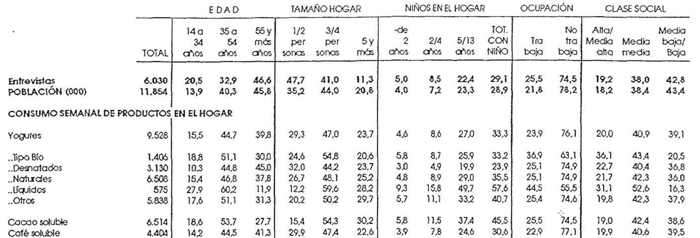

___

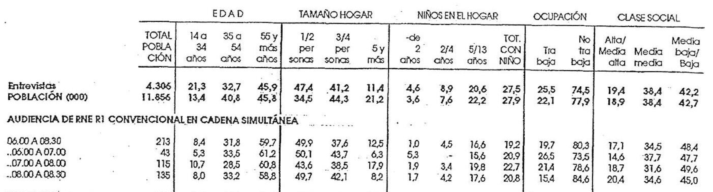

___

## Caso Práctico: El Reto de MediCare - Planificación de Medios en el Sector Salud

### Contexto Empresarial

MediCare, una innovadora empresa del sector salud, está a punto de lanzar al mercado español una nueva línea de productos de autocuidado y bienestar. La compañía ha desarrollado una gama de suplementos vitamínicos _premium_ que combina ingredientes naturales con tecnología de absorción avanzada.

El Director de Marketing, Carlos Ruiz, se enfrenta al reto de elegir el mercado regional más apropiado para el lanzamiento inicial y desarrollar una estrategia de medios efectiva que maximice el impacto entre una población consumidora de esta categoría de productos con un presupuesto limitado.

### Análisis de Mercado

La empresa ha realizado un estudio de mercado en tres regiones diferentes, obteniendo los siguientes índices relativos aplicables a la categoría y a su marca:

  | Región        | CDI  | BDI  |
  |---------------|------|------|
  | Norte         | 112  | 95   |
  | Centro        | 108  | 115  |
  | Levante       | 85   | 98   |

### Medios Disponibles

Para la campaña de lanzamiento, se han preseleccionado los siguientes soportes de prensa con los siguientes datos:

| Soporte               | Mercado | Aud. útil (000) | Aud. útil 2ª inserción (000) | Tarifa página color (€) |
|----------------------|---------|-----------------|----------------------------|----------------------|
| Norte Noticias       | Norte   | 595            | 620                        | 12.500              |
| La Gaceta del Norte  | Norte   | 504            | 720                        | 10.800              |
| El Eco del Norte     | Norte   | 315            | 450                        | 7.200               |
| Centro Diario        | Centro  | 546            | 780                        | 11.800              |
| La Voz de Madrid     | Centro  | 476            | 680                        | 10.200              |
| El Heraldo Central   | Centro  | 294            | 420                        | 6.900               |
| Levante Express      | Levante | 406            | 580                        | 9.500               |
| El Mediterráneo      | Levante | 343            | 490                        | 8.200               |
| Diario de Levante    | Levante | 245            | 350                        | 5.800               |

### Objetivos de Campaña

- Cobertura efectiva mínima: 7% de la población objetivo
- Frecuencia efectiva mínima: 5+ impactos
- Restricción presupuestaria: 100.000€
- Duración de campaña: 3 meses

### Tareas a Realizar

1. **Selección de Mercado**
- Analizar los índices CDI y BDI para cada región
- Justificar la elección del mercado con mayor oportunidad de marca

2. **Planificación de Medios**
- Desarrollar un plan de inserciones utilizando los soportes disponibles
- El plan debe contener un único soporte
- Calcular para cada plan:
  * Cobertura
  * Frecuencia media
  * Distribución de exposición
  * Distribución de exposición acumulada
  * GRPs del plan
  * CPM del plan
  * Coste por punto porcentual de población efectivamente alcanzada

3. **Análisis con Modelo Beta Binomial**
- Realizar un único cálculo manual para un plan básico de n inserciones
- Utilizar MediaPlanR para resto de planes con n inserciones
- Comparar resultados y eficiencia

4. **Diagnóstico y Recomendaciones**
- Evaluar si se cumplen los objetivos de cobertura y frecuencia
- Proponer ajustes si fuera necesario

### Datos Adicionales para el Cálculo

- Población objetivo en cada región:
  * Norte: 8.5 millones
  * Centro: 11.2 millones
  * Levante: 6.8 millones
___

## Caso Práctico P/V: Campaña Informativa de Detergente

### Contexto y Objetivo

Una marca establecida de **detergente** ha decidido lanzar una campaña informativa en el mercado español utilizando una **estrategia de tres oleadas en medios impresos**, con el objetivo de comunicar mejoras en su fórmula a su base de clientes leales. La campaña en medio impreso (revistas) busca mantener y reforzar la fidelidad de sus consumidores actuales, informando sobre los beneficios mejorados del producto, con una previsión de ventas de 5.000.000€. Basándose en el método Publicidad/Ventas (P/V) típico del sector de productos de limpieza para el hogar, debe establecer un **presupuesto inicial** que debe optimizarse para lograr una **cobertura del 25%** de la población objetivo (1.000.000), asegurando una **frecuencia efectiva** en cada fase de la campaña.

La campaña se desarrollará en **revistas orientadas al hogar y gestión familiar**, con alta afinidad con el perfil de compradoras habituales de productos de limpieza.

| Revista | Audiencia Bruta | Índice de Utilidad | Audiencia Útil | Tarifa Página Completa Color (€) |
|---------------|---------------|---------------|---------------|---------------|
| Pronto | 320000 | 0.85 | 272000 | 12000 |
| Lecturas | 290000 | 0.80 | 232000 | 11000 |
| Semana | 310000 | 0.75 | 232500 | 10500 |
| Mía | 280000 | 0.90 | 252000 | 9500 |
| Clara | 250000 | 0.85 | 212500 | 9000 |
| Saber Vivir | 400000 | 0.70 | 280000 | 8500 |
| AR | 230000 | 0.65 | 149500 | 8000 |
| Casa Fácil | 260000 | 0.80 | 208000 | 7500 |
| Diez Minutos | 295000 | 0.75 | 221250 | 10000 |
| ¡Hola! | 420000 | 0.65 | 273000 | 13500 |
| Mi Casa | 245000 | 0.85 | 208250 | 8000 |
| El Mueble | 275000 | 0.70 | 192500 | 9500 |
| Nuevo Estilo | 220000 | 0.60 | 132000 | 9000 |
| Cocina Fácil | 235000 | 0.80 | 188000 | 7000 |
| Casa al Día | 185000 | 0.85 | 157250 | 6500 |
| SuperTele | 280000 | 0.75 | 210000 | 8500 |
| Cuore | 265000 | 0.65 | 172250 | 9500 |
| Qué Me Dices | 255000 | 0.70 | 178500 | 8000 |
| Telva Cocina | 195000 | 0.80 | 156000 | 7500 |
| Saber Cocinar | 210000 | 0.75 | 157500 | 7000 |

**Tabla de Revistas con Audiencias y Tarifas (datos ficticios)**

Explicación de las Columnas:

-   Audiencia Bruta: Audiencia ficticia para cada revista
-   Índice de Utilidad: Proporción que representa la audiencia útil 
-   Audiencia Útil: Audiencia bruta multiplicada por el índice de utilidad
-   Tarifa Página Completa Color (€): Precio estimado por inserción en una página completa a color en cada revista.

### Estructura de la Campaña en Oleadas

Para maximizar la efectividad de la comunicación informativa, se estructurarán tres oleadas con inserciones en cada revista:

**Frecuencia Efectiva Recomendada para una Marca Establecida con Mensaje Informativo**

La presente planificación de medios establece una estrategia de comunicación (mensaje principal: comunicación de mejoras técnicas en la fórmula) orientada a alcanzar una cobertura del 25% sobre un universo de un millón de lectores/as primarios. La campaña se estructura en tres oleadas estratégicas durante 18 semanas, con una frecuencia efectiva mínima de 4 exposiciones por oleada.

**Análisis de Frecuencia Efectiva**

La determinación de la frecuencia efectiva se fundamenta parcialmente en el modelo de Ostrow:

_Factores de Ajuste:_

  - Variables de Marketing (-0.2)
    - Marca establecida (-0.4)
    - Producto de uso diario (+0.2)
    
  - Factores del Mensaje (+0.4)
    - Innovación en producto existente
     
  - Contexto Mediático (+0.4)
    - Alto nivel de saturación publicitaria
    - Estrategia de pulsing, ciclo de compra regular
    - Limitaciones de repetición natural en el medio elegido (prensa)

_Resultado_: Frecuencia efectiva de 4 exposiciones (Base 3 + Ajuste total +0.6)

**Estructura de Campaña**

**Primera Oleada (Semanas 1-5)**

- Objetivo: Establecimiento del mensaje
- Frecuencia: 4 exposiciones
- Timing: Alineado con ciclos de compra (inicio de mes y quincena)
- Hiatus: 2 semanas

**Segunda Oleada (Semanas 8-12)**

- Objetivo: Consolidación del mensaje
- Frecuencia: 4 exposiciones
- Apoyo: Acciones promocionales complementarias
- Hiatus: 2 semanas

**Tercera Oleada (Semanas 15-18)**

- Objetivo: Consolidación del mensaje y alta notoriedad
- Frecuencia: 4 exposiciones

**Justificación Estratégica**

El mantenimiento de una frecuencia constante de ciclos de 4 exposiciones se fundamenta en:

- Alta saturación publicitaria
- Limitadas oportunidades de repetición natural en el medio elegido. Cuando se planifica en revistas, la frecuencia debe ser construida principalmente a través de inserciones pagadas, ya que no se puede contar significativamente con exposiciones adicionales naturales o espontáneas al mensaje.

**Conclusiones**

La estrategia planteada optimiza la inversión publicitaria mediante:

- Sincronización con ciclos de compra y uso
- Aprovechamiento del efecto residual entre oleadas ( _carryover effects_)
- Mantención de intensidad necesaria para la comunicación de este tipo de producto (detergentes)
- Estructura temporal alineada con tres ciclos completos de compra-uso

### Cálculo de Cobertura y Distribución de Contactos

Para evaluar la **cobertura acumulada** y la **distribución de contactos**, utilizaremos los modelos **Sainsbury** y **Binomial**. Estos modelos son útiles para estimar la **cobertura neta** en campañas publicitarias, pero es importante recalcar que **estos métodos solo consideran una inserción por soporte** y la **independencia de las audiencias**, por lo cual son útiles en fase preliminar, y solo a efectos orientativos.

En suma, los resultados que obtendremos con los modelos Sainsbury y Binomial serán **preliminares y solo orientativos**. Estos resultados deberán necesariamente ser corregidos o ajustados mediante **modelos avanzados** como el **Canonical Expansion Model (CANEX)**, que permite un análisis más detallado.

### Solución: primera oleada

```r
library(mediaPlanR)
?mediaPlanR

# Vector de nombres de revistas
soportes <- c("Pronto", "Lecturas", "Semana", "Mía", "Clara", 
              "Saber Vivir", "AR", "Casa Fácil", "Diez Minutos", 
              "¡Hola!", "Mi Casa", "El Mueble", "Nuevo Estilo",
              "Cocina Fácil", "Casa al Día", "SuperTele", "Cuore",
              "Qué Me Dices", "Telva Cocina", "Saber Cocinar")

# Vector de audiencias brutas
audiencias <- c(320000, 290000, 310000, 280000, 250000, 
                400000, 230000, 260000, 295000, 420000,
                245000, 275000, 220000, 235000, 185000,
                280000, 265000, 255000, 195000, 210000)

# Vector de índices de utilidad
indices_utilidad <- c(0.85, 0.80, 0.75, 0.90, 0.85,
                      0.70, 0.65, 0.80, 0.75, 0.65,
                      0.85, 0.70, 0.60, 0.80, 0.85,
                      0.75, 0.65, 0.70, 0.80, 0.75)

# Vector de audiencias útiles
audiencias_utiles <- c(272000, 232000, 232500, 252000, 212500,
                       280000, 149500, 208000, 221250, 273000,
                       208250, 192500, 132000, 188000, 157250,
                       210000, 172250, 178500, 156000, 157500)

# Vector de tarifas
tarifas <- c(12000, 11000, 10500, 9500, 9000,
             8500, 8000, 7500, 10000, 13500,
             8000, 9500, 9000, 7000, 6500,
             8500, 9500, 8000, 7500, 7000)

# Si quieres crear un data frame con todos estos datos
datos <- data.frame(
  soportes = soportes,
  audiencias = audiencias,
  indices_utilidad = indices_utilidad,
  audiencias_utiles = audiencias_utiles,
  tarifas = tarifas
)

# Para ver el data frame completo
print(datos)

resultado_bruto <- optimize_media_plan(
  soportes_df = datos,
  FEM = 4,
  objetivo_cobertura = 25,
  poblacion_total = 1000000,
  presupuesto_max = 1200000,
  modelo = "binomial",
  usar_audiencia_util = FALSE
)
```

***

## Características Generales del Paquete

-   Múltiples modelos de cobertura y frecuencia
-   Optimización con restricciones presupuestarias
-   Soporte para audiencias brutas y ponderadas
-   Procesamiento por lotes para cálculos eficientes
-   Salida detallada con distribuciones de contactos
-   Validación y manejo de errores integrado
-   Seguimiento de progreso para operaciones largas

### Manejo de Errores

El paquete incluye validación de entrada y manejo de errores:

-   Validación de rangos de parámetros
-   Verificaciones de consistencia
-   Mensajes de error descriptivos
-   Seguimiento de progreso

## Contacto y Soporte

-   **Autor**: Manuel J. Sánchez-Franco
-   **ORCID**: [0000-0002-8042-3550](https://orcid.org/0000-0002-8042-3550)
-   **Email**: [majesus\@us.es](mailto:majesus@us.es){.email}
-   **Issues**: Para reportar problemas o sugerencias, usa la sección de [Issues](https://github.com/majesus/mediaPlanR/issues)

## Licencia

Este paquete está disponible bajo la licencia MIT. Ver el archivo LICENSE para más detalles.

## Referencias

- Aldás Manzano, J. (1998). Modelos de determinación de la cobertura y la distribución de contactos en la planificación de medios publicitarios impresos. Tesis doctoral, Universidad de Valencia, España. 

- Díez de Castro, E.C., Sánchez-Franco, M.J., y Martín Armario, E. (2011). Comunicaciones de marketing. Planificación y Control. Pirámide, España. 

- Kelley, L. D., Jugenheimer, D. W., y Sheehan, K. B. (2015). Advertising Media Planning: A Brand Management Approach (4ª ed.). Routledge. 

- Ostrow , J. W. (1982) Setting Frequency Levels. In Effective Frequency: The State of the Art. New York: Advertising Research Foundation, Key Issues Workshop. 

- Rossiter, J.R. y Danaher, P.J. (1998). Advanced Media Planning. Kluwer Academic Publishers, MAS, USA. 

- Rossiter, J.R. y Percy, L. (1987). Advertising and promotion management. Mcgraw-Hill Book Company.

## Cómo Citar

Si utilizas mediaPlanR en tu trabajo, por favor cítalo como:

```         
Sánchez-Franco, M. J. (2024). mediaPlanR: Herramientas para la Planificación de
Medios Publicitarios. R package version 0.1.1.
https://github.com/majesus/mediaPlanR
```

